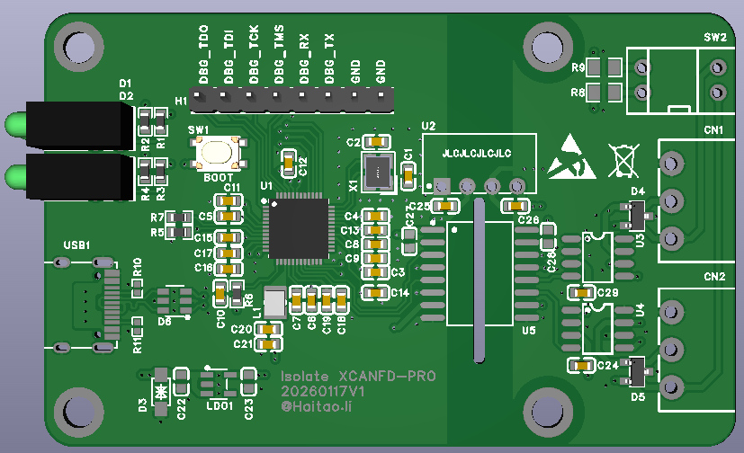
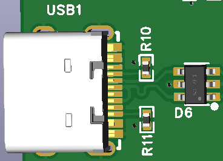
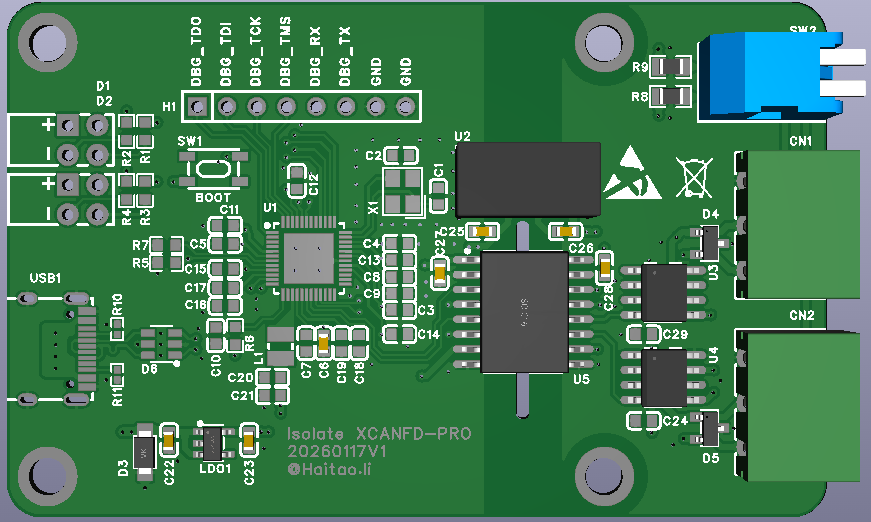
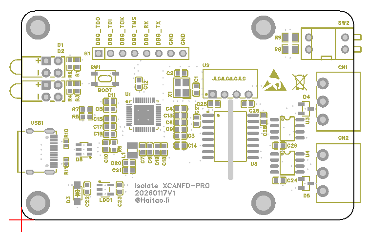

# BOM（物料清单）

> 数据来源：本仓库 [`hardware/BOM_Board1_Schematic1_2026-08-12.xlsx`](../hardware/BOM_Board1_Schematic1_2026-08-12.xlsx)（立创 EDA 导出，实测）。
> 共 **26 种物料**，元件总数约 **60 颗**。所有阻容均为 0603 / 0805 / 0402 等常用贴片封装，方便手焊。

## 总览（按功能区块）

### 1. 主控核心 (CORE)
> 职责：系统大脑，负责运行固件、USB 通信与 CAN‑FD 协议处理。

主控核心区域局部布局如下：

- **U1**：HPM5321IEG1 主控 MCU（RISC‑V，USB 高速 + 2×CAN‑FD）
- **X1** + **C1, C2**：24 MHz 主时钟晶振 + 22pF 负载电容
- **L1** + **C20, C21**：内部 DC‑DC 功率电感（4.7uH）+ 内核电源滤波（22uF）
- **C3–C15、C17、C19**：100nF 退耦电容（每电源脚旁一颗，3V3 域）
- **C6 / C16、C18**：LDO 输入滤波（10uF）/ 3V3 域电源滤波（4.7uF）
- **R1–R4**（5.1kΩ）：MCU 配置 / 上下拉；**R5–R7**（10kΩ）：上拉电阻
- **SW1**：轻触按键（BOOT 按钮，复位上电瞬间按下进 ISP 模式）
- **H1**：1×8 调试 / 烧录排针（连接 U1 调试 / 烧录引脚）
- **D1, D2**：黄绿状态指示灯

### 2. USB 接口 (USB)
> 职责：Type‑C 取电 + USB 高速通信，带 ESD 防护。

USB 接口区域局部布局如下：

- **USB1**：Type‑C 母座（取电 + 通信）
- **R10, R11**：5.1kΩ CC1 / CC2 下拉电阻（Rd，识别电源角色）
- **D6**：USBLC6‑2SC6，USB 接口 ESD 保护

### 3. 电源 + CAN + 隔离 (POWER/CAN)
> 职责：系统稳压、隔离供电，以及两路隔离 CAN‑FD 总线收发。

电源、CAN 与隔离区域局部布局如下：

- **LDO1**：5V → 3.3V 系统稳压（ME6211C33M5G‑N）
- **U2**：B0505S‑1WR3 隔离 DC‑DC（5V → 隔离 5V，1500V 隔离耐压）
- **U5**：CA‑IS3742HW 4 通道数字隔离器（MCU 侧 ↔ CAN 侧信号隔离）
- **U3, U4**：SIT1051AT/3 CAN‑FD 收发器 ×2 通道
- **CN1, CN2**：CAN 接线端子（CANH / CANL / GND）
- **R8, R9**：120Ω CAN 终端电阻
- **SW2**：2 位琴键开关（DP‑02RP，终端电阻切换——拨到 ON 接入 120Ω 终端匹配，拨到 OFF 断开，用于单 / 双节点组网时启用或关闭终端）
- **D3**：SMF5.0CA TVS（5V 过压保护）；**D4, D5**：PESD1CAN（CAN 引脚 ESD）
- **C22–C29**：隔离侧滤波——**C25, C26**（10uF）+ **C27, C28**（1uF）+ **C29**（100nF）为 B0505S 输入 / 输出三级滤波；**C22, C23**（1uF）、**C24**（100nF）为隔离侧退耦 / 滤波

> **归属说明**：C6 服务于主控侧 3.3V（LDO1 输入滤波），因此归入 **主控核心 (CORE)**；C25、C26 服务于隔离后的 CAN 侧 5V（B0505S 输入 / 输出滤波），因此归入 **电源 / CAN 隔离 (POWER/CAN)**。二者分别位于隔离电源的两侧，供电域不同。

## PCB 位号丝印图

下图是 `Isolate XCANFD-PRO` 顶层丝印布局，标注了板上主要元器件的位号与位置：

> 红色箭头所指为 PCB 左下角（原点 / 第 1 脚方向参考）。四个角为安装孔，板名下方标注版本号 `20260117V1`。

## 位号对照表（按功能区块）

| 位号 | 元器件 / 型号 | 功能说明 | 所在区块 |
|------|--------------|----------|----------|
| **U1** | HPM5321IEG1 | 主控 MCU（RISC‑V，USB 高速 + 2×CAN‑FD） | 主控核心 (CORE) |

> **U1 HPM5321IEG1 引脚封装图**
>
> 
>
> 顶视图（1 脚有圆点/凹点标识，位于左下角），逆时针编号 1→48：
> - 中间 **49 脚 = EPAD（VSS）**，接地散热焊盘
> - 关键电源/地脚位：
>   - **5 / 9 / 28 / 33 / 44 = VDD_SOC**
>   - **6 / 34 = VIO_B00**
>   - **30 = VREFL**（接地参考，正常应对 GND 响）
> - 焊接时特别注意：**第 6 脚 VIO_B00 紧贴 EPAD 边缘，最容易桥锡到地**。焊完断电后务必先用蜂鸣档测该脚对 GND，响且阻值稳定不变表示短路；正常应为几十~几百 Ω 且会爬升，或蜂鸣仅短暂响。
>
> 参考案例：见 `docs/soldering-guide.md` 中「实战踩坑：HPM5321 第 6 脚对地击穿」小节。
| **X1** | XL2EL89COI‑111YLC‑24M | 24 MHz 系统主时钟晶振 | 主控核心 (CORE) |
| **C1, C2** | 22pF | 晶振负载电容 | 主控核心 (CORE) |
| **L1** | SWPA252012S4R7MT (4.7uH) | 内部 DC‑DC 功率电感 | 主控核心 (CORE) |
| **C20, C21** | 22uF | 内核电源滤波 | 主控核心 (CORE) |
| **C3–C15、C17、C19** | 100nF | 各电源脚退耦电容 | 主控核心 (CORE) |
| **C6** | 10uF | LDO 输入滤波 | 主控核心 (CORE) |
| **C16、C18** | 4.7uF | 电源滤波 | 主控核心 (CORE) |
| **R1–R4** | 5.1kΩ | MCU 配置 / 上下拉 | 主控核心 (CORE) |
| **R5–R7** | 10kΩ | 上拉电阻 | 主控核心 (CORE) |
| **SW1** | TS‑KG89S‑AT25F | 轻触按键（BOOT 按钮，复位上电瞬间按下进 ISP 模式） | 主控核心 (CORE) |
| **H1** | X6511WV‑08H‑C60D30 | 1×8 调试 / 烧录排针 | 主控核心 (CORE) |
| **D1, D2** | A694B/2SYG/S530‑E2 | 状态指示灯（黄绿 LED） | 主控核心 (CORE) |
| **USB1** | TYPEC‑304‑BCP16 | Type‑C 母座（供电 + USB 通信） | USB 接口 (USB) |
| **R10, R11** | 5.1kΩ | USB CC1 / CC2 下拉电阻（Rd） | USB 接口 (USB) |
| **D6** | USBLC6‑2SC6 | USB 接口 ESD 保护 | USB 接口 (USB) |
| **LDO1** | ME6211C33M5G‑N | 5V → 3.3V 系统 LDO 稳压 | 电源 / CAN 隔离 (POWER/CAN) |
| **U2** | B0505S‑1WR3 | 隔离 DC‑DC（5V → 隔离 5V，耐压 1500V） | 电源 / CAN 隔离 (POWER/CAN) |
| **U5** | CA‑IS3742HW | 4 通道数字隔离器（MCU 侧与 CAN 侧信号隔离） | 电源 / CAN 隔离 (POWER/CAN) |
| **U3, U4** | SIT1051AT/3 | 两路 CAN‑FD 收发器 | 电源 / CAN 隔离 (POWER/CAN) |
| **CN1, CN2** | KF2EDGR‑3.81‑3P | CAN 接线端子（CANH / CANL / GND） | 电源 / CAN 隔离 (POWER/CAN) |
| **R8, R9** | 120Ω | CAN 总线终端匹配电阻 | 电源 / CAN 隔离 (POWER/CAN) |
| **SW2** | DP‑02RP | 2 位琴键开关（终端电阻切换） | 电源 / CAN 隔离 (POWER/CAN) |
| **D3** | SMF5.0CA | 5V 电源 TVS 浪涌 / 过压保护 | 电源 / CAN 隔离 (POWER/CAN) |
| **D4, D5** | PESD1CAN | CAN 引脚 ESD 保护 | 电源 / CAN 隔离 (POWER/CAN) |
| **C22, C23, C27, C28** | 1uF | 隔离侧滤波（C27, C28 为 B0505S 输出滤波） | 电源 / CAN 隔离 (POWER/CAN) |
| **C24, C29** | 100nF | 隔离侧退耦（C29 为 B0505S 输出滤波） | 电源 / CAN 隔离 (POWER/CAN) |
| **C25, C26** | 10uF | B0505S 输入 / 输出滤波 | 电源 / CAN 隔离 (POWER/CAN) |

## 完整清单

| # | 位号 | 数量 | 封装 | 参数 / 值 | 厂商型号 | 厂商 | 立创料号 | 作用 |
|---|------|------|------|-----------|----------|------|----------|------|
| 1 | C1, C2 | 2 | C0603 | 22pF | CL10C220JB8NNNC | SAMSUNG | C1653 | 晶振负载电容 |
| 2 | C3, C4, C5, C7, C8, C9, C10, C11, C12, C13, C14, C15, C17, C19, C24, C29 | 16 | C0603 | 100nF | CC0603KRX7R9BB104 | YAGEO | C14663 | 退耦电容（每电源脚旁一颗） |
| 3 | C6, C25, C26 | 3 | C0603 | 10uF | CL10A106KP8NNNC | SAMSUNG | C19702 | 电源滤波 |
| 4 | C16, C18 | 2 | C0603 | 4.7uF | CL10A475KO8NNNC | SAMSUNG | C19666 | 电源滤波 |
| 5 | C20, C21 | 2 | C0603 | 22uF | CL10A226MQ8NRNC | SAMSUNG | C59461 | 内核电源滤波 |
| 6 | C22, C23, C27, C28 | 4 | C0603 | 1uF | CL10A105KB8NNNC | SAMSUNG | C15849 | 电源滤波 |
| 7 | CN1, CN2 | 2 | CONN‑TH_3P‑P3.81 | KF2EDGR‑3.81‑3P | KF2EDGR‑3.81‑3P | KEFA | C441183 | CAN 接线端子（CANH / CANL / GND） |
| 8 | D1, D2 | 2 | LED‑TH | A694B/2SYG/S530‑E2 | A694B/2SYG/S530‑E2 | EVERLIGHT | C93880 | 状态 LED（黄绿） |
| 9 | D3 | 1 | SOD‑123 | SMF5.0CA | SMF5.0CA | AnBon | C435453 | TVS 浪涌 / 过压保护（5V） |
| 10 | D4, D5 | 2 | SOT‑23‑3 | PESD1CAN | PESD1CAN | UMW | C2687121 | CAN 引脚 ESD 保护 |
| 11 | D6 | 1 | SOT‑23‑6 | USBLC6‑2SC6 | USBLC6‑2SC6 | TECH PUBLIC | C2827654 | USB 接口 ESD 保护 |
| 12 | H1 | 1 | HDR‑TH_8P‑P2.54 | X6511WV‑08H‑C60D30 | X6511WV‑08H‑C60D30 | XKB | C706880 | 调试 / 烧录排针 1×8 |
| 13 | L1 | 1 | IND‑SMD_L2.5‑W2.0 | SWPA252012S4R7MT（4.7uH） | SWPA252012S4R7MT | Sunlord | C87640 | 功率电感（内部 DCDC） |
| 14 | LDO1 | 1 | SOT‑23‑5 | ME6211C33M5G‑N（5V→3.3V） | ME6211C33M5G‑N | MICRONE | C82942 | 系统 3.3V 稳压 |
| 15 | R1, R2, R3, R4 | 4 | R0603 | 5.1kΩ | 0603WAF5101T5E | UNI‑ROYAL | C23186 | MCU 配置 / 上下拉 |
| 16 | R5, R6, R7 | 3 | R0603 | 10kΩ | 0603WAF1002T5E | UNI‑ROYAL | C25804 | 上拉电阻 |
| 17 | R8, R9 | 2 | R0805 | 120Ω | 0805W8F1200T5E | UNI‑ROYAL | C17437 | CAN 终端电阻 |
| 18 | R10, R11 | 2 | R0402 | 5.1kΩ | 0402WGF5101TCE | UNI‑ROYAL | C25905 | USB CC1 / CC2 下拉（Rd） |
| 19 | SW1 | 1 | SW‑SMD_4P | TS‑KG89S‑AT25F | TS‑KG89S‑AT25F | HANBO | C2874599 | 轻触按键（BOOT 按钮） |
| 20 | SW2 | 1 | SW‑TH_DP‑02XP | DP‑02RP | DP‑02RP | 韩荣 | C129041 | 2 位琴键（终端电阻切换） |
| 21 | U1 | 1 | QFN‑48 | HPM5321IEG1 | HPM5321IEG1 | HPMICRO | C49451867 | 主控 MCU（RISC‑V，USB 高速 + 2×CAN‑FD） |
| 22 | U2 | 1 | PWRM‑TH | B0505S‑1WR3 | B0505S‑1WR3 | EVISUN | C7465178 | 隔离 DC‑DC（5V→隔离 5V，1500V） |

> **U2 B0505S‑1WR3 引脚封装图**
>
> 
>
> 顶视图（1 脚圆点标识），开口朝下，从左到右：
> - 1 = `-Vin`（接 USB 侧 GND）
> - 2 = `+Vin`（接 USB 侧 5V）
> - 3 = `-Vout`（接 CAN 侧隔离 GND）
> - 4 = `+Vout`（接 CAN 侧隔离 5V）
>
> **⚠️ 务必与立创数据手册 C7465178 方向一致。旧版文档 `1=VIN+` 写法已修正，焊反会导致输出异常、发热甚至烧毁。**
| 23 | U3, U4 | 2 | SOP‑8 | SIT1051AT/3 | SIT1051AT/3 | SIT（芯力特） | C5382551 | CAN‑FD 收发器 ×2 通道 |

> **U3/U4 SIT1051AT/3 引脚封装图**
>
> 
>
> 顶视图（1 脚圆点标识，位于左侧），SOP‑8 封装：
> - 1 = `TXD`
> - 2 = `GND`
> - 3 = `VCC`
> - 4 = `RXD`
> - 5 = `VIO`
> - 6 = `CANL`
> - 7 = `CANH`
> - 8 = `S`
>
> **⚠️ 焊接时注意 1 脚方向与 PCB 丝印圆点对齐，收发器电源为隔离 5V（ISO_5V），地必须接隔离地（ISO_GND），切勿与系统 GND 相连。**

| 24 | U5 | 1 | SOIC‑16 | CA‑IS3742HW | CA‑IS3742HW | Chipanalog（川土微） | C528654 | 4 通道数字隔离器 |

> **U5 CA‑IS3742HW 引脚封装图**
>
> 
>
> 顶视图（1 脚圆点标识，位于左下角），SOIC‑16 封装：
> - 1 = `VDDA`
> - 2 = `GNDA`
> - 3 = `VI1`
> - 4 = `VI2`
> - 5 = `VO3`
> - 6 = `VO4`
> - 7 = `ENA`
> - 8 = `GNDA`
> - 9 = `GNDB`
> - 10 = `ENB`
> - 11 = `VI4`
> - 12 = `VI3`
> - 13 = `VO2`
> - 14 = `VO1`
> - 15 = `GNDB`
> - 16 = `VDDB`
>
> **⚠️ 焊接时注意 1 脚方向与 PCB 丝印圆点对齐；左侧 1~8 脚为原边（系统侧，接 3V3/GND），右侧 9~16 脚为副边（隔离侧，接 ISO_5V/ISO_GND），切勿把两侧电源/地接反或短接。**

| 25 | USB1 | 1 | USB‑C‑SMD | TYPEC‑304‑BCP16 | TYPEC‑304‑BCP16 | XUNPU | C720629 | Type‑C 母座（取电 + 通信） |
| 26 | X1 | 1 | CRYSTAL‑SMD_4P | XL2EL89COI‑111YLC‑24M（24MHz） | XL2EL89COI‑111YLC‑24M | YXC | C5444545 | 系统主时钟晶振 |

