# 从 0 到 1 完整设计文档（HPM5321 高速隔离 USB-CAN FD 工具）

> 本文是从一张白纸开始，把这块板**完整地设计一遍**的全流程文档：需求拆解 → 技术选型 → 系统方案 → 原理图 → PCB → 数电/模电原理 → 焊接 → 调试 → 可靠性复盘。
---

## 背景与设计目标（先看清楚：做什么、有什么用、难在哪、解决什么问题）

> 本节先把「为什么做这块板、它是什么、核心难点在哪、解决了什么问题」讲清楚，再进入从 0 到 1 的一步一步实现。带着目标读后面的实现，才知道每一步在解决什么。

### 项目背景
本项目的真实位置：CHANGELOG 显示 2026-01-14 立项是「复刻并改造一个开源 HPM5321-PCAN 设计」——走笔记里推荐的「复刻硬件」路径：站在别人验证过的原理图上改，风险最低、学习曲线最平滑。它既是学硬件/嵌入式的教材，也是一份个人作品集项目经历。

### 一句话定义：我要设计什么
> 把 PC 的 **USB 2.0 高速**接口，转换成 **两路工业级、电气隔离的 CAN-FD 总线**，并被 PEAK 的 PCAN-View / PCAN-Basic 识别为 PCAN-FD PRO 兼容设备。

### 功能与指标：它具有什么功能
| 维度 | 需求 | 落地指标 | 对应模块 |
|---|---|---|---|
| 主机接口 | PC 即插即用 | USB 2.0 HS（480 Mbps），Type-C | 第 4 页 USB |
| 现场总线 | 2 路 CAN | CAN-FD，Data Phase 最高 8 Mbps | 第 3 页 CAN×2 |
| 安全 | 隔离 PC 与现场 | CAN 侧对 PC 侧 **1500 V** 隔离 | 隔离 DCDC + 数字隔离器 + 隔离收发器 |
| 兼容生态 | 不学新软件 | 固件实现 PCAN USB 协议，VID/PID 兼容 | 固件层 |
| 体积/成本 | 个人 DIY/小批量 | QFN48、26 种料、国产常用芯片 | 全板 |
| 可制造 | 能手焊/能 SMT | 0603/0805/0402 被动件、SOP/QFN 封装 | BOM |

### 重点设计的部分：高速隔离（本板的设计灵魂）
「高速隔离」是这块板名字里的核心卖点，也是它和一根普通 USB-CAN 线最本质的区别：
- **USB 高速这一侧不做隔离**：HPM5321 片内 HS PHY 的 DP/DM 直连 Type-C（480 Mbps），这种速率隔离器插不进去，也没必要——PC 侧是干净的电源环境。
- **隔离只作用在 CAN 侧**（CAN 控制器 ↔ 收发器之间）：用「数字隔离器 + 隔离 DC-DC + 隔离侧收发器」构 1500 V 安全边界。
- 难点在于「信号过、电不过」——把系统劈成两个电气孤岛，只让信息跨栅、不让电流跨栅。这是后面原理图 / PCB 花费最多篇幅的地方，也是本板区别于普通 USB-CAN 适配器的关键。

### 解决了什么问题（隔离的目的）
USB-CAN 适配器一端插昂贵的 PC，另一端接工业现场 CAN 总线，两者绝不能共地直连：
1. **地电位差 / 接地环路**：工业现场 CAN 两端往往不共地，几伏到上百伏的电位差会形成环路电流，轻则误码、重则烧接口。
2. **共模浪涌 / 现场干扰**：现场线常和电机、变频器捆在一起，共模噪声 / EFT / 雷击感应会顺着 GND 倒灌进 PC，烧毁主板，甚至威胁人身安全。
3. **电气安全 / 安规**：把「干净可触摸的」PC 侧和「脏、暴露的」现场侧隔开，是工业接口类产品的硬性要求。

> 一句话：**隔离 = 保护 PC + 切断地环路抑制共模干扰 + 满足安规隔离耐压**。它不是锦上添花，而是这类工具的必备项。隔离的具体原理与实现，见第 3 章「系统方案与架构」的 §3.4。

### 选型背景：带隔离还是非隔离（市场与取舍）

实际市场上 CAN 适配器分**带隔离**和**不带隔离**两档——它们各有适用场景，不是「有隔离就一定好」。下面用一张拓扑对比图把本质差异画出来，再用表格列出各自的利弊与选型建议，说明本项目为什么落在「带隔离」这一档。

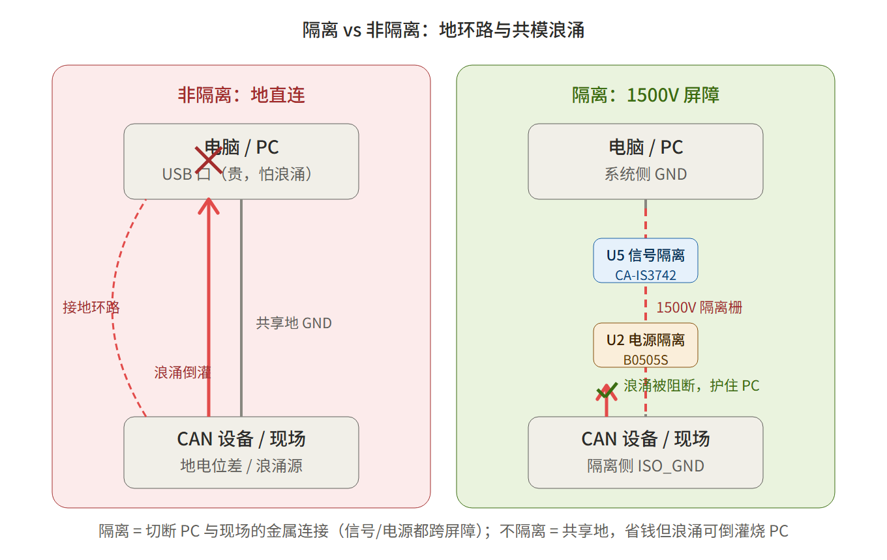

> 图中左侧（非隔离）：PC 与现场共享地 GND，现场浪涌可沿地线倒灌烧 PC 的 USB 口；右侧（隔离）：1500V 屏障切断金属连接，浪涌被信号隔离器（CA-IS3742）+ 电源隔离器（B0505S）共同阻断，PC 安然无恙。

**带隔离的好处**

| # | 好处 | 说明 |
|---|---|---|
| 1 | **保护电脑 / 贵设备** | 现场地电位差、共模浪涌、雷击感应等能量无法跨过 1500V 屏障倒灌进 PC USB 口，避免烧主板或接口芯片 |
| 2 | **打破接地环路** | PC 与 CAN 设备由不同插座供电时，两地存在电位差 → 非隔离下形成环路电流干扰通信；隔离后两侧地各自独立（GND vs ISO_GND），环路物理断开 |
| 3 | **满足安规距离** | 工业现场、新能源车高压系统要求接口侧有足够隔离耐压；1500V 级器件是合法进入这类场景的前提 |
| 4 | **天然抗共模噪声** | 数字隔离器（电容耦/磁耦）只传差分信号、不传共模，现场的地弹、开关噪声被挡在隔离侧 |
| 5 | **允许现场侧灵活接地** | 隔离侧可放心接现场地甚至浮地，不用担心和 PC 地冲突 |

**不带隔离的好处**

| # | 好处 | 说明 |
|---|---|---|
| 1 | **成本低** | 省掉数字隔离器（几元）+ 隔离 DC-DC（十几元）+ 隔离侧退耦电容，BOM 直接省 20–40 元 |
| 2 | **板子更小更简单** | 不需要第二套电源域（ISO_5V/ISO_GND）、不用布隔离槽、不用操心爬电间距和净空，布线难度和 EMC 风险大幅下降 |
| 3 | **延迟更低（理论值）** | 隔离器有 ns 级传播延迟（光耦才慢到百 kHz）；非隔离直连延迟最低。对绝大多数 CAN 应用可忽略，极端硬实时场景有意义 |
| 4 | **受控环境够用** | 实验室台架、同接地单设备调试，地电位差风险极低，隔离反而是过度设计 |

**怎么选（经验法则）**

| 场景 | 建议 |
|---|---|
| 个人学习、低风险台架、同接地调试 | **非隔离够用**，省钱省事 |
| 实车、工业现场、连未知/第三方设备、贵电脑 | **必须隔离** |
| 想做作品集 / 体现工程严谨性 | 隔离是加分项（本项目已实现） |


---

下面进入**从 0 到 1 的一步一步实现过程**：

## 0. 设计流程总览（自顶向下，别一上来死磕阻容）

**高手看电路是电磁场/电流环路，新手看是器件和线；硬件研发从需求拆解开始，而非从零画原理图**。所以正确顺序是：

```
需求定义 ──▶ 系统方案/框图 ──▶ 关键技术选型 ──▶ 原理图(逐模块) ──▶ PCB ──▶ 打样 ──▶ 调试/量产反馈
```

调试/量产阶段发现的问题，会回溯到上游（选型 / 原理图 / 需求定义）迭代修正，形成闭环。


## 1. 需求拆解与系统框图（先抓核心元件 HPM5321）

> 背景与目标见文件开头的「背景与设计目标」。这里把需求拆成可落地的子系统，并用一张框图把每个元件与网络说清。

### 1.1 系统框图（文字版，先抓核心元件 HPM5321）

```
        PC(USB)                        现场 CAN 总线 ×2
           │                              │
   [USB-C 座 USB1]                  [端子 CN1/CN2]
    CC 5.1k 下拉(R10/R11)           120Ω 终端(SW2+R8/R9)
    ESD 阵列 D6                       ESD D4/D5
           │  90Ω 差分 DP/DM              │  CANH/CANL 差分
           ▼                              ▼
   ┌───────────────────── U1 HPM5321 ───────────────────┐
   │  RISC-V 480MHz, 片内 USB HS PHY, 4×CAN-FD 控制器    │
   │  电源: 5V(VBUS)→LDO ME6211→3.3V(3V3)               │
   │  时钟: 24MHz 晶振 X1 → 内部 PLL → 480MHz            │
   │  BOOT: SW1 拨码 + H1 串口(仅 UART0 可烧录)          │
   └───────┬───────────────┬───────────────┬────────────┘
           │ CAN1/2 TX/RX   │               │ 调试 LED D1/D2
           ▼                │               ▼
   [数字隔离器 U5 CA-IS3742] │         (GPIO 限流电阻)
        ┃━━━ 1500V 隔离栅 ━━━┃ (信号:U5 电容耦合 / 电源:U2 磁耦合,两路共同跨栅)
           │                              │
           ▼                              ▼
   [CAN 收发器 U3/U4 SIT1051AT/3]──► CN1/CN2
           ▲
           │ ISO_5V/ISO_GND(U2 给隔离侧供电,并联不串在信号链里)
   [隔离电源 U2 B0505S]  ← 5V(VBUS) 输入
```

上面的文字框图拆解了每个元件与网络；下面用一张分层架构总览图，把"系统侧（非隔离）/ 核心桥接 / 现场侧（隔离）"三层关系和中间的 1500V 隔离屏障一眼看清：

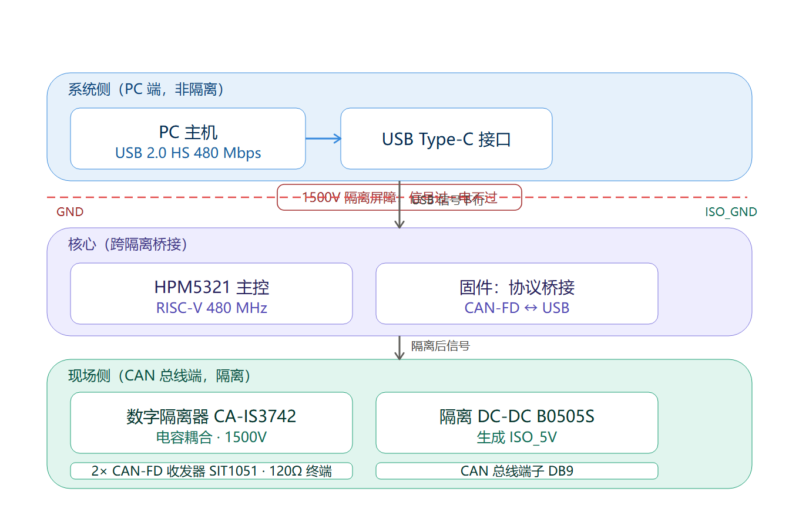

> **读者常见疑问：三层关系和中间的「1500V」是什么意思？在原理图还是 PCB 里体现？**
>
> - **三层关系是什么**：上图竖切为「系统侧（非隔离）/ 核心桥接 / 现场侧（隔离）」三层。1500V 隔离屏障横在**系统侧与现场侧之间**（也就是中间核心桥接层的位置）——它不是某颗芯片，而是「让两边只通信号、不通电流」的一整套机制。
> - **1500V 是什么**：叫**隔离耐压 / 绝缘耐压（isolation withstand voltage）**，是隔离器件（**CA-IS3742HW 额定 5 kVRMS、B0505S-1WR3 额定 1500 VDC**，见 §3.4.2）数据手册标称的**额定值**，是故障/浪涌/雷击感应时的**安全裕量**，不是工作电压（板子工作时两侧各自只有 5V / 3.3V，日常根本不会真加上 1500V）。整道屏障以 B0505S 的 1500 VDC 为上限，故称「1500V 隔离」。
> - **在哪体现**：**原理图标「电气意图」**——原理图里 `GND`（系统侧）和 `ISO_GND`（隔离侧）是两个接地符号，**之间没有任何一根线连起来**，隔离器件 CA-IS3742HW / B0505S-1WR3 恰好「骑」在两侧之间；1500V 这个数值本身写在器件规格书里、被原理图引用。**PCB 标「物理落地」**——GND 铜皮与 ISO_GND 铜皮在板上必须留一段空隙（爬电距离 / 电气间隙）互不相碰，CA-IS3742HW / B0505S-1WR3 跨在缝隙上方。这段空隙够不够大，决定板子实际能否扛住 1500V。
>
> 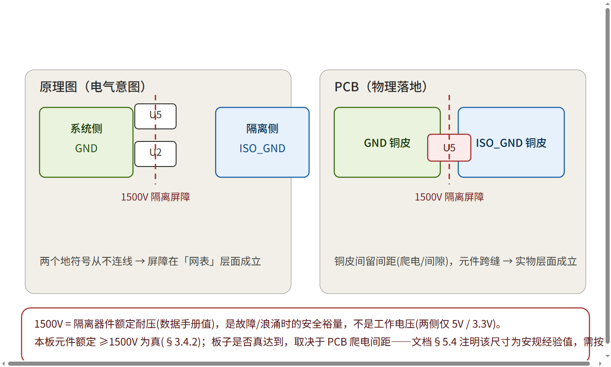
>
> - **诚实边界（见 §5.4 / §12）**：本板**元件额定 ≥1500V 为真**；但**板子实际达没达到 1500V，取决于 PCB 上那段爬电间距**——而文档里 ≥4–8mm 是安规经验值、**非本板实测尺寸**，需按板厂工艺 + 安规确认。所以准确说法：1500V 的**能力来自隔离器件（真）**，1500V 的**落地靠 PCB 间距（本板待实测确认）**；原理图标意图、PCB 标实物。因此对外描述时建议写「采用额定 ≥1500V 的数字隔离器 + 隔离 DC-DC 构建 CAN 侧电气隔离」，不要写成「本板实测通过 1500V 安规」。

### 1.2 关键约束与技术难点（决定后面所有选型）
1. **USB 必须 High-Speed** → 要么选带片内 HS PHY 的 MCU，要么外挂 ULPI PHY（增加 BOM 与阻抗管控难度）。
2. **必须隔离** → 信号和电源都要"过信号不过电"，隔离屏障要连续。
3. **QFN48 封装** → 引脚密度高、无 USB Boot，只能 UART0 烧录（催生了调试排针 + BOOT 拨码）。
4. **个人焊接** → 元件尽量选 SOP/QFN + 常用贴片阻容，避开 BGA。

---

## 2. 技术选型（为什么是这些料，而非别的）

> 选型不是"挑便宜的"，而是**在性能/成本/体积/可焊性/供货之间做权衡**，并提前想"它会怎么失效"（笔记高手思维）。下面每一条都给"备选 vs 选定"。

### 2.1 主控 MCU

| 候选 | 优势 | 否决/保留原因 |
|---|---|---|
| **HPM5321（选定）** | 国产 RISC-V、片内 USB HS PHY、4×CAN-FD、480MHz/288KB SRAM/1MB Flash | 唯一同时满足"片内 HS PHY + ≥2 CAN-FD"的国产 MCU，BOM 最省 |
| STM32F4/F7 | 生态成熟、资料多 | F4 多数只有 USB **FS**（12 Mbps），做不了 HS；F7 有 HS 但需外置 PHY，贵且复杂 |
| GD32 / NXP RT | 有 CAN-FD 型号 | 多数 USB 仅 FS，或需外置 HS PHY |
| 带外置 PHY 的方案 | 灵活 | BOM + 阻抗管控翻倍，个人不友好 |

**结论**：选 HPM5321 的本质是**用高集成度换 BOM 简化**。代价是 QFN48 只能 UART0 烧录——后面用调试接口补回。

> **术语：HS-PHY 是什么？**

> **PHY 是什么**：USB 控制器和 D+/D- 线之间的"物理层收发器"，没有它 MCU 引脚接不上 USB 线。

> **HS 是什么**：USB 2.0 的 480Mbps 高速档；"片内 HS PHY"＝MCU 内部自带物理层，板上不用外挂芯片。

> **为什么选 HPM5321**：F4 大多只有 12M，F7 有 HS 也得外挂 PHY（多料+12 根 ULPI 线）；HPM5321 集成进芯片，又省又简单。

> *注："物理层（PHY）"这个称呼源自 OSI 网络模型，但 USB、CAN、以太网等任何有线通信协议的最底层都叫物理层，因此 USB 收发器也通称 USB PHY——这里并非把 USB 当成以太网，只是共享同一套分层命名。*

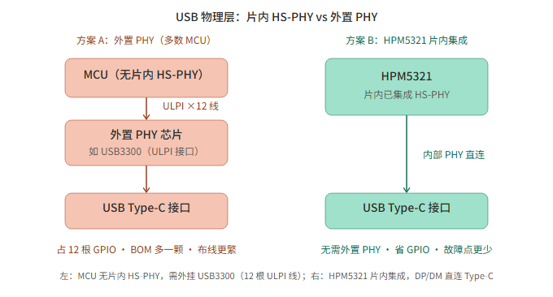

> 图中左侧：MCU 无片内 HS-PHY 时需外挂 USB3300（12 根 ULPI 线），BOM 多一颗、布线更繁；右侧：HPM5321 已把 HS-PHY 做进芯片内部，DP/DM 直连 Type-C，省掉整条外置链路。

### 2.2 USB 接口方案
- **片内 HS PHY（选定）**：DP/DM 直连 HPM5321（第 4 页 `USBHS_DP/DM` → PA24/PA25）。无外部 PHY、无 ULPI 总线、少 1~2 颗芯片。
- 外置 PHY（如 USB3300）：仅在 MCU 无片内 HS PHY 时被迫使用，会带来 60MHz ULPI 并行总线 + 严格等长，个人板不值得。

### 2.3 隔离方案（本板的核心难点）
两种主流思路对比：

| 方案 | 组成 | 优点 | 缺点 | 本板选择 |
|---|---|---|---|---|
| **三级分立（选定）** | 隔离 DCDC(B0505S) + 数字隔离器(CA-IS3742) + 隔离 CAN 收发器(SIT1051) | 每级可独立选型/替换，收发器用普通非隔离型也行，成本低 | 元件多、占板面积 | ✅ |
| 一体隔离收发器 | 如 ADM3053（集成隔离 DCDC + 收发器） | BOM 最少、体积最小 | 贵、供货受限、不可拆分扩展 | ❌ |

**为什么选分立**：① 隔离 CAN 收发器 SIT1051 是"普通收发器 + 外置隔离"思路，国产料便宜好买；② 数字隔离器 CA-IS3742 是 4 通道通用型，剩 2 通道可扩第 3/4 路 CAN；③ B0505S-1WR3 是成熟 SIP 模块，一颗电容就能工作。
**隔离连续性的铁律**：数字隔离器只传信号不传能量，所以**收发器必须挂在隔离电源 ISO_5V / ISO_GND 上**，否则地线一连、隔离白做。

### 2.4 CAN 收发器 —— SIT1051AT/3
- 芯力特 CAN-FD 收发器，支持 8 Mbps Data Phase，ISO 11898-2。
- `/3` 后缀 = 带 **VIO** 引脚，逻辑电平 3.3 V/5 V 可配，直接匹配 HPM5321 的 3.3 V GPIO（无需电平转换）。
- 替代料已在原理图标明：SIT1042 / TJA1042 / TJA1043（引脚兼容），小批量断货时可换。

### 2.5 系统 LDO —— ME6211C33M5G-N
- 5 V(VBUS) → 3.3 V，SOT-23-5。
- **为什么 LDO 不 DCDC**：系统侧电流不大（MCU + 隔离器系统侧 + LED），LDO 噪声低、外围只有 2 颗电容、零电感（不产生 EMI）。效率不是主要矛盾。

### 2.6 ESD / TVS 选型（"花小钱买可靠性"，笔记知识 3）
| 位置 | 器件 | 关键参数 | 为什么选它 |
|---|---|---|---|
| VBUS 5V | SMF5.0CA | 双向 TVS，5V 钳位 | 防 USB 插拔浪涌，保护后级 |
| CANH/L | PESD1CAN | CAN 专用 ESD 二极管 | 引脚电容低，不拖累 CAN 信号 |
| USB DP/DM | USBLC6-2SC6 | 低结电容 ESD 阵列 | **结电容必须低**，否则 480 Mbps 眼图塌陷 |

### 2.7 其它料
- **24 MHz 无源晶振（YXC）**（YXC），配 22 pF 负载电容 C1/C2——无源比有源便宜、干净。
- **功率电感 L1** 4.7 µH（Sunlord），给 HPM5321 内部 DCDC 用（引脚 `DCDC_LP`）。
- **隔离电源 B0505S-1WR3（EVISUN）**，5 V→隔离 5 V，1500 V 耐压，SIP。
- **接插件**：Type-C 母座（TYPEC-304-BCP16，取电+通信）、KF2EDGR 3.81 mm 接线端子（工业常用）、调试/烧录排针（1×8）。
- **开关**：BOOT 拨码开关（4 位，BOOT/配置）、终端切换开关（2 位琴键，终端电阻切换，比跳线帽耐用）。

---

## 3. 系统方案与架构

### 3.1 整体架构（两套地平面，四层堆叠）
- **系统侧（GND / 3V3）**：USB 取电 5 V → LDO → 3.3 V，供 HPM5321、CA-IS3742HW 系统侧、LED、CC 下拉。
- **隔离侧（ISO_GND / ISO_5V）**：5 V → B0505S → 隔离 5 V，供 SIT1051AT/3 收发器、CA-IS3742HW 副边。
- 两者之间只有**隔离器的信号通道**跨越，电源/地完全断开。

### 3.2 电源树
```
USB VBUS (5V)
 ├─ D3(TVS) ─► ME6211 ─► 3V3 ─► U1 / U5(系统侧) / LED / R10,R11 / 退耦
 └─ B0505S-1WR3 ─► ISO_5V ─► U3, U4(收发器) / U5(隔离侧) / C22..C29
```

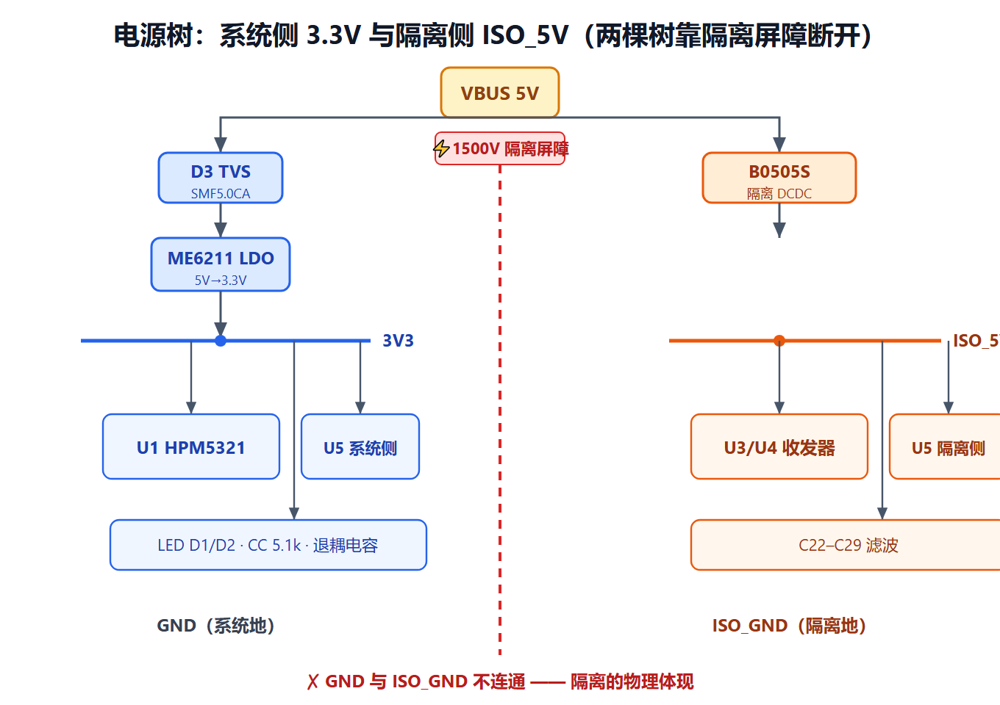

**对应真实原理图的电路实现**（简化提取，元件位号/网络与工程一致）：

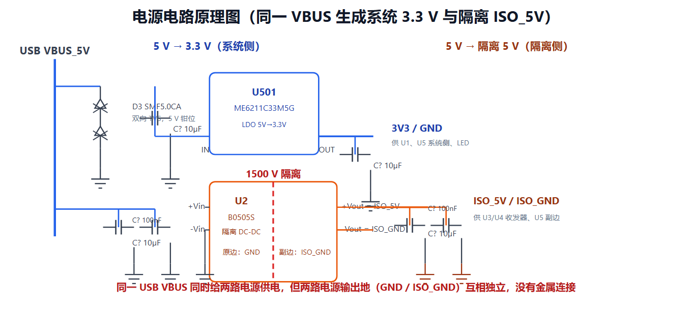

> 图中 `U501`（ME6211C33M5G-N）负责系统侧 3.3 V；B0505S-1WR3用内部高频变压器跨过隔离栅生成 ISO_5V。注意两路输出的地符号不同：`GND`（系统）与 `ISO_GND`（隔离）之间没有金属连接。

### 3.3 信号流向（注意方向性）
- **下行（PC→CAN）**：USB DP/DM → HPM5321 内部 USB PHY → CAN 控制器 → CA-IS3742HW（隔离）→ SIT1051AT/3 → 接线端子。
- **上行（CAN→PC）**：接线端子 → SIT1051AT/3 → CA-IS3742HW（隔离）→ HPM5321 CAN 控制器 → USB PHY → PC。
- CAN 收发器是**单向引脚**（TXD 进、RXD 出），所以每路 CAN 要占隔离器 2 个通道（TX + RX）。

下面用一张数据流图把"现场 CAN 帧如何穿过 1500V 隔离屏障、由 HPM5321 桥接成 USB 封包送达 PC"直观呈现：

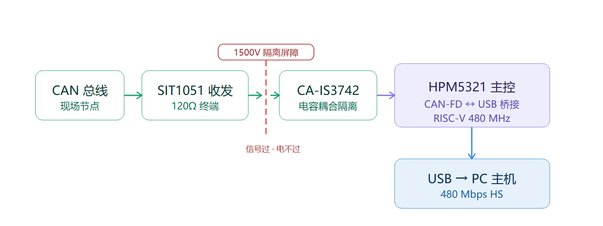

### 3.4 高速隔离的实现原理与目的（本板设计灵魂）

把"隔离"单独拎出来讲透——因为"**高速隔离**"正是这块板子名字里的核心卖点，也是它和一根普通 USB-CAN 线最本质的区别。下面先讲**目的**（为什么不能直连），再讲**原理**（怎么做到信号过、电不过），最后讲"高速"怎么和"隔离"兼得。

#### 3.4.1 隔离的目的：为什么不能让 PC 和 CAN 直连？

USB-CAN 适配器一端插在**昂贵的 PC / 实验室电脑**上，另一端接的是**工业现场的 CAN 总线**。这两者绝不能"共地直连"，原因有三：

1. **地电位差 / 接地环路（Ground Loop）**：工业现场 CAN 总线的两端往往不共地，设备各自接大地，地之间可能有几伏到上百伏的直流/低频电位差。这条电位差会通过 GND 线形成环路电流，轻则通信误码、漂移，重则烧接口。
2. **共模浪涌 / 现场干扰**：现场 CAN 线常和电机、继电器、变频器、电源走线捆在一起，会耦合出共模噪声、EFT、甚至雷击感应浪涌。如果不隔离，这些能量会顺着 GND 倒灌进 PC 的 USB 口，烧毁主板/接口芯片，**还可能威胁人身安全**（1500 V 是安规隔离耐压等级）。
3. **电气安全 / 安规**：把"干净、人可触摸的"PC 侧和"脏、暴露的"现场侧隔开，是工业接口类产品的硬性安全要求。

> 一句话：**隔离的目的 = 保护 PC + 切断地环路抑制共模干扰 + 满足安规隔离耐压**。它不是锦上添花，而是这类工具的必备项。

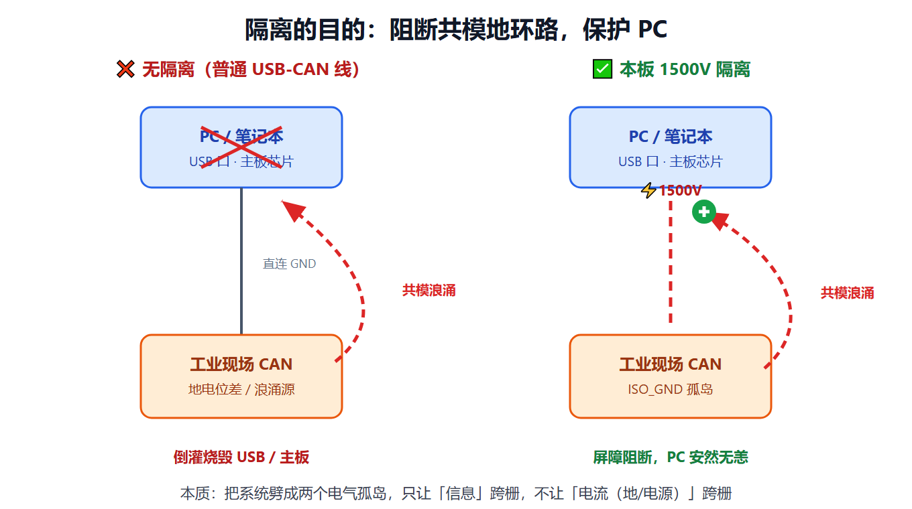

#### 3.4.2 隔离的原理：怎样做到"信号过、电不过"？

**核心概念——电气隔离（Galvanic Isolation）**：在 PC 侧与 CAN 侧之间插入一道"**只传信息、不传电流**"的屏障，把系统劈成**两个完全独立的电气孤岛**：

- 系统侧孤岛：`GND` / `3V3`（接 PC、HPM5321、隔离器系统侧）
- 隔离侧孤岛：`ISO_GND` / `ISO_5V`（接 CAN 收发器、隔离器副边、现场端子）

两个岛之间**没有任何金属导体连通**——这是隔离的物理本质，也是 §5.4 里"GND 与 ISO_GND 两个独立网络、互不铺铜"的由来。

**本板用「三道屏障」实现隔离**（对应 §2.3 的三级分立方案）：

| 屏障 | 器件 | 怎么跨过隔离栅 | 绝缘耐压 |
|---|---|---|---|
| ① 信号屏障 | **CA-IS3742HW 数字隔离器**（4 通道，宽体 SOIC-16-WB，川土微） | **电容耦合**：发送侧把逻辑电平调制成高频 RF 脉冲，穿过 SiO₂ 绝缘层的微型电容，接收侧解调还原 | **5 kVRMS**（远高于 1500V，裕量充足） |
| ② 电源屏障 | **B0505S-1WR3 隔离 DC-DC**（EVISUN） | **磁耦合**：内部高频变压器把能量跨过隔离栅送到隔离侧（5 V→隔离 5 V），原副边绕组间绝缘 | **1500 VDC**（这正是系统「1500V 隔离」标称的来源，也是整道屏障的瓶颈） |
| ③ 收发器挂隔离侧 | **SIT1051AT/3**（电源/地接 ISO_5V / ISO_GND） | 收发器本身就落在隔离岛上，它的 CANH/CANL 引脚自然属于现场侧 | 随收发器（本身不做隔离屏障） |

> **整道屏障的能力受最弱一环限制**：B0505S 额定 1500 VDC，故系统隔离等级为 **1500V 级**；CA-IS3742 本身可达 5 kVRMS，裕量充足。这也是产品名「1500V 隔离」的真正出处——不是隔离器只有 1500V，而是整条链被 DC-DC 这颗 1500V 的料"封顶"了。直接写「采用额定 1500 VDC 隔离电源 + 5 kVRMS 数字隔离器构建 CAN 侧电气隔离」最准。

**隔离连续性铁律（新手最容易翻车）**：数字隔离器**只传信号、不传能量**。所以收发器必须挂在**隔离电源**上；一旦收发器地不小心接到系统 `GND`，就等于在 1500 V 屏障上架了座桥，隔离瞬间失效——"信号过、电也过"，前面两道屏障白做。这就是为什么 §3.1 电源树里 B0505S 单独给 SIT1051AT/3 收发器 / CA-IS3742HW 副边供电、且 GND 与 ISO_GND 严禁连通。

#### 3.4.3 "高速"与"隔离"如何兼得？（精妙的分工）

- **隔离不牺牲速率，关键是隔离器类型**：老式**光耦**受限于 LED 响应速度，带宽只有几百 kHz，撑不住高速；本板用的**电容耦合数字隔离器**带宽达百 MHz 级、传播延迟仅 ns 级，对 CAN-FD（数据段 8 Mbps，单 bit 是 µs 级）**完全透明、可忽略**。
- **一处关键权衡：USB 高速这一侧不做隔离**。HPM5321 片内 HS PHY 的 DP/DM 直连 Type-C（480 Mbps），这种速率隔离器插不进去，也没必要——PC 侧是干净的电源环境。而**隔离只作用在 CAN 侧**（CAN 控制器 ↔ 收发器之间）。这样既保住了 480 Mbps 高速通道，又给暴露在工业现场的 CAN 总线加了 1500 V 护盾。隔离器放在"桥"的中间位置，而非 USB 端，是性能/安全/成本的最优解。

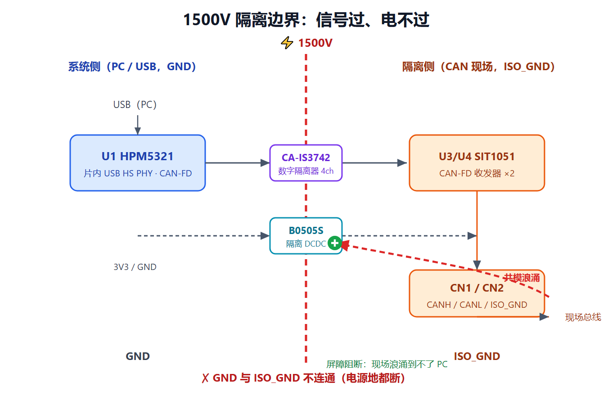

**对应真实原理图的电路实现**（HPM5321→CA-IS3742HW→SIT1051AT/3，含终端电阻/ESD）：

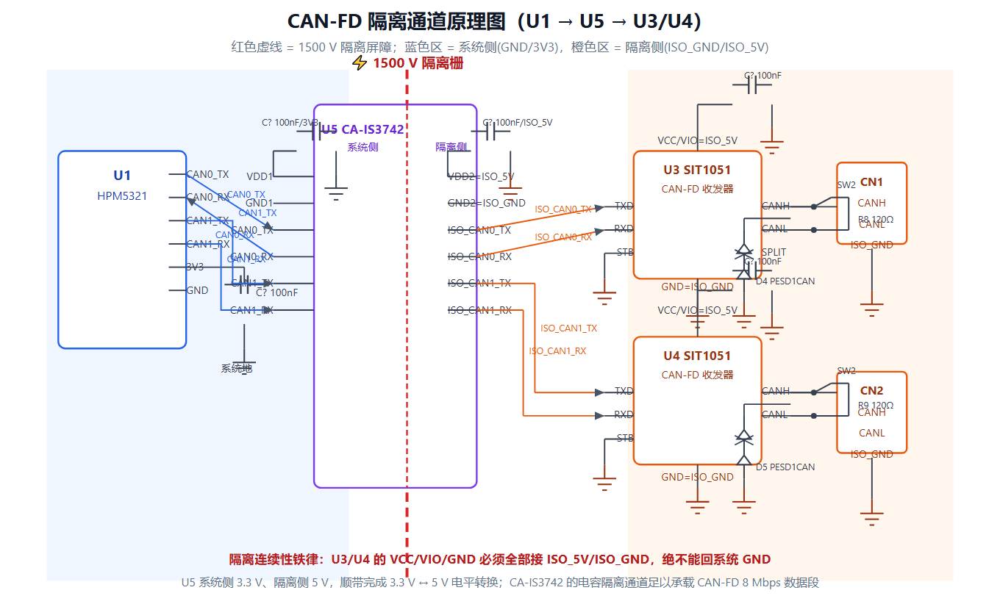

> 图中 CA-IS3742HW 系统侧接 3.3 V、隔离侧接 ISO_5V，4 个通道恰好分给两路 CAN 的 TX/RX；SIT1051AT/3 的 VCC/VIO/GND 全部挂在 ISO_5V/ISO_GND 上。R8/R9=120Ω 终端电阻由终端切换开关控制是否接入；PESD1CAN 跨接 CANH/CANL 到 ISO_GND。

> **一句话总结**：隔离 = 把系统劈成两个电气孤岛，只让**信息**（经电容/变压器）跨栅，不让**电流**（地/电源）跨栅；这样现场再脏的共模噪声也灌不进你的 PC。本板的"高速隔离"= 片内 USB HS PHY 保速度 + 数字隔离器 + 隔离 DC-DC + 隔离侧收发器 构 1500 V 安全边界。

### 3.5 固件分层视角（发挥软件背景优势，本项目的设计考量）
> 笔记提醒：硬件工程师也要懂「软件设计逻辑」——用分层架构（硬件层 / BSP / OS / 应用层）把复杂系统拆干净。作为软件转嵌入式，这是我相对纯硬件新手的**长板**，应在设计阶段就参与固件架构，而不是「画完板子交给别人写代码」。

本适配器的固件（仓库当前仅提供 `*.bin`，源码未开源）逻辑上应分三层：
- **驱动层**：HPM5300 的 CAN-FD 控制器、USB HS 设备控制器（PCAN 协议栈）、UART0 ISP——对应 `hpm_sdk` 的外设驱动。
- **协议 / 桥接层**：把 PCAN 的 USB 描述符 + 报文格式，与两路 CAN-FD 的 ID/DLC/数据场相互映射。这是「USB-CAN 适配器」的核心算法，也是本项目相对裸 MCU 的**原创价值点**（见 `my-build-log.md`）。
- **应用 / 配置层**：BOOT 拨码开关、终端切换开关、LED 状态、上位机可变波特率 / 采样点。

为什么写进设计文档：固件分层决定了**硬件上哪些要留调试接口、哪些要可配置**（如终端切换开关、调试排针烧录口、LED 指示）。硬件和固件是同一系统的两面——这正是「系统思维」的要求。

> 注：固件源码不在本仓库（见 `design-rationale.md`），上述分层是「设计阶段应做的考量」，不是已实现代码；深入固件是后续原创贡献的主攻方向。

---

## 4. 原理图设计（逐模块 + 数电/模电原理）

### 4.1 主控最小系统（CORE，第 2 页）

**(a) 电源引脚分组退耦（模电基础）**
- HPM5321 的 `VDD_SOC` 有 5 个脚（9/5/28/33/45），每个脚旁都放 100 nF（C3–C19 中多数）。
- **为什么每组独立退耦？** 480 MHz CPU、USB PHY、ADC、内部 DCDC 各自瞬态电流不同，分组退耦防止噪声互串（见 §7.2）。
- `VANA`（模拟电源，pin32）经 **磁珠 L1** 隔离后再供，把数字噪声挡在模拟电路外（见 §7.4）。
- `C20/C21 = 22 µF` 给内部 DCDC 做储能，防 CPU 突拉电流时电压塌陷。

**(b) 复位 RESETN（pin13）**
- 低电平复位。一般用上拉电阻保持高电平，按键/复位电路拉低。结合笔记"下拉电阻的确定状态"思想：给不确定引脚一个确定电平。

**(c) BOOT 模式（BOOT 拨码开关 + 调试排针，本板特色）**
- QFN48 **无 USB Boot 引脚**，必须靠 `BOOT0/BOOT1` 选 UART0 ISP 模式。板载 BOOT 拨码开关 + 调试排针把这两个脚和 RESET、UART0(TX/RX) 都引出来。
- 烧录时：拨 BOOT 拨码开关到 BOOT 档 → 上电 → 进 UART0 ISP → HPMicro Manufacturing Tool 烧录。
- 这是"封装换体积、调试接口补回"的典型取舍（见 §2.1）。

**(d) 状态 LED**
- 经限流电阻接 GPIO（原理图标 LED1–LED4，对应 2 颗 LED 的双向指示）。LED 是新手调试第一步："亮不亮"直接反映固件跑了没。

**(e) 时钟（24MHz 晶振）**
- 24 MHz 无源晶振接 `XTALI/XTALO`（pin35/36），配 C1/C2 = 22 pF 负载电容（原理见 §7.3）。

**主控最小系统对应真实原理图（简化）**：

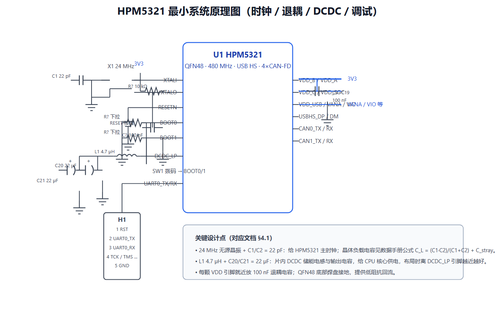

> 简化图保留了与本项目最相关的部分：24 MHz 晶振 + C1/C2 负载电容、DCDC_LP 外接 L1 4.7µH + C20/C21 22µF、多组 VDD 退耦电容、BOOT0/1 下拉 + BOOT 拨码开关、RESET 上拉/按键、调试/烧录排针。

### 4.2 时钟电路（模电）
- 无源晶振两端接 MCU 内部反相放大器，构成皮尔斯振荡器。
- **负载电容公式**：`CL ≈ (C1·C2)/(C1+C2) + C_stray`。取 C1=C2=22 pF、杂散约 3–5 pF → CL≈16 pF，落在晶振标称负载范围内，保证起振且频率准。
- 选 24 MHz 是因为 HPM5300 推荐外部 HS 频率，内部 PLL 倍频到 480 MHz，同时给 USB HS PHY 当参考时钟。

### 4.3 系统电源 LDO（模电）
- ME6211 是 LDO（低压差线性稳压器）。把 5 V 降到 3.3 V，压差约 1 V 内即可工作。
- **为什么纹波低**：LDO 是线性调整，不像 DCDC 有开关动作，所以给对噪声敏感的数字/模拟电路最干净。
- 输入/输出各放 10 µF（C6 等）+ 100 nF 组合：大电容稳直流、小电容滤高频。

### 4.4 隔离电源 B0505S（模电 + 隔离）
- 它是**开关型**隔离 DC-DC 模块，内部高频变压器实现能量跨隔离栅传输。
- **代价是开关噪声**：所以输入/输出各放 10 µF（C25/C26）+ 1 µF（C27/C28）+ 100 nF（C29）三级滤波，防止噪声污染敏感的 CAN 信号（见 §7.6）。

### 4.5 数字隔离器 CA-IS3742HW（数电）
- 4 通道、**每通道单向**传输。本板用 2 路 CAN 各占 TX+RX = 4 通道（恰好用完，留扩展余量）。
- **电平转换**：系统侧 3.3 V ↔ 隔离侧 5 V（或 3.3 V，看收发器 VIO），隔离器顺带完成电平匹配。
- **传播延迟**：数字隔离有 ns 级延迟，对 CAN（µs 级 bit）可忽略；但对 USB 高速不能用这种方案（USB 用片内 PHY 直连，无隔离器）。

### 4.6 CAN-FD 接口（数电 + 模电，第 3 页）
**(a) 差分与共模（数电）**
- CAN 用 CANH/CANL **差分电压**表示显性/隐性：显性≈2 V 差、隐性≈0 V 差。共模范围宽（±12 V 甚至更高），抗地电位偏移能力强——这是它适合车载/工业的原因。

**(b) 终端电阻 120 Ω（阻抗匹配，数电核心）**
- CAN 双绞线特征阻抗 ≈ 120 Ω。总线**两端**各放 120 Ω，吸收信号反射（见 §6.2）。
- 本板 `R8/R9 = 120 Ω`（0805），由**终端切换开关**控制接入——中间节点可不接，避免双终端导致的驱动冲突。这就是笔记里"CAN 120 Ω 终端电阻"的实物落地，且做成可切换更专业。

**(c) 收发器供电 VIO（数电/电平）**
- SIT1051 的 VIO 接 3.3 V，使 RXD/TXD 逻辑电平与 HPM5321 的 3.3 V GPIO 匹配。

**(d) CAN 引脚 ESD 保护（PESD1CAN，模电）**
- PESD1CAN 并联在 CANH/CANL 到地，静电/瞬态到来时钳位，保护收发器输入级。

### 4.7 USB 高速接口（数电 + 模电，第 4 页）
**(a) Type-C CC 下拉（数电确定状态）**
- `R10/R11 = 5.1 kΩ`（0402）把 CC1/CC2 下拉到 GND。这是 USB-C 规范定义的 **Rd（UFP 设备识别电阻）**：host 检测到 CC 被 5.1 k 下拉，才确认"对端是 Device"并给 VBUS 供电。两颗保证正反插都能识别（笔记知识 5 的教科书实例）。

**(b) DP/DM 90 Ω 差分（数电/模电，已据原理图核实）**
- `USBHS_DP/DM` 直连 HPM5321（片内 PHY，PA24/PA25）。这对线是 **90 Ω 差分阻抗**（笔记高速规范）。
- **实测原理图：DP/DM 上未放任何串联匹配电阻**（仅 R10/R11=5.1k CC 下拉 + USBLC6 低结电容 ESD）。我之前的草稿曾误写"原理图串了 22Ω 匹配电阻"——那是猜测，已更正。
- **改进项（非错误，是 SI 增强）**：对 480 Mbps 高速，通常会在 DP/DM 各串一颗 **22 Ω 阻尼电阻**（改善信号完整性、限 ESD 电流）。本工程未放，属可优化点；补料时加 2 颗 0402 22Ω 即可（需在原理图新增位号，如 R?）。
- **阻抗管控提醒**：实测本板未设阻抗规则（见 §5.2），DP/DM 90 Ω 靠线宽/线距近似，重打应勾选阻抗管控。

**(c) USB ESD 保护（USBLC6-2SC6，模电）**
- USBLC6-2SC6 是**低结电容** ESD 阵列，专保护 DP/DM。结电容低=不拖累 480 Mbps 信号完整性（对比：普通 TVS 结电容大，会压垮眼图）。

**(d) VBUS 取电**
- VBUS 经 SMF5.0CA（TVS）后给整板供电；本板作为 Device 只取电不做 OTG host，BOM 更简。

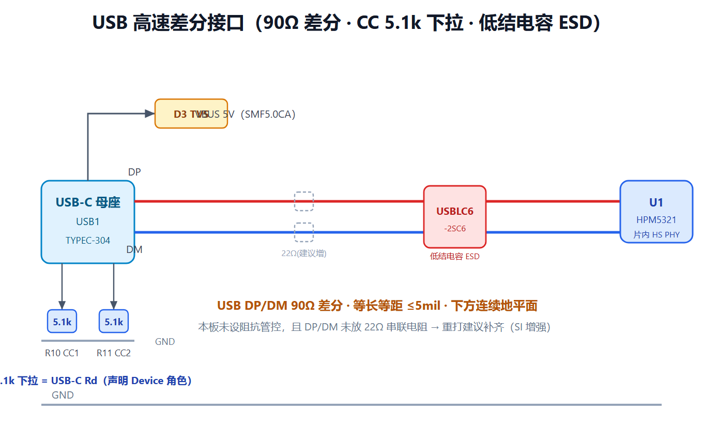

**USB 接口对应真实原理图（简化）**：

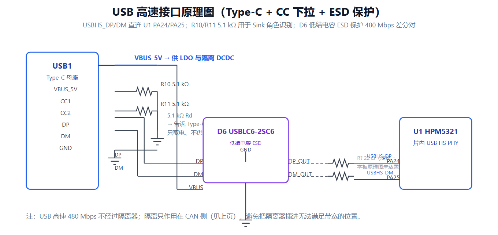

> 简化图与真实工程一致：CC1/CC2 经 R10/R11=5.1 kΩ 下拉到 GND（Sink 识别）；DP/DM 经 USBLC6-2SC6 低结电容 ESD 后直连 HPM5321 PA24/PA25。图中 22Ω 串联电阻用虚线表示，因本工程原理图**未放置**（属 SI 增强项）。

### 4.8 小结：原理图设计心法
- 先画**核心元件 + 子系统框图**（§1.1），再向下画每个模块的电源/地/信号。
- 每个对外接口都问一句"它怎么失效"→ 补 TVS/ESD/终端/滤波。
- 隔离边界必须"电源地都断"，否则隔离名存实亡。

---

## 5. PCB 设计

### 5.1 板材与层数（已据 PCB 源文件核实）
- 本板为 **4 层板**，堆叠为 **TOP（信号）/ Inner1（内电层·平面 PLANE）/ Inner2（信号 SIGNAL）/ BOTTOM（信号）**，板厚 1.6 mm。其中 Inner1 为 PLANE 类型（平面层，承载 GND/电源平面），Inner2 为 SIGNAL 类型（内层走线）。
- USB 差分走 TOP，正下方 Inner1 是连续地平面 → 回流连续，SI 优于 2 层板。这是当初选 4 层的真实收益，不是"重打建议"。
- 铜厚默认 **1 oz**（规则里同时存在 1oz/2oz 铜厚规则，本体按 1oz 量产）。
- ⚠️ 原始草稿曾误写成"2 层板、建议重打选 4 层"——已据 EasyEDA 工程源文件（`.epro2` 解包后的 `.epru`）更正。

> 下面把「这块 PCB 是怎么画出来的」和「每一层到底是什么」讲透——这正是面试/作品集里最该讲清楚的部分。数据来自通过 EasyEDA 桥接 API（`getAllLayers()`）读取的工程真实图层数据，与 §12.1 的核实结论一致。

#### 5.1.1 这块 PCB 是怎么画出来的（设计流程）

在 EasyEDA 里，PCB 不是凭空画的，流程是**先原理图、后 PCB**，中间靠「网表」衔接：

1. **画原理图（4 页）** —— 每一页元件都标了位号（U1、R10…）和网络名（GND、ISO_GND、USBHS_DP…）。见 `hardware/HPM5321高速隔离USBCANFD工具_原理图.pdf`。
2. **原理图 → 更新/转换到 PCB** —— 元件按位号「飞」进 PCB 编辑区，连线变成**飞线（ratline）**，提醒「这两个脚该连」。
3. **定层数 / 堆叠** —— 在板子设置里选 **4 层**，层序 `TOP / Inner1 / Inner2 / BOTTOM`，并把 **Inner1 设为 PLANE（平面层）** 整面铺 GND（这就是工程里 `Inner1 (id=15, PLANE)` 的由来）。
4. **画板框 + 摆元件** —— 画板外形（Board Outline），按 3D 图布局把 HPM5321 居中、Type-C 母座放边、接线端子放对侧。
5. **铺铜 + 布线** —— TOP 走元件和 USB 差分；Inner1 整面 GND 平面；Inner2 走内层信号；BOTTOM 补元件和走线。GND 与 ISO_GND 各自铺、互不连。
6. **设设计规则** —— 工程实测有 `DIFFER_ENTAIL`（差分对 DP1/DP2）和 `NET_LENGTH_TOLERANCE`（长度公差）规则，约束 USB DP/DM 等长等距（§5.3）。
7. **DRC 校验** —— 间距/短路/未连网络检查，通过才发厂。

#### 5.1.2 每一层到底是什么（对照工程真实图层）

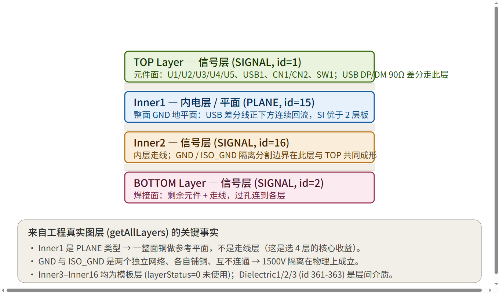

| 层（真实 id） | 类型 | 上面有什么 |
|---|---|---|
| **TOP (id=1)** | SIGNAL 信号层 | 元件面：HPM5321 / B0505S-1WR3 / SIT1051AT/3 / SIT1051AT/3 / CA-IS3742HW、Type-C 母座、接线端子、BOOT 拨码开关 / 调试排针；**USB DP/DM 90Ω 差分走这层**（下方紧挨 Inner1 地平面做回流） |
| **Inner1 (id=15)** | **PLANE 平面层** | 一整面 **GND 地平面**，不做走线。给所有表层信号当「地板」，回流路径最短、最干净 |
| **Inner2 (id=16)** | SIGNAL 信号层 | 内层走线；GND / ISO_GND 的**隔离分割边界**在这一层与 TOP 共同切出 |
| **BOTTOM (id=2)** | SIGNAL 信号层 | 焊接面：剩余元件 + 走线，用**过孔（via）**连到其它层 |
| Inner3–Inner16 | SIGNAL（模板，未用） | `layerStatus=0`，EasyEDA 默认模板层，**没用到**——所以你是 4 层不是 16 层 |
| Dielectric1/2/3 (id 361-363) | 介质 | 层间 FR-4 绝缘层（1.6mm 板厚由它们 + 铜厚构成） |
| 丝印/阻焊/钢网/装配/板框/Multi-Layer | 辅助层 | 印字、开窗、SMT 钢网、装配图、过孔环、板外形——不参与导电 |

**为什么是 4 层而不是 2 层？** —— 这是面试里最值得讲清楚的取舍：

- **2 层板的死穴**：只有 TOP/BOTTOM 两层信号，没有中间完整地平面。USB 跑 480 Mbps 时，差分线的回流路径被迫绕远，阻抗和眼图都难控。
- **4 层解法**：插一层 **Inner1 = 整面 GND 平面**，让 TOP 上的 USB DP/DM 正下方永远有一块连续「地板」做回流（§5.6 地回流）。信号质量从源头就有保障。
- **Inner2 当信号层**：把不急的内层走线塞进去，给表层腾空间摆元件和高速差分。
- **代价几乎为零**：4 层板对个人项目成本低、嘉立创打样成熟，所以当初直接选了 4 层（不是「2 层重打选 4 层」——§12.2 已据源文件更正过这个误写）。

### 5.2 阻抗控制（最关键的高速项，已据 PCB 源文件核实）
- USB DP/DM 目标 **90 Ω 差分**；CAN 虽是差分但速率相对低，终端 120 Ω 已匹配，通常不强制控阻抗。
- **实测本板未设置任何阻抗规则**（全板源文件无 `impedance` 约束字段）：USB DP/DM 的 90 Ω 目前靠**手动线宽/线距近似**，并非板厂阻抗管控。这是**已知短板**，不是"已做但可选"。
- **改进（若重打/量产）**：嘉立创下单勾**「阻抗管控」**并备注"Type-C DP/DM 90Ω 差分，介质 1.6mm FR-4"，让板厂反算线宽/线距；同时在原理图 DP/DM 各补一颗 22 Ω 串联阻尼电阻（见 §4.7b，本工程当前未放）。

### 5.3 差分线布线（笔记高速规范，已据 PCB 源文件核实）
- DP/DM **等长、等距**，下方有**连续参考地平面**（Inner1 平面层）提供回流。
- **实测本板已建立差分对规则（DP1/DP2）与"网络长度公差"规则（`NET_LENGTH_TOLERANCE`）**：差分等长/间距由设计规则约束，而非纯手工近似。这是当初 4 层板 + 规则驱动布线的真实做法。
- 不走锐角、不跨分割平面；换层时旁边打伴地过孔。

### 5.4 隔离间距与爬电（1500 V 落地，已据 PCB 源文件核实）
- 实测 PCB 中 `GND`（系统地）与 `ISO_GND`（隔离地）是**两个独立网络**，各自铺铜、互不相连——"隔离"在物理上成立（已在源文件 net 列表中确认）。
- 板内定义了多个 `REGION`（可能含隔离带/禁布区/板槽），但**具体隔离槽宽度与爬电距离需以实际 PCB + 板厂工艺/安规为准**。原稿写的"≥4–8 mm"是按安规经验给的参考值，**并非本板实测尺寸**——请勿当作已验证事实引用。
- 隔离器件（B0505S-1WR3 / CA-IS3742HW / SIT1051AT/3）跨在分割带上方，引脚不跨区混连。

下图从顶视图角度展示隔离如何在 PCB 上物理落地——左侧系统侧铺 GND 铜、右侧隔离侧铺 ISO_GND 铜，中间 CA-IS3742HW（数字隔离器）+ B0505S-1WR3（隔离 DC-DC）跨过 1500V 隔离栅：

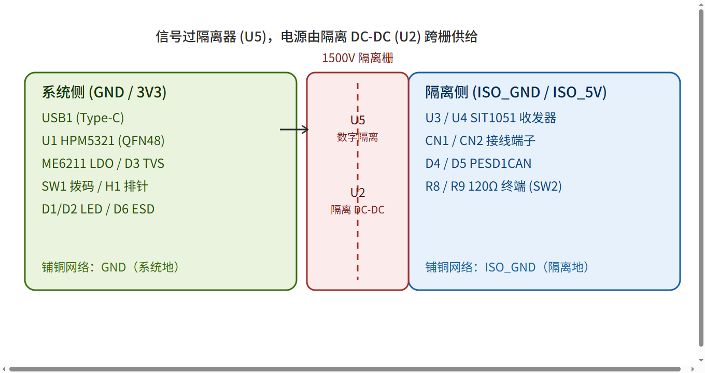

> 一句话收口：**Inner1 整面 GND 是「高速」的保障，GND/ISO_GND 双网络不连是「隔离」的保障，二者叠加 = 你的 4 层板同时拿到了 480Mbps 速度和 1500V 安全边界。**

### 5.5 电源完整性（PI）
- 退耦电容**紧贴**对应电源引脚放置，过孔尽量短；大电流路径（VBUS、ISO_5V）走宽铜/多过孔（≥1 A 打 2 个过孔，见笔记过孔规范）。
- LDO 输入/输出电容靠近芯片引脚。

### 5.6 地平面与回流
- 系统侧铺 GND 铜；隔离侧铺 ISO_GND 铜；两者不连通。
- 信号回流路径最短：差分线下方地平面连续，避免跨分割。

### 5.7 可制造性 DFM（笔记可制造性要求）
- 板边 2 mm 内不摆元件；丝印线宽 ≥ 8 mil、高度 40 mil，不压焊盘/过孔。
- Mark 点：1 mm 圆形焊盘，放板角对角 2 处，周边 3 mm 无元件，供 SMT 定位。
- 过孔内径 ≥ 8 mil（推荐 10 mil+）、外径 24 mil；散热区过孔开窗，接地过孔全连接。

### 5.8 热设计
- HPM5321 QFN48 底部有**散热焊盘（EPAD）**，PCB 上对应开窗 + 多个接地过孔把热导到内层/背面地，避免 480 MHz 满负荷过热。

### 5.9 下单 Checklist（把知识变成动作）
- [ ] 层数/板厚确认（**4 层 / 1.6 mm，已确认**）
- [ ] 勾选「阻抗管控」+ 备注 USB DP/DM 90 Ω（**本板当前未设，属待补项**）
- [ ] 考虑在原理图补 DP/DM 22 Ω 串联阻尼电阻（SI 增强，当前未放）
- [ ] DFM：板边留白、丝印不压盘、Mark 点
- [ ] 隔离槽/爬电距离按实际板厂工艺 + 安规确认（≥4–8 mm 为经验参考，非本板实测）

---

## 6. 数电专项（从本项目吃透数字电路）

### 6.1 差分信号为什么抗干扰
- 用两根线的**电压差**传信息，外部共模噪声同时加到两根线上被接收端减掉。CAN/USB 高速都用它——这是工业现场抗干扰的基石。

### 6.2 终端电阻与传输线反射
- 当信号沿走线传播，若末端阻抗 ≠ 线特征阻抗（120/90 Ω），能量会**反射**回来造成振铃/误码。终端电阻 = 特征阻抗，吸收反射。
- CAN 只在**总线两端**放 120 Ω；本板用终端切换开关可切，避免中间节点多余终端。

### 6.3 电平转换与数字隔离
- HPM5321 GPIO 是 3.3 V；CAN 收发器 VIO 配 3.3 V 时逻辑匹配。若收发器是 5 V 逻辑，CA-IS3742 隔离器本身就完成 3.3↔5 V 转换，省外部电平转换电路。

### 6.4 上拉/下拉与"确定状态"
- CC 5.1 k 下拉（声明 Device 角色）、BOOT/RESET 上拉（默认确定电平）——同一类思想：**给不确定的输入一个确定状态**，防止浮空误动作（笔记知识 5）。

### 6.5 CAN 位时序 / 采样点（建立-保持）
- CAN 每位由同步段+传播段+相位段组成，收发双方靠**比特率+采样点**对齐。终端电阻错/缺会导致边沿畸变、采样错误——所以终端切换开关拨错会直接收不到帧。

### 6.6 推挽 vs 开漏
- USB DP/DM 在 HS 模式是**差分推挽**；I2C 等才是开漏需上拉。本板不涉及开漏总线，但理解它有助于读懂其它项目。

---

## 7. 模电专项（从本项目吃透模拟电路）

### 7.1 LDO 原理与压差
- LDO = 误差放大器 + 调整管，像"可调水龙头"：输入-输出压差越小效率越高。ME6211 压差约 0.1–0.2 V 级，5→3.3 V 压差够。

### 7.2 退耦/旁路电容（频率特性）
- **小电容（100 nF）滤高频噪声**：贴芯片脚旁，提供本地瞬态电流，抑制电源 bounce。
- **大电容（10/22 µF）稳直流**：应对较大电流突变。
- 实际选电容要看 **ESR 与自谐振频率**——多层瓷介（MLCC）在 MHz 附近自谐振，正是退耦最佳频段。

### 7.3 晶振负载电容与起振
- 反相器 + 晶振 + 负载电容构成振荡器，负载电容决定振荡频率精度。`CL ≈ (C1·C2)/(C1+C2)+Cstray`，22 pF 是常见安全值。

### 7.4 磁珠（阻抗-频率）
- L1 4.7 µH 磁珠对**高频数字噪声呈现高阻抗**、对直流几乎无碍，把数字噪声挡在 VANA 模拟电源外，提升 ADC/模拟性能。

### 7.5 TVS / ESD 钳位
- 正常时高阻；电压超阈值瞬间变成低阻，把浪涌/静电泄放到地。
- **结电容是关键权衡**：USB DP/DM 用低结电容阵列（USBLC6），否则 480 Mbps 眼图塌陷；CAN 用 PESD1CAN，速率低、容限大。

### 7.6 隔离 DC-DC 的开关噪声
- B0505S 内部高频开关，输出带纹波/尖峰。靠输入/输出多级电容（10 µF + 1 µF + 100 nF）滤平，否则噪声耦合进 CAN 收发器引起误帧。

### 7.7 共模干扰与共模抑制
- 现场 CAN 两根线常受同相噪声（地电位差、电机干扰），差分接收天然抑制共模。隔离进一步切断共模回流路径，双重保护 PC。

---

## 8. 焊接与装配（边学边做，防炸板）

> 完整方法论见 [`my-build-log.md`](my-build-log.md)；这里给"该怎么做 + 为什么"。

**PCB 3D 顶视图（辅助焊接参考，3D 图仅供参考，具体以实物为准）：**

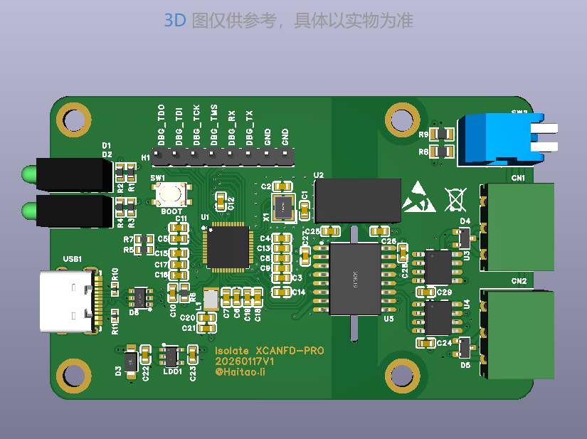

> 图中可见全部元件位号：U1(HPM5321 QFN48 居中)、U2(B0505S 隔离电源)、U3/U4(SIT1051 CAN 收发器)、U5(CA-IS3742 数字隔离器)、USB1(Type-C)、CN1/CN2(接线端子)、H1(调试排针)、SW1(拨码)、D1/D2(LED)、D3–D6(TVS/ESD)。焊接时对照此图确认每个元件的位置与方向。

### 8.1 工具清单
- 恒温烙铁（60 W+）、0.5–0.8 mm 焊锡、助焊膏、**热风枪（焊 QFN 强烈推荐）**、镊子、放大镜/显微镜、吸锡带、酒精棉、静电手环。
- 调试：万用表、**带限流的直流稳压电源（首次上电必用，限流 100 mA）**、USB 转串口模块（3.3 V 电平）。

### 8.2 焊接顺序（原型优先，方案 2）
1. 先焊**最小被动件**（R/C/D 小料）——板平、好固定。
2. 焊**电源部分**（ME6211、B0505S、相关电容）→ **上电测电源轨**：万用表蜂鸣档量 `VCC–GND` 无短路，再量 3.3 V、ISO_5V 对。
3. 电源 OK 再焊**贵芯片**（HPM5321 HPM5321、SIT1051AT/3、CA-IS3742HW）——万一电源有毛病，烧的是几毛钱 LDO 不是几十块 MCU。
4. 最后焊**接插件/机械件**（USB-C 座、端子、排针、开关），全程板子能平放。

> 折中方案：小被动件 → 电源并测轨 → 中件 → 最后 MCU/收发器/接插件。

### 8.3 QFN48 焊接要点（新手最易虚焊）
- 先给焊盘薄薄涂助焊膏，芯片对位，**热风枪 320–350 ℃ 均匀吹**，看焊锡自然润湿。
- 焊完用**显微镜/放大镜**检查四边是否虚焊、桥连；底部 EPAD 也要上锡导热。
- 有条件用 X-ray 看底部（个人通常没有，靠功能测试兜底）。

### 8.4 被动件封装
- 0402（CC 下拉 R10/R11）最小，需稳手；0603（R1–R7、退耦）、0805（R8/R9 120Ω）较易。新手可把 0402 手工换成 0603（若引脚兼容）。

### 8.5 上电前必查（万用表）
- 蜂鸣档量各电源网络对地**无短路**；量退耦电容两端不短路。
- 确认 VBUS 5 V、3.3 V、ISO_5V 各自来源正确，GND 与 ISO_GND **互不连通**（隔离验证第一步）。

---

## 9. 调试与上电

### 9.1 首次上电（限流保护）
- 用带限流电源从 VBUS 供 5 V、限流 **100 mA**。电流异常（>100 mA 或焦味）→ 立刻断电，查短路。

### 9.2 电源轨测量
- 量 3.3 V（LDO 输出）、ISO_5V（B0505S 输出）是否到位；量压差/纹波（无示波器时至少确认直流值）。

### 9.3 三类工具的分工与"我目前的现状"（诚实版，见知识 4）

| 现象 | 理想工具 | 我目前用什么 |
|---|---|---|
| 板子不供电/发烫 | 万用表 | **万用表**（完全能查，最救命） |
| USB 枚举失败 | 示波器 | **电脑替代**：设备管理器看 PCAN 设备、PCAN-View 能否开 |
| CAN 帧错/协议不对 | 逻辑分析仪 | **电脑替代**：PCAN-View 直接解 CAN ID/DLC/数据 |

- 边界：万用表+上位机**查不了信号完整性**（波形毛刺、眼图、晶振起振）。这些等以后上 100–200 MHz 示波器再补（笔记：单片机开发此规格足够）。
- 关键认知：把"该用什么"和"手头只有什么"分开写——既证明懂方法论，又不夸大条件，作品集反而更可信。

### 9.4 故障排查树
- **不上电/电流大**：万用表量 VCC–GND 短路 → 分段断开电源域定位。
- **USB 不枚举**：查 BOOT 是否进 ISP、CC 下拉对不对、DP/DM 有无断线、固件烧没烧。
- **CAN 收不到**：终端切换开关的终端电阻拨对没、波特率/采样点匹配没、隔离两侧各自有电没。

### 9.5 烧录流程（QFN48 只能 UART0）
1. USB 转串口接调试排针：TX→DBG_RX、RX→DBG_TX、GND→GND（模块拨 **3.3 V**，5 V 烧芯片）。
2. 按住 BOOT 拨码开关到 BOOT 档 → 插 USB 上电 → 进 UART0 ISP。
3. HPMicro Manufacturing Tool 载入 `*.bin` → 烧写 → 复位。

### 9.6 从调试到量产：工厂协作与制造交接（笔记：SMT 工厂选择 / 隐性实力）
> 笔记的硬核经验：**选 SMT 工厂看技术细节，不看出厂设备先进度**；真正拉开差距的是「隐性实力」——设备维保校准记录、来料检测、锡膏管理（0–10℃ 存储 / 4 h 回温 / 24 h 用完）、ECN 工程更改流程、防静电环境（定期测阻抗留存记录）。这些决定小批量焊接的一致性与良率。

本项目的制造交接要点（无论自己焊还是发工厂）：
- **三件套齐备**：Gerber + BOM + 坐标文件；0402（R10/R11 CC 下拉）若手焊困难可发工厂贴片，但需确认工厂能贴 0402。
- **检测手段对齐**：SPI（锡膏厚度）/ AOI（贴片缺陷）/ X-ray（QFN 底部虚焊）。个人没有 X-ray，所以 §8.3 用「显微镜查四边 + 功能测试兜底」替代——这是诚实的取舍，不是疏漏。
- **防静电**：焊 HPM5321 / SIT1051 等 CMOS 器件必须戴防静电手环、工作台接地。笔记把「防静电环境定期测阻抗」列为隐性实力，个人也不能省。
- **ECN 思维**：本项目已发生一次设计变更（§12 核查发现的「阻抗规则未设 / DP/DM 无串联阻尼」），若要重打，应走「改原理图 → 更新 BOM → 同步 Gerber」的变更闭环，而非随手改一处。

体会：笔记说「逆向阶段压缩成本会偷工减料在 TVS/保险丝/安规件上」——本项目**反其道而行**，TVS/ESD/隔离一个没省（§10.2），因为对外接口暴露在恶劣总线环境。把「省料 vs 可靠性」的权衡写清楚，比单纯列 BOM 更显工程成熟度。

---

## 10. 可靠性与 EMC 复盘（用笔记的"高手思维"收尾）

### 10.1 失效模式分析（FMEA，按接口）
| 接口 | 可能失效 | 本板对策 |
|---|---|---|
| USB VBUS | 插拔浪涌 | SMF5.0CA TVS |
| USB DP/DM | ESD/眼图塌陷 | USBLC6-2SC6 低结电容 ESD 阵列 |
| CANH/L | 现场静电/共模 | PESD1CAN ESD + 1500 V 隔离 |
| 电源 | 短路/过流 | 限流上电、LDO 保护 |
| 隔离 | 爬电不足击穿 | 开槽+间距满足 1500 V |
| 焊接 | QFN 虚焊 | 显微镜检查 + 功能测试 |

### 10.2 防护清单（"花小钱买可靠性"）
- TVS/ESD 一律默认加，不省"隐蔽但关键"的料（笔记逆向阶段雷区）。
- 隔离连续性铁律：信号过、电源地都断。
- 终端电阻可切换，适配不同总线位置。

### 10.3 可改进点（作品集诚实项）
1. USB 差分勾阻抗管控（90 Ω）。
2. 隔离爬电靠 PCB 开槽/间距真正落地 1500 V。
3. 两路 CAN 终端电阻独立控制（目前共用 终端切换开关）。
4. 增加"终端电阻是否接入"硬件检测，上位机可提示。

### 10.4 用笔记的「高手五层认知」复盘本设计
> 笔记把高手与普通工程师的差距拆成五层。用这五层当「镜子」，逐一照本板的设计决策——这也是面试时能讲出深度的框架：

| 认知层级（笔记） | 本板里的对应体现 |
|---|---|
| **1. 看电路是电磁场 / 电流环路，不是器件和线** | §5.6 回流路径：差分线下方 Inner1 连续地平面提供回流；§3.4 隔离边界「电源地都断」本质是打断共模电流环路 |
| **2. 可靠性思维：先想「怎么失效」** | §10.1 FMEA 逐接口列失效 + 对策；§10.2 TVS/ESD/隔离一个不省 |
| **3. 问题定位：根因分析，不「换件试错」** | §9.3 把「该用什么工具」和「手头只有万用表」分开，用 PCAN-View 可视化根因，而非盲目换芯片（§9.4 故障树按症状定位） |
| **4. SI / PI / EMC 内功：从源头解决** | §5.2 阻抗管控（已知短板、源头补）、§7.2 退耦、§7.4 磁珠挡数字噪声、§7.6 隔离 DCDC 开关噪声滤波 |
| **5. 量产系统思维：管控能量与热分布** | §5.7 DFM、§5.8 QFN EPAD 散热过孔、§9.6 工厂协作与 ECN 变更闭环 |

收获：第 1、4 层（场思维 + SI/PI/EMC）是本项目**最该补**的——实测未设阻抗规则（§5.2）说明「从源头控 SI」还没做到位；第 2、3、5 层（可靠性 / 根因 / 量产）相对扎实。这份自检比罗列参数更有说服力。

---

## 11. 从 0 到 1 的闭环总结

> 这块板的设计逻辑是：**用 HPM5321 的高集成（片内 USB HS PHY + 多路 CAN-FD）压缩 BOM，再用「隔离 DCDC + 数字隔离器 + 隔离 CAN 收发器」构建 1500 V 安全边界，最后用拨码开关/排针弥补 QFN48 封装的调试不便**。它不是堆料，而是在性能/体积/成本/可焊性/安全性之间的一次典型嵌入式硬件权衡——而**权衡本身，就是硬件工程师的核心能力**（笔记：高手与普通工程师差距在认知深度与系统思维）。

**给面试官的一句话故事素材**：
"我做了一个 USB-CAN FD 隔离适配器，从需求拆解、选型对比（为什么选 HPM5321 而非 STM32）、原理图、PCB 阻抗与隔离设计、到自己焊接调试全走完。最难的是 1500 V 隔离——我让信号过隔离器、电源地完全断开，用 B0505S 单独给收发器供电。过程中我只有万用表，就用 PCAN-View 把 CAN 帧可视化来排错，边界是查不了信号完整性，这部分我规划下一步上示波器。"

---

## 12. 文档准确性核查（哪些已核实 / 哪些曾是猜测，已据 PCB 源文件更正）

> 本节是给面试官/审稿人的"诚实清单"：本文件绝大部分内容来自真实工程（原理图 4 页 + BOM 26 料 + 设计理由 + 实物日志），但初稿有几处是按"通用经验"推测的，已用 **EasyEDA 工程源文件（`.epro2` → `.epru` 解包）** 逐条核实并更正。下面按"结论 / 原稿说法 / 实际核实 / 处理"列出。

### 12.1 已据 PCB 源文件**核实正确**、无需改动（举例）
| 内容 | 核实方式 | 结论 |
|---|---|---|
| 板为 **4 层**、TOP/Inner1(PLANE)/Inner2(SIGNAL)/BOTTOM、1.6 mm、1 oz | 解析 `.epru` 图层定义与铜厚规则 | ✅ 正确 |
| **差分对规则 DP1/DP2 + 网络长度公差规则**已建立 | `.epru` 中 `DIFFER_ENTAIL` / `NET_LENGTH_TOLERANCE` 规则 | ✅ 正确（初稿只说"手工等长"，实际是规则约束） |
| `GND` 与 `ISO_GND` 是**两个独立网络**、各自铺铜 | `.epru` net 列表 | ✅ 正确（隔离在物理上成立） |
| CC 5.1k 下拉（R10/R11）、USBLC6-2SC6 低结电容 ESD、SMF5.0CA TVS、PESD1CAN | 原理图 + BOM | ✅ 正确 |
| C20/C21=22µF 储能、C1/C2=22pF 晶振负载 | 原理图 | ✅ 正确 |
| 三级分立隔离（B0505S + CA-IS3742 + SIT1051AT/3） | 原理图 + BOM | ✅ 正确 |

### 12.2 初稿**猜测/写错**、已更正（重点）
| 章节 | 原稿（猜测） | 实际核实 | 已改 |
|---|---|---|---|
| §5.1 | "**2 层板**，建议重打选 4 层" | 实测就是 **4 层板**（Inner1=PLANE 地平面） | ✅ 改为"4 层板，已确认" |
| §4.7(b) | "原理图 DP/DM **串了 22Ω 匹配电阻**" | 原理图 DP/DM **无任何串联电阻**（仅 CC 下拉 + ESD） | ✅ 改为"未放，列为 SI 增强项" |
| §5.2 | "嘉立创下单勾选阻抗管控"（暗示可选/已考虑） | 全板源文件**无 impedance 规则**，90Ω 靠线宽近似 | ✅ 改为"已知短板，重打应补" |
| §5.3 | "差分等长靠手工（≤5mil）" | 实测有**差分对规则 + 长度公差规则**约束 | ✅ 改为"由设计规则保证" |
| §5.4 | "隔离爬电 ≥ 4–8 mm" | 该数值是**安规经验值，非本板实测** | ✅ 改为"需按实际板厂/安规确认" |

### 12.3 仍属"通用最佳实践 / 理论"、未逐条在本板实测（保留，但请勿当作本板测量值）
- §5.5–§5.8 电源完整性 / 地回流 / DFM / 热设计（如 QFN EPAD 散热过孔）：属行业通用方法，QFN 带 EPAD 是标准；文中作为**方法论**而非本板实测数据。
- §7 模电公式（负载电容 `CL`、磁珠阻抗-频率、退耦 ESR/自谐振）：通用理论。
- §8 焊接与 §9 调试：通用工艺；§9.3"仅万用表 + PCAN-View"来自实物日志，属实。
- §10.3 第 3 条"两路 CAN 终端共用 终端切换开关"：从原理图观察，但 CID 字体导致连线文本提取不全，**建议你在 EDA 里肉眼确认一次 终端切换开关是否同时控制两路终端**。
- 新增的「背景与设计目标」前言（含项目背景 / 生命周期定位）、§3.5（固件分层）、§9.6（工厂协作 / 制造交接）、§10.4（高手五层认知）均来自的**行业经验 / 通用最佳实践**，属方法论与认知框架，非本板实测测量值；其中 §9.6 的工厂检测（SPI/AOI/X-ray）、锡膏管理、ECN 等为「应知应会」，本板未实际走量产，请勿当作本板已执行数据引用。


---
