# HPM5321 高速隔离 USB-CAN FD 工具 — 焊接完整版指南

> **本指南版本对应 PCB：`isolated XCANFD-PRO 20260117V1 @FanhaoCloud`**（即嘉立创 EDA 截图右上角的 3D 板）
> **BOM 数据源**：[`docs/bom.md`](bom.md)（实测导出 26 种料）
> **适用人群**：愿意自己手焊、想一边焊一边学硬件的人（你现在的状态）；也兼容「全部买件 → 找 SMT 厂」的量产场景。
> **核心原则**：**先焊电源，量好再上贵芯片**。一炸板动辄几十块 HPM5321，量一分钟电省一个 MCU。

---

## 0. 这块板子比你想象的难，提前打预防针

这块板子不是 Arduino 那种「几颗 LED 一个 MCU」的难度，**属于嵌入式进阶**：

| 难度项 | 说明 |
| --- | --- |
| QFN-48 主控 | 底部散热焊盘 + 0.5mm 周边引脚间距，必须热风枪 + 助焊膏 + 锡膏回流，新手头几次空焊 / 连锡几乎必然 |
| 隔离 DC-DC | 模块化封装（U2 B0505S-1WR3），但有方向、还有原副边隔离距离要求，错了就 1500V 失效 |
| 多通道高速 | USB 2.0 高速差分 90Ω、CAN 差分 120Ω，阻抗线已经画在 PCB 上，**焊接不能桥接差分对** |
| 双地系统 | USB 侧 GND 与 CAN 侧 ISO_GND 物理隔开，跨隔离边界走线是禁忌 |

> **心理预期**：第一块板空焊 / 翻车概率 30%~50% 正常；第二块就稳了；别第一块炸了就觉得硬件难。

---

## 1. 物料清单（实操前对照）

完整立创料号见 [`docs/bom.md`](bom.md)。**下面只列焊接顺序敏感的元件**，对照你截图的 BOM 表全部要齐。

### 1.1 主控 + 时钟（最贵、最难焊）

| 位号 | 名称 | 立创料号 | 数量 | 备注 |
| --- | --- | --- | --- | --- |
| U1 | HPM5321IEG1（QFN-48） | C49451867 | 1 | 注意方向：第 1 脚有丝印圆点 / 缺口 |
| X1 | 24MHz 晶振（CRYSTAL-SMD_4P） | C5444545 | 1 | 4 脚贴片，正反面有方向 |
| C1, C2 | 22pF（C0603） | C1653 | 2 | 晶振两端 |
| L1 | 4.7μH 功率电感（IND-SMD_2.5×2.0） | C87640 | 1 | MCU 内核 DCDC 的电感 |

### 1.2 电源路径（先焊这部分）

| 位号 | 名称 | 立创料号 | 数量 |
| --- | --- | --- | --- |
| LDO1 | ME6211C33M5G-N（SOT-23-5，USB 5V → 3.3V） | C82942 | 1 |
| U2 | B0505S-1WR3（**PWRM-TH 插件**，5V → 隔离 5V） | C7465178 | 1 |
| C6, C25, C26 | 10μF（C0603） | C19702 | 3 |
| C16, C18 | 4.7μF（C0603） | C19666 | 2 |
| C20, C21 | 22μF（C0603） | C59461 | 2 |
| C22, C23, C27, C28 | 1μF（C0603） | C15849 | 4 |
| C3–C29 中的 100nF | 退耦（C0603） | C14663 | **16 颗**，每颗电源脚旁一颗，**少一颗都可能出问题** |

### 1.3 CAN + 隔离（中间焊）

| 位号 | 名称 | 立创料号 | 数量 |
| --- | --- | --- | --- |
| U3, U4 | SIT1051AT/3（CAN-FD 收发器，SOP-8） | C5382551 | 2 |
| U5 | CA-IS3742HW（4 通道数字隔离器，SOIC-16） | C528654 | 1 |
| R8, R9 | 120Ω（R0805） | C17437 | 2（CAN 终端电阻） |
| CN1, CN2 | KF2EDGR 3.81-3P（**TH 端子**） | C441183 | 2 |
| D4, D5 | PESD1CAN（SOT-23-3，CAN 总线 ESD） | C2687121 | 2 |

### 1.4 USB + 接口（最后焊）

| 位号 | 名称 | 立创料号 | 数量 |
| --- | --- | --- | --- |
| USB1 | TYPEC-304-BCP16（USB-C 母座，SMD） | C720629 | 1 |
| R10, R11 | 5.1kΩ（R0402，CC 下拉 Rd） | C25905 | 2 |
| D6 | USBLC6-2SC6（SOT-23-6，USB ESD） | C2827654 | 1 |
| H1 | X6511WV-08H（1×8 排针，TH 调试 / 烧录） | C706880 | 1 |

### 1.5 开关 + LED + 保护（哪里空焊补哪里）

| 位号 | 名称 | 立创料号 | 数量 |
| --- | --- | --- | --- |
| SW1 | TS-KG89S-AT25F（**轻触按键**，BOOT 按钮） | C2874599 | 1 |
| SW2 | DP-02RP（2 位琴键，**终端电阻切换**） | C129041 | 1 |
| R1–R4 | 5.1kΩ（R0603） | C23186 | 4 |
| R5–R7 | 10kΩ（R0603） | C25804 | 3 |
| D1, D2 | A694B/2SYG/S530-E2（LED，黄绿） | C93880 | 2（**长脚是正极**） |
| D3 | SMF5.0CA（SOD-123，5V TVS） | C435453 | 1（**有方向**） |

### 1.6 物料到手后先做的事
- **逐包对照清单**，差一颗不焊（尤其是 16 颗 100nF 退耦）
- 用万用表二极管档**测一下 USB-C 母座、晶振、芯片**有没有运输短路
- **IC 类元件**放防静电袋里、用镊子取；不要徒手摸芯片引脚（人手指油脂对贴片焊接影响不大，但对芯片保存有影响）

### 1.7 元件实物照片对照（焊接前先翻一眼）

> 照片目录：[`docs/元器件照片/`](元器件照片/)。下表把每个位号对应到实物照片，**焊之前先对照照片认元件**，尤其要注意方向、封装、丝印。
>
> **容值编码速记**（阻容照片文件名末尾 3 位数字 = 容值）
> - `104` = 10×10⁴ pF = **100nF**　`105` = **1μF**　`106` = **10μF**　`226` = **22μF**　`475` = **4.7μF**　`220` = **22pF**
> - 电阻 `5101` = 510×10¹ = **5.1kΩ**　`1200` = 120×10⁰ = **120Ω**　`1002` = 100×10² = **10kΩ**

| 组 | 位号 | 名称 / 参数 | 实物照片 | 焊接注意 |
| --- | --- | --- | --- | --- |
| 已焊 | **LDO1** | ME6211C33M5G-N（SOT-23-5，5V→3.3V） | [`元器件照片/ME6211C33M5G-N.jpg`](元器件照片/ME6211C33M5G-N.jpg) | **⚠️ 注意 1 脚方向**（顶面圆点 / 斜角对齐 PCB 丝印） |
| 已焊 | **C3, C4, C5, C7** | 100nF（C0603，YAGEO） | [`元器件照片/CC0603KRX7R9BB104.jpg`](元器件照片/CC0603KRX7R9BB104.jpg) | 无方向，文件名 `104` |
| 已焊 | **C22, C23** | 1μF（C0603，SAMSUNG） | [`元器件照片/CL10A105KB8NNNC.jpg`](元器件照片/CL10A105KB8NNNC.jpg) | 无方向，文件名 `105` |
| 已焊 | **C6, C25** | 10μF（C0603，SAMSUNG） | [`元器件照片/CL10A106KP8NNNC.jpg`](元器件照片/CL10A106KP8NNNC.jpg) | 无方向，文件名 `106` |
| 组3 | L1 | 4.7μH 功率电感（SWPA252012S4R7MT） | [`元器件照片/SWPA252012S4R7MT.jpg`](元器件照片/SWPA252012S4R7MT.jpg) | 电感无需方向 |
| 组2 | C20, C21 | 22μF（C0603） | [`元器件照片/CL10A226MQ8NRNC.jpg`](元器件照片/CL10A226MQ8NRNC.jpg) | 文件名 `226` |
| 组6 | U2 | B0505S-1WR3（隔离 DC-DC，插件） | [`元器件照片/B0505S-1WR3.jpg`](元器件照片/B0505S-1WR3.jpg) | **⚠️ 有方向**，丝印圆点对齐 |
| 组6 | C26 | 10μF（C0603，SAMSUNG） | [`元器件照片/CL10A106KP8NNNC.jpg`](元器件照片/CL10A106KP8NNNC.jpg) | 同 C6/C25，随 U2 焊 |
| 组7 | U3, U4 | SIT1051AT/3（CAN 收发器，SOP-8） | [`元器件照片/SIT1051AT-3.jpg`](元器件照片/SIT1051AT-3.jpg) | **⚠️ 注意 1 脚丝印**，同型号 ×2 一起焊 |
| 组7 | U5 | CA-IS3742HW（数字隔离器，SOIC-16） | [`元器件照片/CA-IS3742HW.jpg`](元器件照片/CA-IS3742HW.jpg) | **⚠️ 注意 1 脚丝印**（跨隔离边界放置） |
| 组1 | R8, R9 | 120Ω（R0805，终端电阻） | [`元器件照片/0805W8F1200T5E.jpg`](元器件照片/0805W8F1200T5E.jpg) | 文件名 `1200` |
| 组5 | CN1, CN2 | KF2EDGR-3.81-3P（CAN 端子，TH） | [`元器件照片/KF2EDGR-3.81-3P.jpg`](元器件照片/KF2EDGR-3.81-3P.jpg) | 插件，最后插焊 |
| 组4 | D4, D5 | PESD1CAN（CAN ESD，SOT-23-3） | [`元器件照片/PESD1CAN.jpg`](元器件照片/PESD1CAN.jpg) | **⚠️ 有方向** |
| 组3 | X1 | 24MHz 晶振（XL2EL89C01…-24M） | [`元器件照片/XL2EL89C01-11YLC-24M.jpg`](元器件照片/XL2EL89C01-11YLC-24M.jpg) | **无极性，正着贴** |
| 组2 | C1, C2 | 22pF（C0603） | [`元器件照片/CL10C220JB8NNNC.jpg`](元器件照片/CL10C220JB8NNNC.jpg) | 文件名 `220`，晶振负载 |
| 组8 | U1 | HPM5321IEG1（QFN-48，主 MCU） | [`元器件照片/HPM5321IEG1.jpg`](元器件照片/HPM5321IEG1.jpg) | **🔥 最难**：热风枪+锡膏，注意 1 脚 |
| 已焊 | USB1 | TYPEC-304-BCP16（Type-C 母座，SMD） | [`元器件照片/TYPE-C-304-BCP16.jpg`](元器件照片/TYPE-C-304-BCP16.jpg) | 固定脚多，先点对角 |
| 组1 | R10, R11 | 5.1kΩ（R0402，CC 下拉 Rd） | [`元器件照片/0402WGF5101TCE.jpg`](元器件照片/0402WGF5101TCE.jpg) | 0402 小，勿丢 |
| 组4 | D6 | USBLC6-2SC6（USB ESD，SOT-23-6） | [`元器件照片/USBLC6-2SC6.jpg`](元器件照片/USBLC6-2SC6.jpg) | **⚠️ 有方向** |
| 组5 | SW1 | TS-KG89S-AT25F（轻触按键，BOOT） | [`元器件照片/FS-KC8S-AT25F.jpg`](元器件照片/FS-KC8S-AT25F.jpg) | SMD，方向无所谓但位置固定 |
| 组5 | SW2 | DP-02RP（2 位琴键，终端切换，TH） | [`元器件照片/DIP-02RP.jpg`](元器件照片/DIP-02RP.jpg) | 插件，最后 |
| 组4 | D1, D2 | LED（黄绿，A694B/2SYG/S530-E2） | [`元器件照片/CJS530-E2.jpg`](元器件照片/CJS530-E2.jpg) | **长脚为正极** |
| 组4 | D3 | SMF5.0CA（5V TVS，SOD-123） | [`元器件照片/SMF5.0CA.jpg`](元器件照片/SMF5.0CA.jpg) | 有方向 |
| 组5 | H1 | X6511WV-08H（1×8 排针，TH 调试/烧录） | [`元器件照片/X6511WW-08H-C60D30.jpg`](元器件照片/X6511WW-08H-C60D30.jpg) | 插件，最后 |
| 组1 | R1–R4 | 5.1kΩ（R0603） | _（无单独照片，同族丝印）_ | 文件名 `5101` 同族 |
| 组1 | R5–R7 | 10kΩ（R0603） | [`元器件照片/0603WAF1002T5E.jpg`](元器件照片/0603WAF1002T5E.jpg) | 文件名 `1002` 同族（**已补购，本板需焊**） |
| 组2 | C16, C18 | 4.7μF（C0603） | [`元器件照片/CL10A475KO8NNNC.jpg`](元器件照片/CL10A475KO8NNNC.jpg) | 文件名 `475` |
| 组2 | C27, C28 | 1μF（C0603） | [`元器件照片/CL10A105KB8NNNC.jpg`](元器件照片/CL10A105KB8NNNC.jpg) | 文件名 `105`，同 C22/C23 |

**注（照片与 BOM 的小差异，焊前务必确认）：**

- ✅ **D3 封装已核对（2026-08-16 用户拍摄包装标签确认）**：实物立创 C435453 / SMF5.0CA / SOD-123 / AnBon（安邦），与 BOM 完全一致。原照片文件名 SMBJ5.0CA.jpg 系命名笔误，已重命名为 SMF5.0CA.jpg。
- **② X1 照片 `XL2EL89C01…`** 与 BOM 的 `XL2EL89COI…` 末尾字符略有差异，但都是 **24MHz** 晶体，参数一致，可焊。
- **③ H1 照片 `X6511WW-08H`** 与 BOM `X6511WV-08H` 仅末位字母不同，同系列 1×8 排针，可焊。
- **④ U5（CA-IS3742HW 数字隔离器）实物照片已补充**（2026-08-20 用户拍摄元件标签确认）：实物立创 C528654 / CA-IS3742HW / SOIC-16 / Chipanalog（川土微），与 BOM 完全一致，4 通道数字隔离器，焊前按照片 + PCB 丝印认 1 脚。
- **⑤ R5–R7（0603WAF1002T5E 10kΩ 电阻）实物照片已补充**（2026-08-20 用户拍摄元件标签确认）：实物立创 C25804 / 0603WAF1002T5E / R0603 / 10kΩ ±1% / UNI-ROYAL（厚声），与 BOM 完全一致，文件名末 3 位 `1002` = 10kΩ。

---

## 2. 工具与环境

### 2.1 焊接工具（最低配置 → 升级配置）

| 工具 | 最低要求 | 强烈推荐 |
| --- | --- | --- |
| 烙铁 | 可调温 350°C | T12 / T15 焊台，350–380°C，**接地良好** |
| 烙铁头 | 尖头 / 刀口 | 加马蹄形（处理 QFN 拖焊） |
| 热风枪 | 可调温 | 8586 之类，350°C 风量 2-3 档 |
| 助焊膏 | **必备** | 品牌不限（中性 / 无铅都行），QFN 离了它一定翻车 |
| 锡丝 | 0.5mm 含松香 | 0.3mm 也行（精细焊） |
| 锡膏（**低温 Sn-Bi**） | 可选 | QFN 用锡膏 + 热风枪会显著提升成品率 |
| 镊子 | 弯头 + 直头 | 弯头 ESD 镊子 |
| 吸锡带 / 吸锡器 | 必备 | 处理连锡用 |
| 洗板水 / 异丙醇 | 必备 | 焊完清理松香残留 |
| 放大镜 / 显微镜 | 必备 | **QFN 必须有**（手机微距镜凑合能用） |
| 万用表 | 必备 | 上电前测短路 |
| 防静电手环 | 必备 | MCU / 收发器都比较怕静电 |

### 2.2 测试仪器
- **万用表**（最低）：测电压、通断、短路
- **示波器**：不在则 USB 通信判断用 PCAN-View 等上位机替代
- **逻辑分析仪**：CAN / SPI 协议解析，本项目其实用得不多

### 2.3 环境
- 工作台铺防静电垫或硬纸板（防板子滑动）
- 良好通风（焊锡烟雾别直接吸）
- 光线充足（QFN 脚几乎看不见）

### 2.4 没有防静电手腕带？—— 平替防静电方案（焊 IC 前必看）

> QFN 主控（U1）、隔离器（U5）、CAN 收发器（U3/U4）都很怕 ESD。**没有手腕带绝不代表可以徒手硬上**——下面这套平替方案能把静电风险压到很低，成本几乎为零。核心思路只有一个：**让"你的身体"和"芯片/PCB"始终处于同一电位（都接到真正的地）**。

**① 让身体先放电 + 保持接地（替代手腕带）**
- 焊接前，先**用手摸一下自来水管 / 暖气片 / 插着电的台式机机箱金属外壳 / 接地的金属窗框**（任一真正接地的金属体）2~3 秒，把身上静电放掉。
- 整个焊接过程中，**每隔一会儿就再摸一下**这个接地金属体（比如每次拿新元件前）。这比戴手腕带简单，但效果接近——关键是"持续把身体电位拉到地"。
- 如果工作台边有**插着电的台式机**，直接把**小一字螺丝刀搭在机箱金属外壳上**，手一直扶着螺丝刀柄金属部分即可（柄是绝缘的，安全），等于一个"临时手腕带"。

**② 工作台也接同一个地（可选但推荐）**
- 铺一张普通纸板/杂志页在桌面上（防滑动），上面再放 PCB。若手头有铝箔，把铝箔摊平铺在桌面，边缘用导线/夹子连到上面的接地金属体，PCB 放铝箔上——整片工作区同电位。

**③ 工具接地（比手腕带更关键）**
- **烙铁**：必须用**三线插头**的温控烙铁。焊前用万用表测「烙铁头 ↔ 电源插头地线脚」应**导通（低阻）**。若不通，说明烙铁没接地，ESD 风险高，不要用它焊 IC。
- **热风枪**：用三线插头机型，外壳/支架金属部分接地。热风枪本身不碰芯片，但手柄若带电会通过您身体传导。
- 所有 IC 元件**只放防静电袋/泡棉上**，别直接扔普通塑料/泡沫（这类材料极易积累静电）。

**④ 操作习惯（同样重要）**
- 拿芯片时**只碰边缘/EPAD 背面，绝不碰引脚**；取芯片前先按 ① 放电。
- 干燥天气（冬天/空调房）尤其危险，可在旁边放一碗水增加湿度，或先喷一点防静电喷雾。
- 别在化纤地毯、毛衣、塑料袋旁边操作。

**⑤ 最低可行组合（预算为零也能做）**
摸一下接地金属体放电 + 三线插头烙铁（头子确认接地） + 只碰芯片边缘 + 干燥环境加湿。这四步加起来零成本，对 QFN 这类敏感芯片足够防住大部分 ESD 击穿。

> 💡 真实教训：本板有用户手焊 U1 时**未做任何防静电**，结果 HPM5321 多个电源脚（5/6/9/34）对 VSS 全部击穿报废，整颗芯片得换。换新时务必按上面 ①~⑤ 做，否则新芯片可能再坏一次。

---

## 3. PCB 全貌识别（结合你的截图）

> 截图是嘉立创 EDA 编辑器视角，左侧 BOM，右侧 3D。**3D 图里的元件 = 焊接时 PCB 上表面的元件**；背面（BOTTOM）的元件（BOM 里写了 BACK 就焊背面）需要翻过来焊。

### 3.1 板面分区（基于截图 3D）

```
                ┌──────────────────────────────────────────┐
   3D 视角      │                                  ┌──────┐│
   （俯视）     │  H1 (1×8 排针，调试烧录)         │ U5   ││   ← 隔离器
                │                                  │CA-3742││
                │                                  └──────┘│
                │                                            │
                │     ┌─────────────────┐      ┌────┐ ┌────┐│
                │     │   U1 HPM5321    │      │U3  │ │U4  ││   ← CAN 收发器
                │     │   (QFN-48)      │      │SIT │ │SIT ││
                │     │                 │      └────┘ └────┘│
                │     └─────────────────┘                    │
                │                                            │
   [丝印]       │   X1            SW1      D1 D2             │
   isolated     │   24MHz         轻触按键  LED               │
   XCANFD-PRO   │                                            │
   20260117V1   │  USB1 (Type-C)         CN1  CN2  U2 (插件) │   ← DC-DC 隔离
   @FanhaoCloud │   母座                 CAN×2  DC-DC         │
                └──────────────────────────────────────────┘
```

### 3.2 隔离边界

- **A 面（GND）**：USB、MCU、SW1、晶振、Type-C 的地
- **B 面（ISO_GND）**：U3 / U4 / U5 的 CAN 侧 / 隔离器副边、CN1 / CN2 端子
- U5（CA-IS3742HW）跨在中间，**它的两侧 PCB 走线不能跨过芯片主体**（已在原理图里分开了）

> **焊错位置的最常见症状**：用万用表量 USB 侧 GND 和 CAN 端子的地，**应该不通（OL）**。如果通了说明隔离焊错或桥锡，**别上电**。

---

## 4. 焊接顺序（按元件型号 / 料盘分组，同型号一次焊完）


**为什么"同型号一次焊完"在这里合理？**
- 电阻 / 电容 / 二极管 / 电感 / 晶振 / 连接器都是**无源或结构件，不通电不危险**，
  一次性焊完既省找料、又不会出问题——这正是你要的"少反复找芯片"。
- 真正"怕焊错伤件"的只有 4 类 IC：**U2（隔离 DC-DC）、U5（隔离器）、U3/U4（CAN 收发器）、U1（主控）**。
  把它们按"关卡"卡在中间即可：**先验证 U2 隔离没问题 → 再焊隔离侧 IC（U5/U3/U4） → 最后焊最贵最难的 U1**。
  这样既享受"批量拿料"的效率，又不牺牲"早发现问题"的安全性。


### 焊接顺序总览（按型号分组）

| 组 | 同型号一次性焊完（位号） | 数量 | 难度 | 有方向？ | 一句话关键提醒 | 状态 |
| --- | --- | --- | --- | --- | --- | --- |
| — | **焊前验收**（板子目视 + 蜂鸣对地/隔离地） | — | — | — | 先确认 3V3/5V 对地不短路、隔离地不导通 | 前置 |
| 1 | **电阻**：R1–R4(5.1k)、R5–R7(10k)、R8/R9(120Ω)、R10/R11(5.1k) | 11 | ★ | 无 | 取 R0603/R0805/R0402 三盘；R1–R4 与 R10/R11 同值不同封装，别混 | 待焊 |
| 2 | **电容（全 C0603）**：12×100nF + C1/C2(22pF) + C16/C18(4.7µF) + C20/C21(22µF) + C27/C28(1µF) | 20 | ★ | 无 | 取 C0603 一盘，按印字 3 位分拣；C6/C25/C22/C23 已焊、C26 随 U2 | 待焊 |
| 3 | **电感 + 晶振**：L1(4.7µH)、X1(24MHz) | 2 | ★ | 无 | 全是被动件，无极性，正着贴 | 待焊 |
| 4 | **二极管 / TVS / ESD / LED**：D1/D2、D3、D4/D5、D6 | 6 | ★★ | **D1/D2/D3/D4/D5/D6 有** | 保护类一次取齐；LED 长脚=正极先焊一颗验方向 | 待焊 |
| 5 | **连接器 / 开关 / 排针 / 端子**：SW1、SW2、H1、CN1/CN2 | 5 | ★★ | **SW1 有** | 大块头结构件，平放好焊；USB1 已焊只复查 | 待焊 |
| 6 | **隔离电源模块 U2**（B0505S-1WR3）+ C26 | 2 | ★★ | **U2 有** | 方向焊反不工作；焊完做 🔑关卡 A 隔离验证 | 待焊 |
| 7 | **隔离侧 IC**：U5（SOIC-16）+ U3/U4（SOP-8 同型号 ×2） | 3 | ★★★ | **U5/U3/U4 有** | 多脚 IC 焊油必备；U3/U4 同型号一起焊；不上电 | 待焊 |
| 8 | **主控 MCU U1**（HPM5321 QFN-48） | 1 | ★★★★ | **U1 有** | **全板最难最贵，最后焊**；焊完做 🔑关卡 B 整板上电 | 待焊 |

> 表中"有方向"的只有 **U2 / U5 / U3 / U4 / U1 / D1 / D2 / D3 / D4 / D5 / D6 / SW1** 共 12 颗，其余全是 0603 无方向阻容/电感/晶振。

### 焊前验收（拿到 PCB 先做的事）
1. 目视：有无明显划伤、焊盘缺失、走线断（参考嘉立创出厂报告 / 飞逝达人公众号那种验收流程）
2. 万用表蜂鸣档：测 `3V3` ↔ `GND`、`5V` ↔ `GND`、两侧隔离地之间，**应该都不通**

---

### 组 1：电阻（同型号一次取齐，R0603 / R0805 / R0402）

> 电阻**全部无方向**。一次性把本板所有电阻从料盘取齐焊完，省得反复找：
> - **R1–R4**：5.1kΩ（R0603，印字 `5101`）×4
> - **R5–R7**：10kΩ（R0603，印字 `1002`）×3 —— 已补购，本板需焊；实物照片见 [`元器件照片/0603WAF1002T5E.jpg`](元器件照片/0603WAF1002T5E.jpg)
> - **R8, R9**：120Ω（R0805，印字 `1200`）×2 —— CAN 终端电阻，比 0603 大一圈
> - **R10, R11**：5.1kΩ（R0402，印字 `5101`）×2 —— ⚠️ **0402 比 0603 还小一圈**，和 R1–R4 同值但不同封装，千万别混盘！

**本组实物照片（焊前对照认料）：**

| 位号 | 参数 / 封装 | 实物照片 |
| --- | --- | --- |
| R1–R4 | 5.1kΩ（R0603，印字 `5101`） | _（无单独照片，同族丝印，认 `5101` 即可）_ |
| R5–R7 | 10kΩ（R0603，印字 `1002`） | 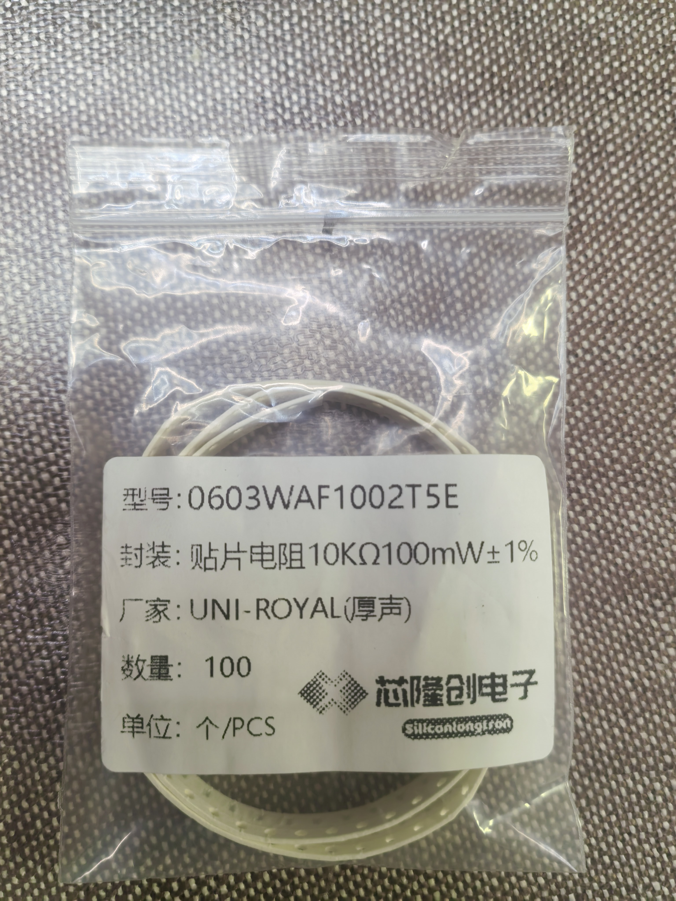 |
| R8, R9 | 120Ω（R0805，印字 `1200`） | 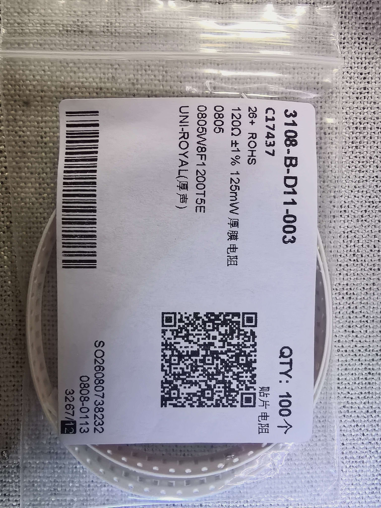 |
| R10, R11 | 5.1kΩ（R0402，印字 `5101`） | 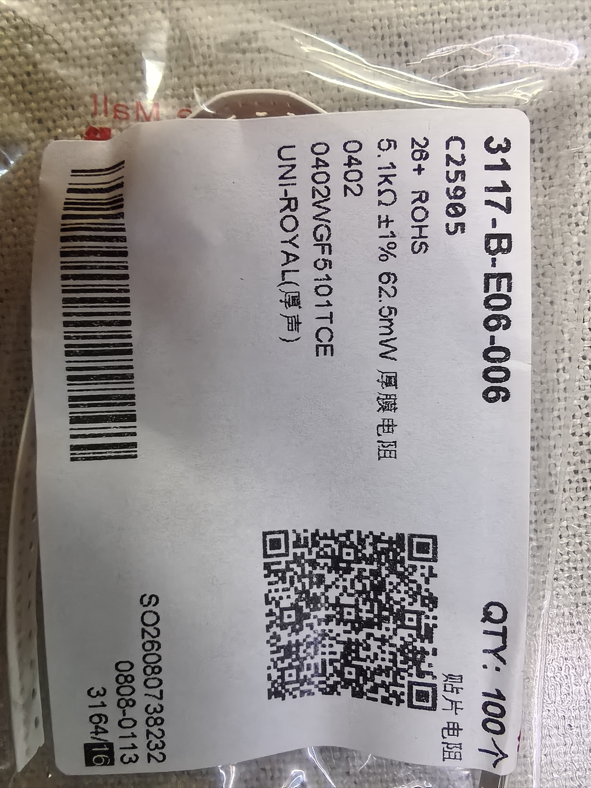 |

#### 0603 / 0805 / 0402 阻容「7 步法」（首次定义，后续复用）

> 电阻和电容通用、无方向、无极性。这是整份指南最基础的手法，第一次完整写一遍，后面 组2/组3 直接"复用本 7 步法"。

1. 目标焊盘薄涂一层焊油（0603/0402 焊盘小，焊油要少）。
2. 其中一个焊盘**预上锡**（极薄一层，堆厚了会垫高元件）。
3. 镊子夹元件**侧面**（别夹两端，容易弹飞），摆上对齐两个焊盘，轻轻压平。
4. 烙铁熔预上锡端 → 元件定位。
5. 焊另一端：烙铁尖同时碰焊盘 + 元件端头，左手送极少量锡丝，锡包住端头即可。
6. 回焊第 1 端补一点锡，让两端焊点对称饱满。
7. 显微镜 / 手机微距检查：焊点光亮、元件贴合板面、无桥锡、无偏移。

> 💡 电阻电容分不清时：看 PCB 丝印位号——**C 开头焊电容位、R 开头焊电阻位**。放反了不会炸，但功能错。

#### 组 1 焊完检查

| 检查项 | 方法 | 期望 |
| --- | --- | --- |
| 目视 | 显微镜 / 手机微距 | 焊点光亮饱满，无桥锡、无偏移 |
| 蜂鸣抽测 | 关键网络对地 | 3V3、5V、CANH/CANL 对地不短路 |

---

### 组 2：电容（全 C0603，按印字 3 位一次分拣焊完）

> 本板所有电容都是 **C0603 同封装、无方向、无极性**。一次性把 C0603 料盘取来，按文件名末尾 3 位分拣焊完：
> **容值速记**：`104`=100nF、`105`=1μF、`106`=10μF、`226`=22μF、`475`=4.7μF、`220`=22pF。

| 容值 | 位号 | 数量 | 印字 | 摆放位置 |
| --- | --- | --- | --- | --- |
| 100nF | C8,C9,C10,C11,C12,C13,C14,C15,C17,C19,C24,C29 | 12 | `104` | 各 IC 电源脚旁（U1/U3/U4/U5/U2/USB1），看丝印 |
| 22pF | C1, C2 | 2 | `220` | 晶振 X1 两端（负载电容） |
| 4.7μF | C16, C18 | 2 | `475` | 电源轨滤波 |
| 22μF | C20, C21 | 2 | `226` | HPM5321 内核电源轨滤波 |
| 1μF | C27, C28 | 2 | `105` | 同 C22/C23（C22/C23 已在阶段 1 焊好） |

> **已焊 / 不在此列**：C3/C4/C5/C7（100nF）、C6/C25（10µF）、C22/C23（1µF）已在阶段 1 焊好；C26（10µF）随 组6 的 U2 焊。

**本组实物照片（按印字 3 位分拣对照）：**

| 容值 | 位号 | 实物照片 |
| --- | --- | --- |
| 100nF（`104`） | C8,C9,C10,C11,C12,C13,C14,C15,C17,C19,C24,C29 | 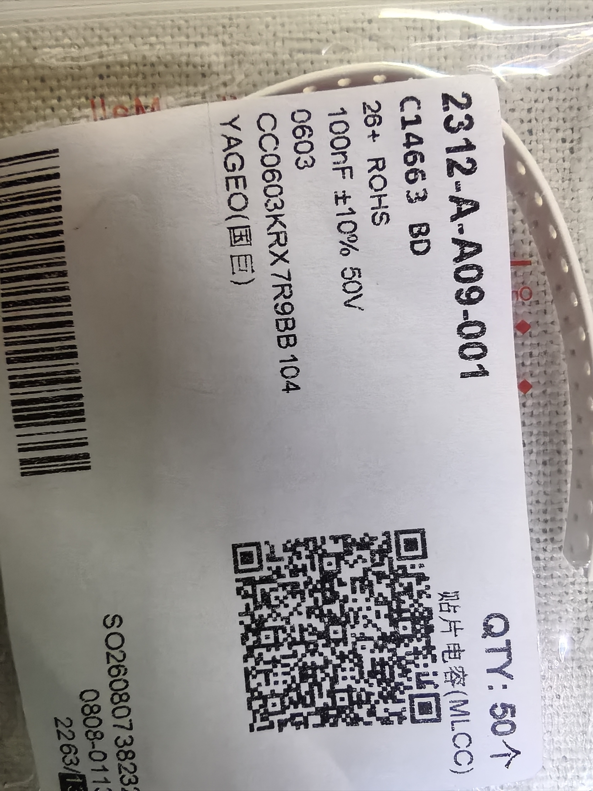 |
| 22pF（`220`） | C1, C2 | 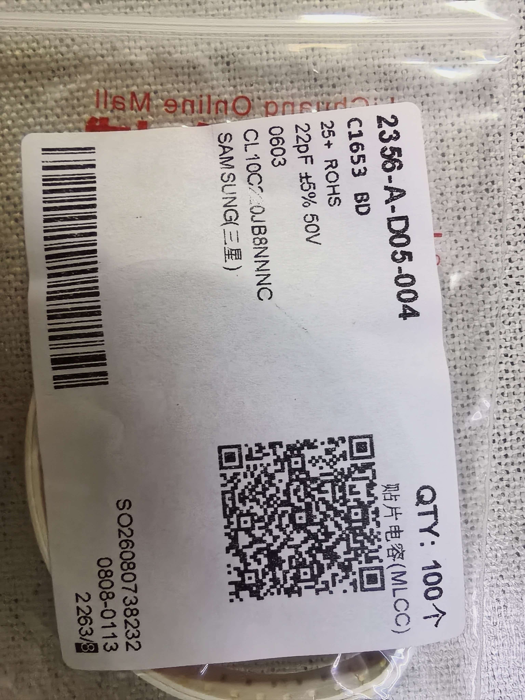 |
| 4.7μF（`475`） | C16, C18 | 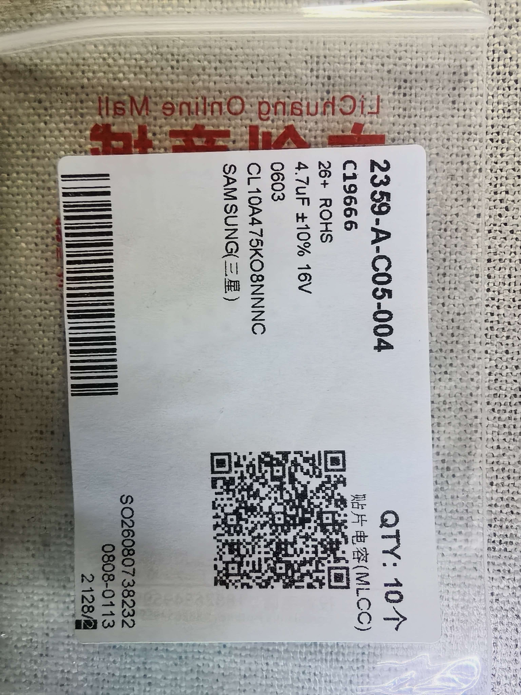 |
| 22μF（`226`） | C20, C21 | 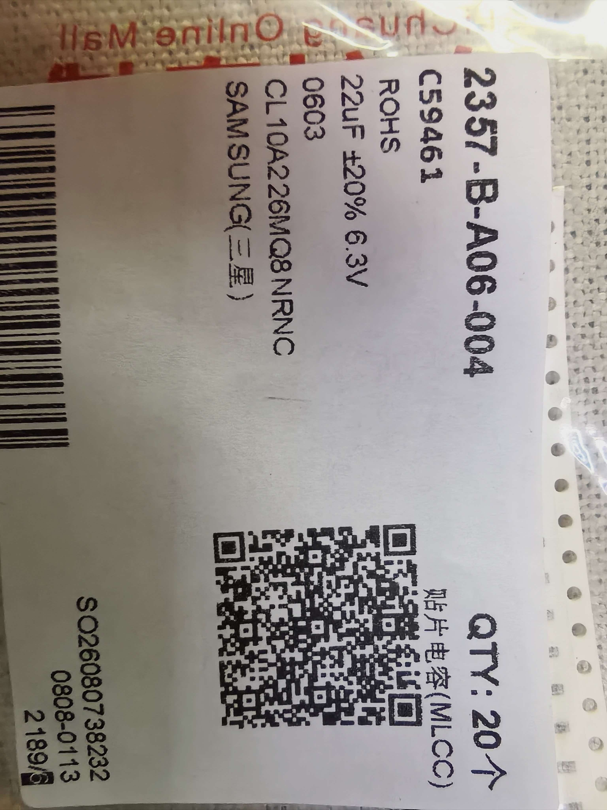 |
| 1μF（`105`） | C27, C28 | 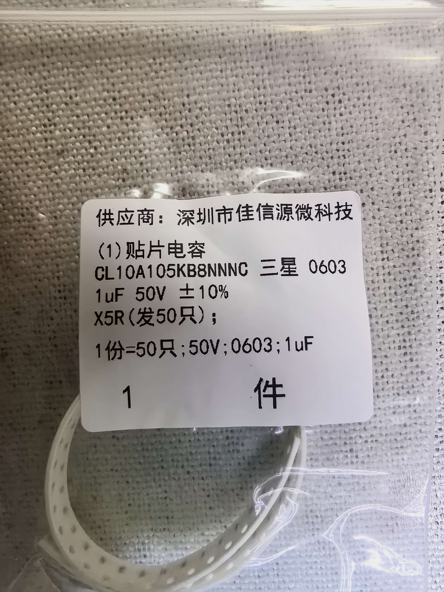 |

**焊接步骤**：全部复用上面「7 步法」。电容和电阻手法完全一样。

> ⚙️ **为什么 100nF 用了 16 颗、还要 1µF/10µF/22µF 多种？**（PCB 设计硬知识，别只焊一种）
> 实际电容 = 理想 C ＋ ESL ＋ ESR，构成串联谐振，自谐振 `SRF = 1/(2π√(ESL·C))`，每个电容只在 SRF 附近阻抗最低。
> - **100nF**：SRF ≈ 20–40 MHz → 滤 IC 开关的 **MHz 级高频毛刺**，必须紧贴 IC 电源脚（少一颗对应脚就可能抖、CAN 报错、USB 枚举失败）。
> - **1µF**：SRF ≈ 2–4 MHz → 给 LDO 反馈环路做**中频段相位补偿**（不补可能振荡）。
> - **10µF**：SRF ≈ 0.4 MHz → 应对 USB 端**突发电流**（远端储能）。
> - **22µF**：HPM5321 内核 DCDC 输出滤波。
> - **22pF**：晶振负载电容，和 X1 一起决定 24MHz 起振。
> 多种并联 = 共同覆盖 10 kHz ~ 100 MHz 全频段。少了任何一座，对应频段噪声没人管。

#### 组 2 焊完检查

| 检查项 | 方法 | 期望 |
| --- | --- | --- |
| 100nF 数量核对 | 数板上 100nF 焊好的颗数（含阶段 1 的 C3/C4/C5/C7） | **共 16 颗**，一颗不能少 |
| 目视 | 显微镜 / 手机微距 | 焊点光亮、贴板、无桥锡 |
| 蜂鸣抽测 | 关键网络对地 | 3V3、5V、CANH/CANL 对地不短路（注意：100nF 跨 VDD-GND，蜂鸣可能"哒"一声即停，属正常充电，不是短路） |

---

### 组 3：电感 + 晶振（无源小件，无方向 / 无极性）

**本组实物照片（焊前对照认料）：**

| 位号 | 参数 / 封装 | 实物照片 |
| --- | --- | --- |
| L1 | 4.7μH 功率电感（SWPA252012S4R7MT） | 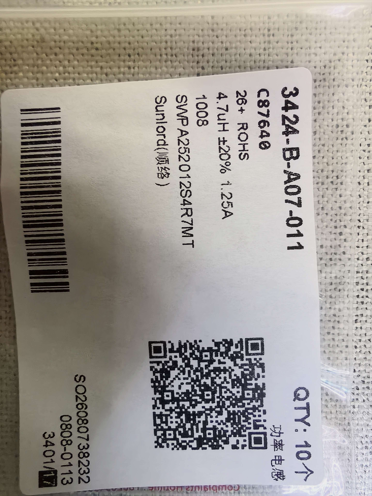 |
| X1 | 24MHz 晶振（CRYSTAL-SMD_4P） | 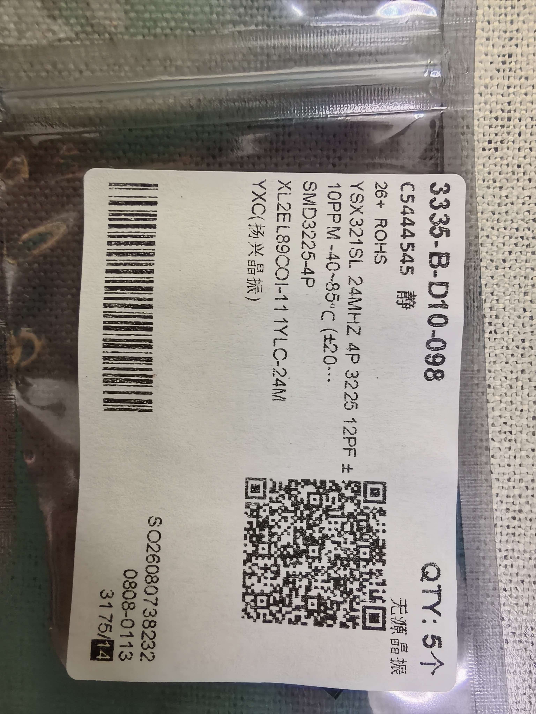 |

#### L1（4.7μH 功率电感，SWPA252012S4R7MT）


> 屏蔽功率电感，**无方向**（两端都是绕组，随便焊哪头都行）。封装约 2.5×2.0mm，比 0603 大一圈，很好夹。

**焊接步骤（烙铁 + 焊油）**：
1. 两个焊盘薄涂焊油。
2. 烙铁预上锡其中一个焊盘（薄层）。
3. 镊子夹电感**侧面**，摆上对齐焊盘，压平。
4. 烙铁熔预上锡端固定 → 焊另一端（送少量锡丝，焊点包住端电极）。
5. 显微镜检查两端焊点饱满、无桥锡（电感只有 2 脚，桥锡风险低）。

#### X1（24MHz 晶振，CRYSTAL-SMD_4P）


> **无源四脚晶振（YSX321SL 系列），没有方向**：1/3 脚等价（接 MCU 的 XTAL_IN/OUT 两个信号脚），2/4 脚等价（GND）。扬兴官方百科原话"脚1和脚3为无极性引脚，不具备方向性，不用担心贴反"。所以**正着贴就行**——不需要找 1 脚、不用旋转 180°，本板 PCB 上 X1 的 4 个焊盘也是完全对称的，任意方向都能工作。

**焊接步骤（烙铁 + 焊油）**：
1. 4 个焊盘薄涂焊油。
2. 实物顶面字符（`YXC` / `24.000`）**朝上正读**，放进 PCB 的 X1 框里摆正。
3. 烙铁依次点 4 个脚。
4. 显微镜检查 4 脚无桥锡、晶振贴板无缝隙（缝隙会振不起来）。

> 💡 晶振是 MCU 的"心跳"，但这里先焊它和负载电容 C1/C2 只是"占位热身"——**MCU（U1）要到 组8 才焊**，现在测不到起振属正常，别慌。

#### 组 3 焊完检查

| 检查项 | 方法 | 期望 |
| --- | --- | --- |
| 目视 L1 / X1 | 显微镜 / 手机微距 | 焊点光亮饱满，X1 贴板无缝隙、无桥锡 |
| 蜂鸣测 L1 两端对地 | 分别量电感两个焊盘对 GND | **不响**（响 = 绕组碰地，重焊电感） |
| 蜂鸣测 C20/C21 对地 | 黑笔 GND，红笔量非 GND 端 | **不响**（响先看是不是 GND 端，见下方提示） |

> 💡 **实测「C20/C21 对地响」先别慌——先判断是哪一端**：MLCC 无极性，两个焊盘**一个本来就是 GND 端**，另一个才是 VDD 内核端。黑笔搭已知 GND、红笔分别点两个焊盘：
> - **哪头 ≈0Ω 直接响** = 那是 GND 端，**正常！不是故障**。
> - **另一头也 ≈0Ω 响** = 真短路，查桥锡 / 电容次品。**修复前绝对不要焊 MCU（U1）**。

---

### 组 4：二极管 / TVS / ESD / LED（保护 + 指示，有方向注意）

> 这一组是"二极管类"——TVS、ESD、LED。混合了 TH / SOD-123 / SOT-23 几种封装，但都是"有方向、焊前认阴极/极性"的件，一次取齐焊完。

#### D1, D2（LED，A694B/2SYG/S530-E2，TH）

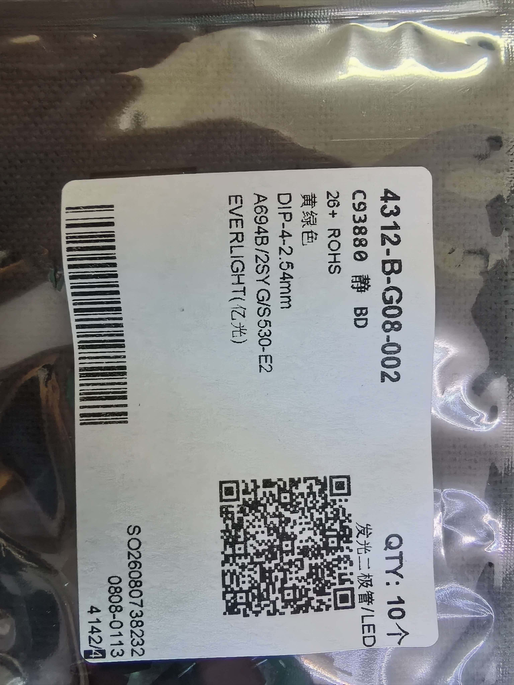

> 直插 LED，**有方向**：长脚 = 阳极（+），短脚 = 阴极（-）；本体上**平底 / 缺口 / 绿点**那端是阴极。板子丝印通常用 "K"（阴极）或减号标记。

**焊接步骤（TH）**：
1. 先认方向：长脚插 "+" 孔，短脚插阴极孔（丝印 "K"）。
2. **技巧：先焊一颗，上电看亮不亮确认方向对不对**，再焊另一颗（避免两颗都焊反重拆）。
3. 引脚穿板，烙铁 340°C 焊，注意 LED 本体别贴板太紧（留一点高度好看灯）。

#### D3（SMF5.0CA，TVS，SOD-123）

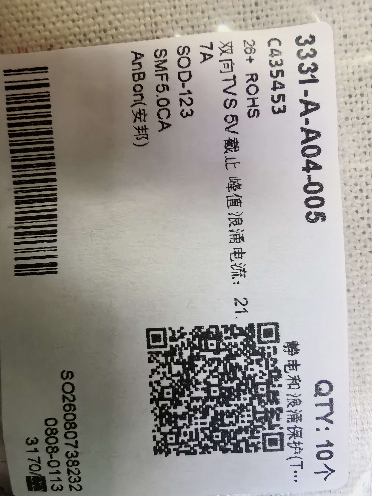

> ✅ **封装已核对**：实物立创 C435453 / SMF5.0CA / SOD-123 / AnBon（安邦），与 BOM 完全一致。
> TVS **有方向**（阴极标记：带色环 / 横线那端是阴极），对齐 PCB 丝印阴极。

**焊接步骤（SOD-123 / SMB，烙铁 + 焊油）**：
1. 认阴极（色环/横线端），对齐 PCB 丝印。
2. 预上锡一脚固定 → 焊另一脚。SOD-123 两脚间距小，注意别桥锡。

#### D4, D5（PESD1CAN，CAN 引脚 ESD，SOT-23-3）

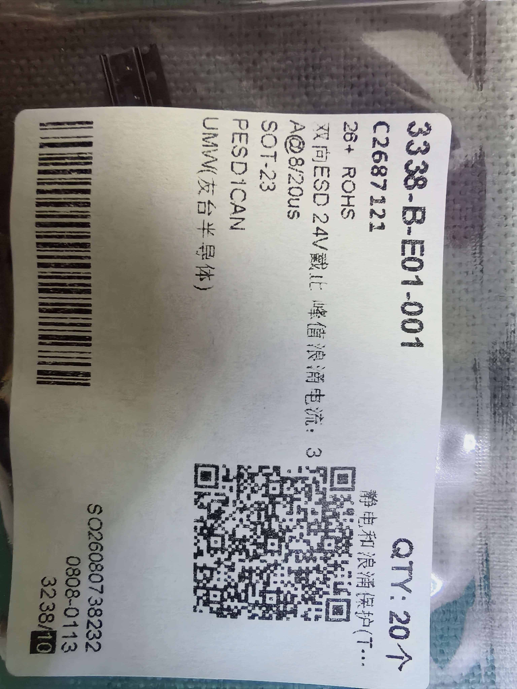

> SOT-23-3，**有方向**（阴极标记，通常是元件上的一条横线 / 色环对应阴极）。CAN 总线 ESD 保护。

**焊接步骤（SOT-23-3，烙铁 + 焊油）**：
1. 3 个焊盘薄涂焊油。
2. 认阴极：PCB 丝印上 D4/D5 的阴极端（通常标横线 / "K"），对齐元件阴极标记。
3. 1 脚预上锡固定 → 对角脚 → 其余；显微镜查 3 脚无桥。

#### D6（USBLC6-2SC6，USB ESD，SOT-23-6）

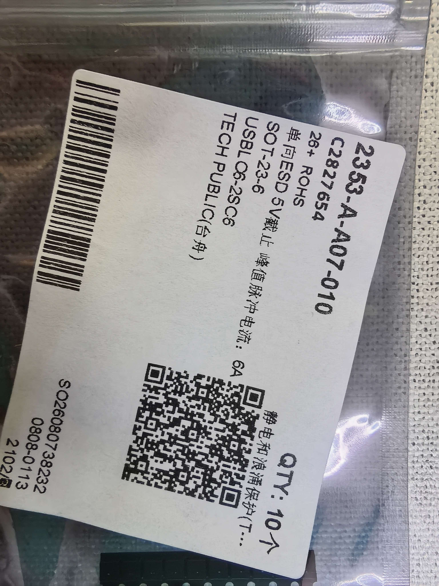

> SOT-23-6，**有方向**（6 脚，1 脚圆点/缺角）。USB D+/D- 的 ESD 保护器件。

**焊接步骤（SOT-23-6，烙铁 + 焊油）**：
1. 6 个焊盘薄涂焊油。
2. 认 1 脚（圆点/缺角），对齐 PCB 丝印。
3. 1 脚预上锡固定 → 对角脚（如第 4 脚）定位 → 其余 4 脚。
4. 6 脚较密，每脚送锡极少；显微镜查无桥锡。

#### 组 4 焊完检查

| 检查项 | 方法 | 期望 |
| --- | --- | --- |
| 目视 D1–D6 | 显微镜 / 手机微距 | 方向正确、焊点光亮、无桥锡 |
| 蜂鸣抽查 | 关键网络对地 | CANH/CANL、3V3、5V 对地不短路 |

---

### 组 5：连接器 / 开关 / 排针 / 端子（结构件，平放好焊）

> 大块头直插 / SMD 结构件，建议放在贴片基本焊完后再焊——板子一直能平放操作，不会压歪贴片。USB1 已焊，这里只复查。

#### SW1（轻触按键，TS-KG89S-AT25F，SMD）

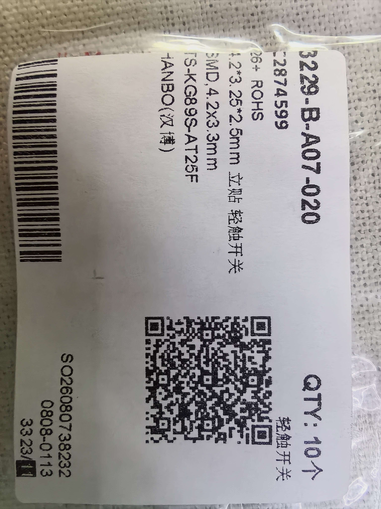

> SMD 轻触按键（4 脚，按下导通、松开断开）。作为 **BOOT 按钮**使用：按住上电进 ISP，松开从 Flash 启动。

**焊接步骤（SMD 多脚，烙铁 + 焊油）**：
1. 焊盘薄涂焊油。
2. 对齐焊盘，摆上压平。
3. 先固定对角 2 脚 → 再焊其余脚。
4. 焊完按下测试：**按下导通（BOOT0 拉高 → ISP），松开断开（BOOT0 低 → Flash 启动）**。

#### SW2（2 位琴键，DP-02RP，TH）

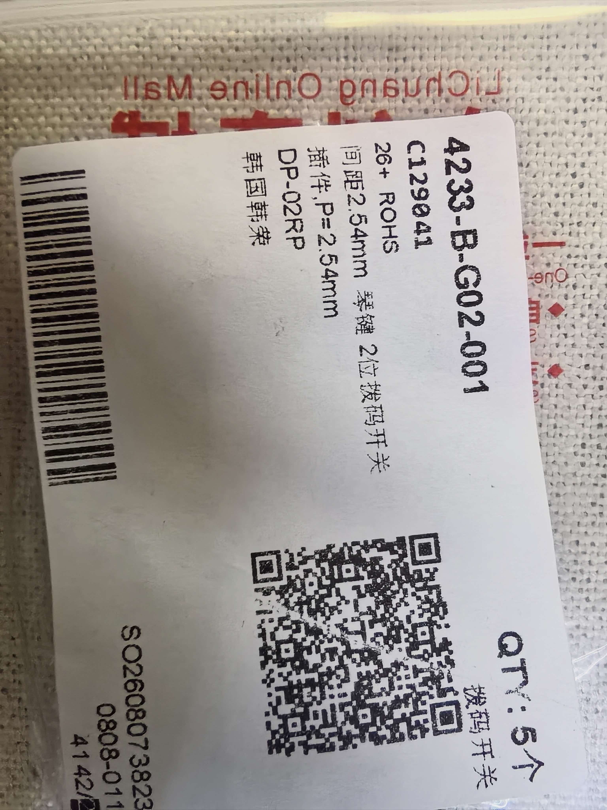

> 2 位直插琴键开关，TH。用于终端电阻切换（120Ω 终端使能）。

**焊接步骤（TH）**：
1. 从 TOP 面插入，压到底（开关体贴板）。
2. 翻背面，烙铁 340°C 焊两引脚，锡饱满填满孔。
3. 注意焊接时不要拨动开关体（避免内部簧片移位）。

#### H1（调试排针 1×8，X6511WV-08H，TH）

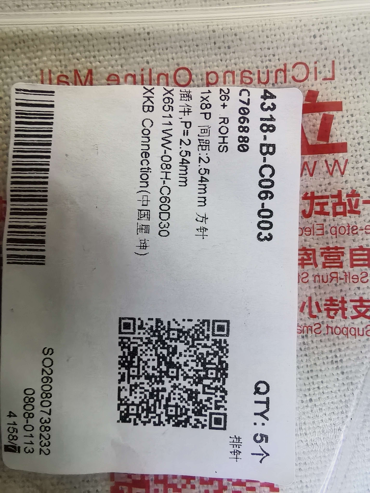

> ⚠️ 照片 `X6511WW-08H` 与 BOM `X6511WV-08H` 末位不同，同系列 1×8 排针，可焊。
> 8 针直插排针，TH。**可先插上不焊**，用杜邦线调试，最后再焊死。

**焊接步骤（TH）**：
1. 插入排针，用板子边缘或夹具把排针压**垂直**于板面（别歪）。
2. 翻背面，逐针焊，锡饱满。
3. 焊完检查排针与板面垂直、无歪斜。

#### CN1, CN2（KF2EDGR-3.81-3P，CAN 接线端子，TH）

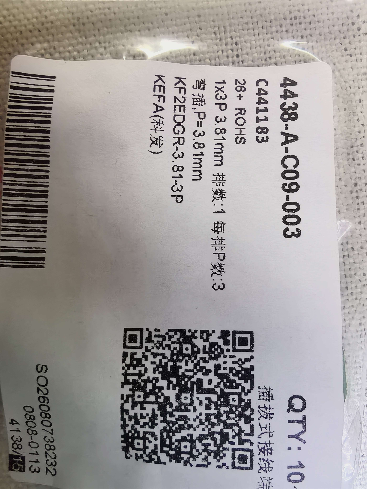

> 3 针绿色端子（CANH / CANL / GND），TH。**所有贴片焊完后统一插焊**，保持与板垂直。

**焊接步骤（TH）**：
1. 插入，压到底贴板。
2. 翻背面逐针焊，锡饱满填满孔。

#### USB1（Type-C 母座）—— 已在阶段 1 焊好

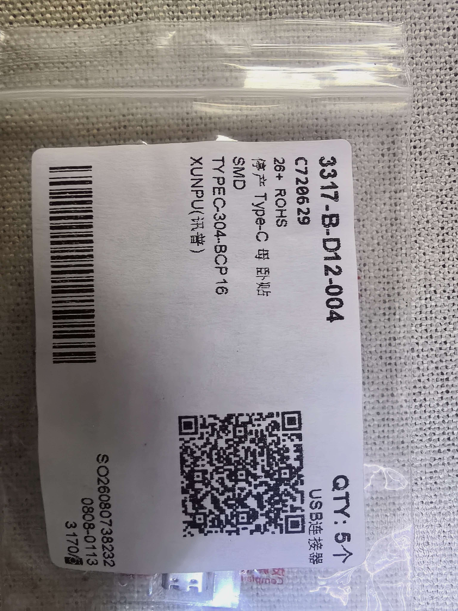

> 你已提前焊好。**复查要点**：固定脚（4 个角的大焊盘）全部焊牢、母座贴板无翘起、插拔顺畅不松动。这是机械结构件，焊不好插拔 USB 会掉。

#### 组 5 焊完总检查

| 检查项 | 方法 | 期望 |
| --- | --- | --- |
| TH 插件贴板垂直 | 目视 / 直角尺 | 排针、端子、开关都垂直于板面，无歪斜 |
| SW1 按键 | 按下导通测试 | 按下 BOOT0=高（ISP），松开=低（Flash 启动） |
| USB1 机械复查 | 插拔 USB 线测试 | 母座不松动、不翘起 |

---

### 组 6：隔离电源模块 U2（B0505S-1WR3，TH，有方向）

> U2 把 USB 侧 5V 隔离成 CAN 侧的 5V，中间 1500V 隔离。**这是板子设计上最硬核的一步，也是验证「隔离真的隔开了」的关卡**——测出来两侧各自有电、但地不导通，就是 1500V 隔离成立的铁证。焊完本组立刻做 🔑关卡 A。

#### 组 6 工具温度设定

| 工具 | 本阶段设定 | 说明 |
| --- | --- | --- |
| 烙铁 | **340°C** | 直插引脚大、铜厚，稍高温度让锡饱满包住 |
| 热风枪 | **不用** | 直插件烙铁即可 |
| 焊油 | **必备** | 直插脚大，焊油帮助锡流动填满孔 |
| 锡丝 | 0.6~0.8mm | 直插脚大，粗一点锡丝效率高 |

#### U2（B0505S-1WR3，PWRM-TH 直插）

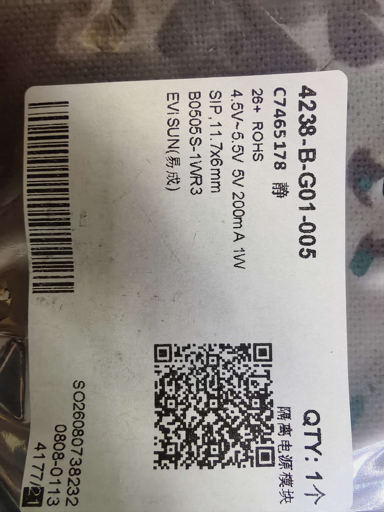

> **U2 引脚封装图（数据手册）**：`1=-Vin`、`2=+Vin`、`3=-Vout`、`4=+Vout`，开口朝下从左到右，1 脚有圆点标识。
> 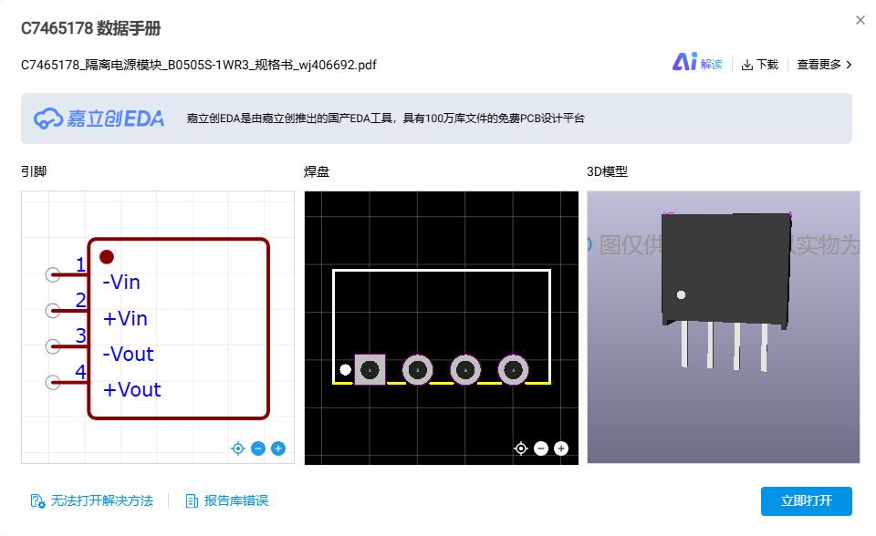

> **单列直插封装（SIP）**：信号脚从左到右固定为 `1=-Vin`、`2=+Vin`、`3=-Vout`、`4=+Vout`。**注意：这与旧版文档中的写法相反**，请务必以立创数据手册（C7465178）截图为准。实物常见 4 脚（SIP-4）；若你看到 **5 个焊脚**，第 5 个是**外壳/屏蔽脚 `Case`**（在最外侧），不参与电路，忽略即可——信号脚 1~4 的位置和定义不变。**有方向**，PCB 丝印上一定标了 1 脚（圆点 / 数字 "1" / 缺口），对齐再焊——**方向焊反会导致 U2 输出异常、甚至烫手烧毁**。
>
> **引脚排布（俯视，开口朝下，从左到右）：**
> ```
>         ◯ ← 顶面小圆点 = 1 脚方向标识
>   ┃1┃  ┃2┃  ┃3┃  ┃4┃   (若见第 5 脚在最外侧 = Case 外壳，忽略)
>   -Vin +Vin -Vout +Vout
>   USB-  5V   CAN侧 隔离5V
>   GND   输入  GND   输出
> ```

**焊接步骤（烙铁 + 焊油）**：
1. 对照照片 + PCB 丝印确认 1 脚方向（丝印圆点对齐芯片 1 脚标记）。
2. 元件从 **TOP 面**插入，引脚穿过 PCB 焊盘孔，轻轻压到底（模块外壳贴紧板面，别留缝）。
3. 翻到**背面**，烙铁 340°C，每个引脚焊 2~3 秒，送锡丝让锡**饱满包住引脚并填满孔**。
4. 剪脚（留 1~2mm）或保留长脚都可。
5. 显微镜/目视检查 4 脚：锡爬满孔、无虚焊、相邻脚不桥锡。

> **顺手焊 C26（10μF，文件名 `106`）**：这是 U2 隔离 5V 输出的滤波电容，和阶段 1 的 C6/C25 同料同容值，只是摆在隔离侧。复用「7 步法」焊接，位置紧贴 U2 输出侧（`+Vout` / `-Vout` 引脚 3/4 附近）。**注意：C26 属于本组，组 2 不再重复列它。**

#### 🔑 关卡 A：上电验证隔离 5V + 隔离成立（最关键）

**① 焊完短路检查（上电前）**

| 检查项 | 方法 | 期望 |
| --- | --- | --- |
| 蜂鸣测 U2 相邻引脚 | 1-2、3-4 之间 | **不响**（内部是变压器隔离，原边副边本就不通） |
| 蜂鸣测 VIN 对地 | 黑笔 GND，红笔量 -Vin / +Vin | `-Vin` 接 USB 侧 GND（响正常），`+Vin` 是 5V（不响） |

**② 上电测试（5V 充电器，别插电脑）**

| 测试点 | 期望 | 说明 |
| --- | --- | --- |
| U2 的 `+Vin(2)` ↔ `-Vin(1)` | **5.0V**（来自 USB 侧） | 确认隔离模块输入到了 |
| U2 的 `+Vout(4)` ↔ `-Vout(3)` | **5V ± 0.25V**（4.75~5.25） | 隔离输出成立 |

**③ 🔑 关键隔离检查（最核心）**

> 万用表**电阻档 / 蜂鸣档**，一头搭 **USB 侧 GND**，另一头搭 **U2 副边 `-Vout(3)`**：
> - **应该不导通（OL / 不响）** ← 正常，隔离成立
> - **如果导通（蜂鸣响）** = 隔离没隔开 = 板子出问题，先断电查 U2 方向 / 周边是否意外连地

**异常处理**

| 现象 | 多半是 | 怎么办 |
| --- | --- | --- |
| 输出 0V | 输入 5V 没到 / 方向焊反 | 量 `+Vin(2)` 有没有 5V，没有查 USB 接线；有 5V 仍 0V 查方向 |
| 输出偏差大 / 模块发热 | 输出滤波或负载问题 | **立刻断电**，核对 U2 周边滤波电容是否漏焊（C26） |
| 隔离检查导通 | U2 方向错 / 副边意外接地 | **立刻断电**，重新核对 1 脚方向 |

> ✅ 关卡 A 通过 = 隔离 5V 真的隔开了。可以放心焊下一组的隔离侧 IC（U5/U3/U4），它们由这个隔离 5V 供电。

---

### 组 7：隔离侧 IC（U5 隔离器 + U3/U4 收发器，同型号一起焊）

> 隔离侧元件，由 组6 验证过的隔离 5V 供电。**注意：这一步不上电**，等 组8 焊完 MCU 再一起上电验证。U3/U4 是**同一型号（SIT1051AT/3）×2**，正好一次取两颗一起焊，符合"同型号一次焊完"。

#### 组 7 工具温度设定

| 工具 | 本阶段设定 | 说明 |
| --- | --- | --- |
| 烙铁 | **320°C** | SOP-8 / SOIC-16 引脚密，温度别太高 |
| 热风枪 | 可选 | 若 SOP-8 烙铁不好焊，可用热风枪 + 锡浆（但烙铁也能行） |
| 焊油 | **必备** | 多脚 IC 防桥锡第一神器 |
| 锡丝 | 0.4~0.5mm | SOP 引脚细，细锡丝好控制送锡量 |

#### U5（CA-IS3742HW，4 通道数字隔离器，SOIC-16）

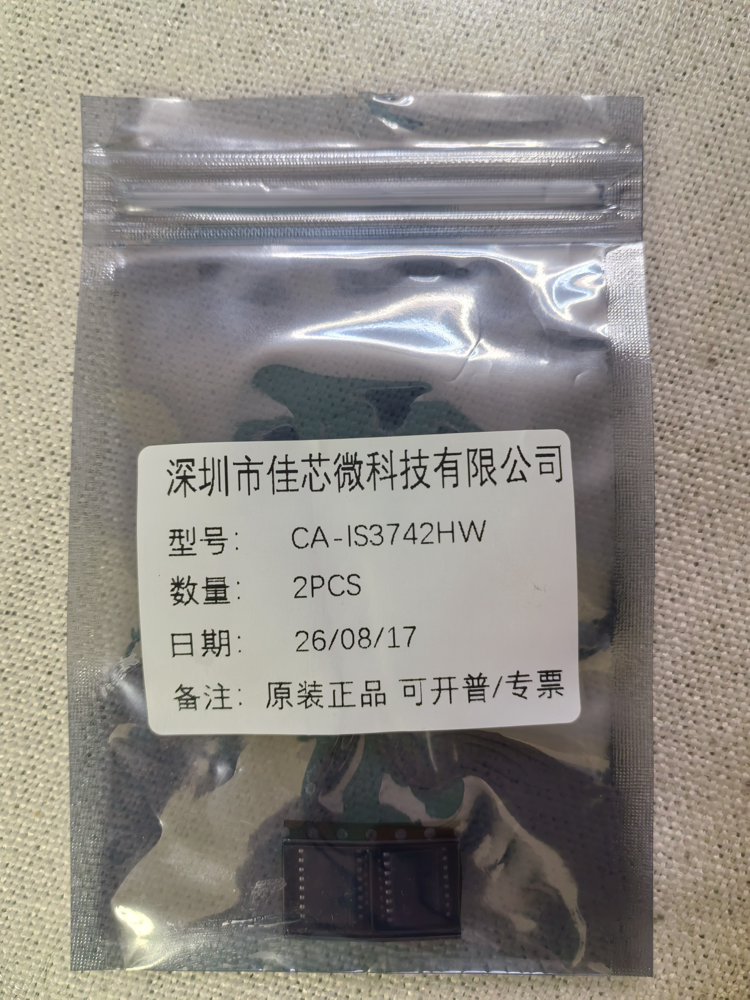

> **U5 引脚封装图（数据手册）**：SOIC-16，1 脚圆点标识（左下角）；1~8 脚为原边（系统侧，接 3V3/GND），9~16 脚为副边（隔离侧，接 ISO_5V/ISO_GND）。
> 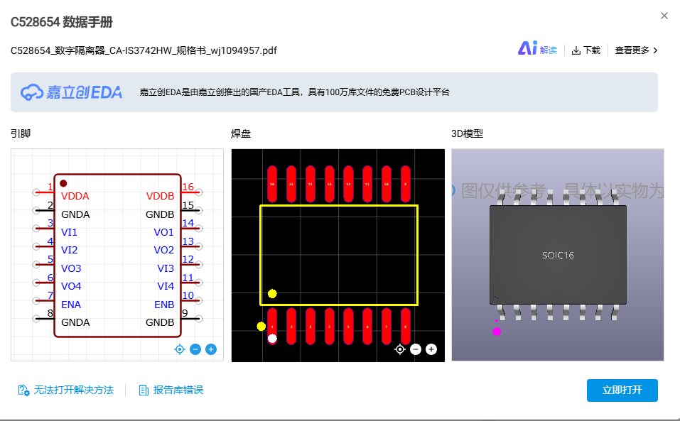

> 川土微数字隔离器，SOIC-16，**有方向**。实物照片已补充（`元器件照片/CA-IS3742HW.jpg`，2026-08-20 拍摄标签确认：立创 C528654 / Chipanalog / SOIC-16，与 BOM 完全一致）。焊前对照照片 + PCB 丝印认 1 脚（圆点 / 缺角）；引脚功能以川土微官方数据手册为准。它是 16 脚密脚 IC，**比 U3/U4（SOP-8）更难焊**，必须显微镜 + 焊油；且它**跨在隔离边界上**——两侧走线本就不能跨过芯片主体，焊的时候也别让锡珠溅到隔离缝另一侧把两边连起来。

**焊接步骤（烙铁 + 焊油，SOIC-16）**：
1. 16 个焊盘全部薄涂一层焊油（密脚 IC 防桥第一神器）。
2. 认 1 脚：PCB 丝印上的圆点 / 缺角 / 数字 "1" = 第 1 脚；芯片本体顶面通常也有圆点 / 凹坑标 1 脚，找不到就按川土微数据手册三视图。
3. 第 1 脚焊盘预上锡（薄层）。
4. 镊子夹芯片摆正，**1 脚对齐 PCB 丝印**，压实贴板（SOIC 两边都有引脚，贴不平会翘）。
5. 烙铁熔第 1 脚固定 → 焊**对角**那个脚（如第 9 脚或第 16 脚）定位，芯片不扭转。
6. 焊其余脚：烙铁尖同时碰焊盘 + 引脚，左手送**极少量**锡丝（16 脚密，**锡多必桥**）。可从一边拖到另一边（拖焊），靠焊油张力让锡均匀爬过每个脚。
7. 显微镜检查 16 脚：**无桥锡、无偏移、焊点光亮**。有桥用焊油 + 吸锡带修（烙铁从两脚间划过带走多余锡）；反复修不好就加热整边让锡重流。
8. **隔离边界复查**：确认芯片两侧（原边 / 副边）之间没有意外连锡或锡珠，隔离缝干净。

#### U3, U4（SIT1051AT/3，CAN-FD 收发器，SOP-8）—— 同型号 ×2 一起焊

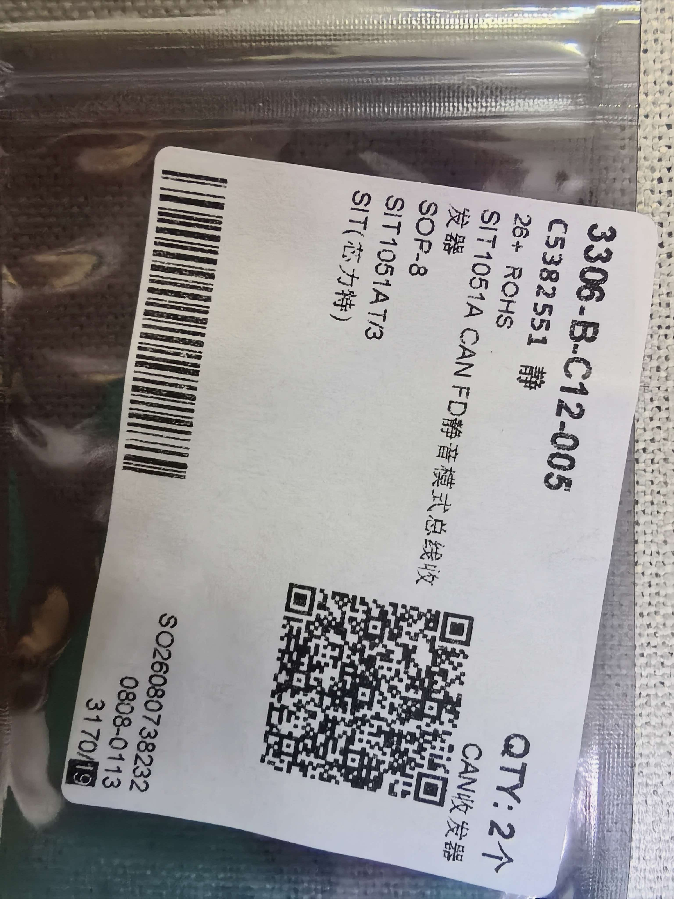

> **U3/U4 引脚封装图（数据手册）**：SOP-8，1 脚圆点标识（左侧）；1=TXD、2=GND、3=VCC、4=RXD、5=VIO、6=CANL、7=CANH、8=S；电源为隔离 5V，地接隔离地。
> 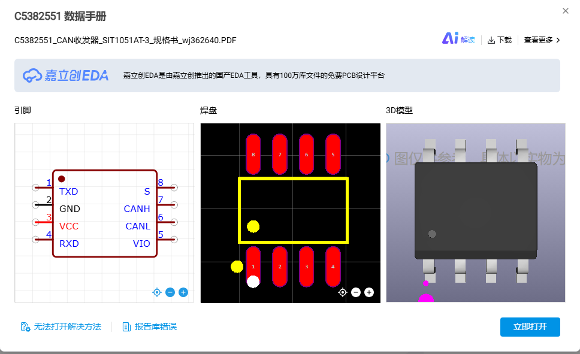

> SOP-8，**有方向**（1 脚圆点 / 缺口）。2 颗，分别是 CAN 通道 1 和通道 2，型号完全相同，**一起取两颗焊完**。

**焊接步骤（烙铁 + 焊油，SOP-8）**：
1. 8 个焊盘薄涂焊油。
2. 第 1 脚焊盘预上锡（薄层）。
3. 镊子夹芯片，1 脚对齐 PCB 丝印圆点 / 缺口。
4. 烙铁熔第 1 脚固定 → 焊**对角**脚（如第 5 脚）定位，芯片不扭转。
5. 焊其余脚：烙铁尖同时碰焊盘 + 引脚，左手送极少量锡丝（SOP 脚细，**锡多必桥**）。
6. 显微镜检查 8 脚无桥锡；有桥用焊油 + 吸锡带修（烙铁从两脚间划过带走多余锡）。

#### 组 7 焊完检查清单

| 检查项 | 方法 | 期望 |
| --- | --- | --- |
| 目视 U3/U4/U5 | 显微镜 / 手机微距 | 8/8/16 脚无桥锡、无偏移、焊点光亮 |
| 蜂鸣测各 IC 相邻引脚 | 万用表蜂鸣档挨个测 | **不响**（响 = 桥锡，必须修） |
| 蜂鸣测 CANH / CANL 对地 | 黑笔 GND，红笔量 CANH、CANL 网络 | **不响**（总线对地短路会让 CAN 完全不通信） |

> 此阶段**不上电**，等 组8 焊完 MCU 后统一上电验证 CAN 通信。

---

### 组 8：主控 MCU U1（HPM5321 QFN-48，最难最贵，最后焊）

> **全板最贵最难的件，放在所有其它件焊完、关卡 A 已通过之后最后焊。** 焊完做 🔑关卡 B 整板上电通检（§5）。

#### 组 8 工具温度设定

| 工具 | 本阶段设定 | 说明 |
| --- | --- | --- |
| 热风枪 | **350°C**，中档风量 | QFN 焊盘多，需整体均匀加热 |
| 烙铁 | **320°C** | 仅用于修桥锡 / 补底部散热焊盘 |
| 锡膏（有铅） | **必备** | 没有钢网就用刮刀 / 牙签薄涂 |
| 焊油 | 备用 | 修桥锡时用 |

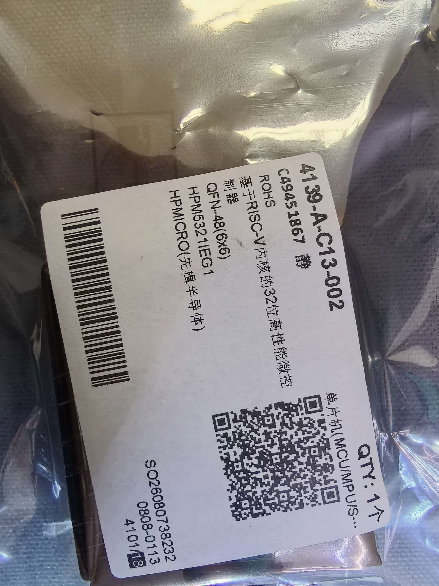

> QFN-48：**48 个脚 + 底部散热焊盘，脚全在肚子底下**，烙铁根本伸不进去。必须**热风枪 + 锡膏**（或用钢网）。**这是整块板最难的一步**，强烈建议第一次焊 QFN 的人先**拿块报废板 / 废 PCB 练一次手感**再动这颗。

#### U1 引脚分布（顶视图，1 脚在左下角，逆时针编号）

> 官方封装图（立创数据手册 C49451867）：
>
> 
>
> - 顶视图，1 脚位于左下角，本体上有圆点/凹点标识
> - 中间 **49 脚 = EPAD（VSS）**，接地散热焊盘
> - 引脚按逆时针方向 1→48 编号

```
                  HPM5321IEG1  QFN48  引脚分布（顶视图）
                    1 脚在左下角，逆时针编号
                中间 EPAD = VSS（接地散热焊盘）

      48      47      46      45      44      43      42      41      40      39      38      37
     PA05    PA06    PA07    VDD_SOC PA26    PA27    PA28    PA29    PA30    PA31
   1  PA04 ┌──────────────────────────────────────────────────────────────────────┐ 36  XTALO
   2  PA08 │                                                                      │ 35  XTALI
   3  PA09 │                                                                      │ 34  VIO_B00
   4  PA10 │                                                                      │ 33  VDD_SOC
   5  VDD_SOC│                                                                      │ 32  VANA
   6  VIO_B00│                                                                      │ 31  VREFH
   7  PA03  │                                                                      │ 30  VREFL
   8  PA02  │                                                                      │ 29  VIO_B01
   9  VDD_SOC│                      ( 中间 EPAD = VSS )                            │ 28  VDD_SOC
  10  VDD_OTPCAP│                                                                      │ 27  PB08
  11  PA01  │                                                                      │ 26  PB09
  12  PA00  │                                                                      │ 25  PB10
      └──────────────────────────────────────────────────────────────────────┘
   13  RESETN
   14  WAKEUP
   15  DCDC_LP
   16  VPMC
   17  VDD_PMCCAP
   18  PY01
   19  PY00
   20  PB15
   21  PB14
   22  PB13
   23  PB12
   24  PB11
```

**按边分组：**

| 边 | 脚号 → 名称 |
|---|---|
| 上边 (48→37) | 48 PA05 · 47 PA06 · 46 PA07 · 45 VDD_SOC · 44 PA24/USB_DP · 43 PA25/USB_DM · 42 PA26 · 41 PA27 · 40 PA28 · 39 PA29 · 38 PA30 · 37 PA31 |
| 右边 (36→25) | 36 XTALO · 35 XTALI · 34 VIO_B00 · 33 VDD_SOC · 32 VANA · 31 VREFH · 30 VREFL · 29 VIO_B01 · 28 VDD_SOC · 27 PB08 · 26 PB09 · 25 PB10 |
| 下边 (24→13) | 24 PB11 · 23 PB12 · 22 PB13 · 21 PB14 · 20 PB15 · 19 PY00 · 18 PY01 · 17 VDD_PMCCAP · 16 VPMC · 15 DCDC_LP · 14 WAKEUP · 13 RESETN |
| 左边 (12→1) | 12 PA00 · 11 PA01 · 10 VDD_OTPCAP · 9 VDD_SOC · 8 PA02 · 7 PA03 · 6 VIO_B00 · 5 VDD_SOC · 4 PA10 · 3 PA09 · 2 PA08 · 1 PA04 |
| 中间 | 49 (EPAD) = VSS |

**★ 3V3 供电脚（共 13 个，蜂鸣排查对地短路用）：**
`5, 6, 9, 10, 16, 17, 28, 29, 31, 32, 33, 34, 45`

**地脚：仅中间 EPAD（脚 49 = VSS）** —— QFN-48 **没有外围独立 VSS 引脚**，GND 全部集中在底部散热焊盘。焊 U1 后若出现「3V3 对地短路 / 装芯片就掉到 0V」，最大嫌疑是 **EPAD 锡量过多受热溢出到左侧脚 5/6/7 一带，把 3V3 与 GND 短接**。处理：拆芯片 → 用吸锡带把 EPAD 彻底吸平（低于四周引脚焊盘）→ 重焊时 EPAD 只涂极薄一层锡、四周引脚极少锡、热风后烙铁+焊油拖锡清桥。

**方法 A（热风枪 + 锡膏，推荐）**：
1. PCB 焊盘涂均匀一层**薄**锡膏（钢网最好；没有就用刮刀/牙签薄涂，切忌堆太厚 → 必桥）。
2. HPM5321 用镊子摆上去，**注意第 1 脚**（点标记 / 切口 / 丝印），对齐 PCB 1 脚。
3. 对好位置后，热风枪 **350°C**、中档风、**画小圆**加热整个芯片。
4. 等看到锡膏**整体反光熔化**，芯片会自动「归位」（QFN 自对中效应）。
5. **关键：加热时间不超过 90 秒**，否则塑料基板会鼓包变形。
6. 冷却后，烙铁 / 吸锡带处理可能桥接的脚（即使锡膏回流好也建议显微镜下检查四角）。

**方法 B（烙铁 + 助焊膏，慎用）**：
1. PCB 所有焊盘涂助焊膏。
2. 芯片摆上，对好 1 脚。
3. **刀口烙铁 + 大量焊锡**沿一边拖焊，靠锡张力让锡爬过每个脚。
4. 拖完 4 边后，显微镜看有没有桥；桥了的用吸锡带吸走再补锡。
5. **底部散热焊盘**：从 PCB 背面能看到焊盘空窗，**单独补锡**（这一步新手最常漏，导致散热不良、芯片过热）。

> **不论 A 还是 B，做完用万用表二极管档量每个相邻引脚之间是否短路**。QFN 一旦桥锡，第一帧 USB 都发不出去。

#### 组 8 焊完检查清单

| 检查项 | 方法 | 期望 |
| --- | --- | --- |
| 目视芯片贴装 | 显微镜 / 手机微距斜照 | 芯片四周无缝隙、1 脚对齐、四角焊点均匀 |
| 二极管档测相邻脚 | 万用表二极管档挨个测 48 脚 | **不短路**（相邻脚间应有 PN 结压降，不是 0Ω） |
| 蜂鸣测所有 VDD 脚对地 | 黑笔 GND，红笔量各 VDD/VCC 焊盘 | **不响**（响 = 电源对地短路） |

#### 🔧 实战踩坑：HPM5321 第 6 脚（VIO_B00）对地击穿的真实案例（2026-08）

> 这是一位用户手焊 U1 后真实踩过的坑，整理出来避免你重蹈覆辙。

**现象（一步步排查记录）：**
1. 第一次整板量第 6 脚（VIO_B00）对 GND → 蜂鸣**持续响**，电阻档 0.5~0.9Ω **死死不动**（非电容，是真短路）。
2. 拆下 U1，量**空 PCB** 第 6 脚焊盘对 GND → **不响**（证明 PCB 本身、3V3 走线、去耦电容都正常）。
3. 单独测**芯片**第 6 脚对 EPAD(VSS) → 蜂鸣响、0.9Ω 不动（说明不是桥锡，是芯片本体坏）。
4. 进一步全面测芯片：第 **5 / 6 / 9 / 34 脚**（VDD_SOC 与 VIO_B00 电源域）对 EPAD **全部响/短路**，而第 30 脚 VREFL 响是正常接地。→ 结论：**整片电源域（VDD_SOC + VIO_B00）对 VSS 内部击穿，芯片整体报废**。
5. 用户自述焊接顺序：先焊 LDO 并上电确认 3.3V 正常（此时 U1 未焊），**然后断电再焊 U1**；焊 U1 时**没有做防静电**（无手腕带、工具未确认接地）。

**根因判断：**
- 焊 U1 时**断电**，所以不是"上电烧"；空 PCB 不响，所以不是 PCB 侧短路拉坏。
- 多个电源脚一起对地短路 = 芯片内部电源结构整体击穿，最可能是**焊接时 ESD 静电击穿**或**热风枪温度过高/吹太久过热损伤**（该用户热风枪原本设 350°C、8 挡风速第 4 挡，偏热偏猛）。单脚坏像 ESD，多脚一起坏更像热 + ESD 叠加。
- ⚠️ 注意：用户第一次单独测芯片说"第 5 脚不响（好）"，后来认真重测发现第 5/9 脚其实也响——**QFN 引脚小、侧面氧化或表笔压偏都会导致误判，测电源脚务必认真点对、必要时多测几次**。

**换新前必做（避免新芯片再坏）：**

- [ ] **空 PCB 确认 3V3 干净**（断电、蜂鸣档）：
  - 第 5/9 脚 VDD_SOC 焊盘 → GND：**不响**
  - 第 6/34 脚 VIO_B00 焊盘 → GND：**不响**（本板已确认第 6 脚不响 ✅）
  - LDO1 输出 VOUT 焊盘（ME6211 第 5 脚）→ GND：**不响**
  - 全部不响才焊新芯片。
- [ ] **严格防静电**（无手腕带看下方 §2.4 平替方案）：手腕带接地 + 三线工具接地，只碰芯片边缘。
- [ ] **热风枪降参数**：350°C → **320~330°C**，4 挡 → **2~3 挡**，单颗芯片加热 **≤20 秒**，画圈均匀加热别单点猛吹。
- [ ] **EPAD 薄锡托正**：底部散热焊盘只涂极薄一层锡，把芯片托住居正，减少第 6 脚这类贴边电源脚桥锡/下沉。
- [ ] **焊完先断电测新芯片**第 5/6/9/34 脚对 EPAD：全都应**高阻不响**，才上电。
- [ ] **首次上电串限流**，摸 U1/LDO 不发烫、电流正常再继续。

**判断"芯片坏 vs 桥锡 vs PCB 短路"的三步法：**
1. 整板量某电源脚对 GND 响 → 先拆芯片。
2. 量**空 PCB** 同脚焊盘对 GND：不响 = PCB 好；响 = PCB 侧 3V3 短路（查去耦电容/铺铜）。
3. 量**芯片**该脚对 EPAD：不响 = 芯片好（之前是焊接桥锡，清桥锡即可）；响且阻值稳定不动 = 芯片内部击穿报废，换新。

#### 🔥 实战踩坑：U5（CA-IS3742HW）副边桥锡导致 U2 隔离 DC-DC 发热（2026-08）

> 用户真实排查记录，整理出来避免你重蹈覆辙。本板当时 U1 已拆下（损坏待换），其余 IC（U2/U5/U3/U4）均已焊接，上电发现 U2 摸起来发烫。

**现象（一步步排查记录）：**
1. U2（B0505S-1WR3）上电后**明显发热**——文档 §关卡 A 异常处理表把"模块发热"列为危险信号，要求立刻断电。
2. 先排除 C26：蜂鸣测 C26 两焊脚 ↔ U2 的 3/4 脚均导通（在位、接对），且 C26 两焊脚 ↔ USB 侧 GND / 系统 3V3 均**不响** → C26 正常，不是发热原因。
3. 确认 U2 方向：1 脚圆点对齐 PCB 丝印（1=-Vin、2=+Vin、3=-Vout、4=+Vout）→ 方向正确。
4. 蜂鸣查 U5 副边：第 9 脚 ↔ 第 15 脚**响**（同为 GNDB，符合预期）；但 `VDDB(16) ↔ GNDB(9/15)` **响** → 说明 U5 隔离侧 `VDDB ↔ GNDB` 直接短路。
5. 结论：U5 把 U2 的隔离 5V 输出（ISO_5V / +Vout）和隔离地（ISO_GND / -Vout）短接在一起，U2 一上电输出就被短路 → 过载发热。
6. 重焊 U5 后复测 `VDDB(16) ↔ GNDB(9/15)` **不响**，短路消失；U2 不再被拉短路。

**根因判断：**
- SOIC-16 密脚，U5 第 15 脚（GNDB）与第 16 脚（VDDB）**相邻**，手焊时锡偏多 → 桥锡，把隔离侧电源和地短接。
- 这是典型"手焊密脚 IC 桥锡"问题，不是芯片本身坏（重焊即好），也不是 U2 坏（U2 发热是被动被短路拉垮）。

**排查顺序（U2 发热时按此走）：**
1. 断电，蜂鸣查 C26 是否在位、有没误接系统地 → 排除滤波漏焊。
2. 确认 U2 方向（1 脚对齐）→ 排除方向反。
3. 蜂鸣 `USB 侧 GND ↔ U2 副边 -Vout(3)` → 应不响（隔离成立铁证；响 = 隔离侧意外接地）。
4. 蜂鸣查隔离侧 IC 电源对地：`U5 VDDB(16)↔GNDB(9/15)`、`U3/U4 VCC(3)↔GND(2)` → 全应不响；任一项响 = 那颗 IC 把 U2 拉短路。
5. 蜂鸣查 `USB 侧 GND ↔ U5/U3/U4 的隔离地` → 全应不响（响 = 隔离屏障被打穿到系统侧）。
6. 以上全正常仍热 → U2 可能已在首次上电被烫坏，换颗新 B0505S（立创 C7465178）。

**换新前必做（避免反复发热）：**
- [ ] U2 发热先**断电**，别连续通电烤。
- [ ] 用显微镜查 U5/U3/U4 相邻脚有没有桥锡（尤其 U5 的 15/16 脚），有桥用焊油 + 吸锡带修。
- [ ] 修/重焊后断电蜂鸣确认隔离侧电源对地不短路、隔离地不碰系统 GND，再上电。
- [ ] 上电点测 `U2 +Vout(4) ↔ -Vout(3) = 5V±0.25V` 且**不烫**，才算关卡 A 通过。

> ⚠️ 测量全程只用万用表蜂鸣档，板子断电悬浮，**严禁把板子 GND 接到插线板/市电大地**（会破坏隔离、引入触电风险）。

#### 🔑 关卡 B：整板上电通检（焊完 U1 后，详见 §5）

> 组 8 焊完，整板 SMD + TH 基本完工。进入 §5 上电通检，做焊完 MCU 后的完整自检（VDD 对地、QFN 相邻脚、3V3 稳压、晶振启振、退耦电容齐套），然后才是烧录固件。

---

> 🎉 **整板焊接到此全部完成！** 接下来进入 §5 上电通检，做焊完 MCU 后的完整自检，然后才是烧录固件。

---

## 5. 上电通检（**别跳过！**）

### 5.1 不插 MCU 时的电源自检（阶段 1 完成后做）

| 测试点 | 期望 | 工具 |
| --- | --- | --- |
| USB1 VBUS ↔ GND | 5.0 V | 万用表 |
| LDO1 输出 ↔ GND | 3.30 V ± 0.05 V | 万用表 |
| VBUS ↔ 3V3 是否短路 | 不通 | 万用表蜂鸣 |
| U2 输入侧 GND ↔ 输出侧 -Vo | **不通**（蜂鸣不响） | 万用表蜂鸣 |

### 5.2 焊完 MCU 后的完整自检

| 测试点 | 期望 |
| --- | --- |
| 测所有 VDD 引脚 ↔ GND | **不短路**（蜂鸣不响） |
| 测 HPM5321 每个相邻引脚 | **不短路**（QFN 最常桥这里） |
| 插 USB，测 3V3 稳压 | 仍 3.30V 且不跌 |
| 测晶振引脚两端 | 一端近 1.6V、另一端近 1.6V（启振后才会有） |

### 5.3 烧录固件
> 详细烧录流程见 [`firmware/README.md`](../firmware/README.md) 与 HPMicro 官方文档。

1. **HPM5321(QFN48) 的 USB 引脚在 LQFP100 才有**，**所以走串口烧录**（详见 [`docs/glossary.md` ISP](glossary.md)）
2. 下载 [HPMicro Manufacturing Tool](http://www.hpmicro.com/)（HPMicro 官网资源页），准备 USB-TTL 串口模块（3.3V，别接 5V，会烧）
3. 接线：USB-TTL 的 `TX → H1.RX`, `RX → H1.TX`, `GND → H1.GND`
4. 按住板子 **SW1（BOOT 按键）** → 接 USB 上电 → 出现 COM 口后松开
5. Manufacturing Tool 检测到 COM 口 → 选 [`firmware/FDFW_20260201.bin`](../firmware/FDFW_20260201.bin) → 烧录
6. **烧录成功** → 重启 → 插电脑 USB，**设备管理器出现 PCAN-USB** 设备（设备 ID `0x0BFD/0x0001` 或类似 PEAK 仿冒标识）

### 5.4 通信测试
- Windows：装 [PEAK PCAN-View](https://www.peak-system.com/PCAN-View.5.0_LANG=EN.html)（或 PCAN-Basic）
- Linux：`ip link` 应该看到 `can0` / `can1`（如果 socketcan 已识别）
- 发送一帧：`TX: 123#DEADBEEFCAFEBABE`（CAN-FD 标准帧）
- 接收：自身回环（把 CANH / CANL 短接 or 用 DB9 回环头）能收到回显，**说明 CAN 收发器 + 隔离器 + MCU 都通了**

---

## 6. 故障排查表

| 症状 | 可能原因 | 排查方法 |
| --- | --- | --- |
| 插 USB 没反应（设备管理器无 PCAN） | (1) MCU 没起振；(2) QFN 桥锡；(3) 烧录没成功 | (1) 测晶振电压 1.6V；(2) 显微镜查 QFN 每脚；(3) 重烧录 |
| 3.3V 偏低（2.5V~3.0V） | 退耦不足 / 某芯片短路 | 摸芯片温度、断开 LDO 输出测空载电压 |
| 3.3V 为 0 | LDO 方向焊错 / 输入 5V 没到 | 重测输入、查 LDO 1 脚 |
| USB 枚举但看不到 PCAN | USB ESD 桥锡 / D+/D- 桥锡 | 显微镜查 USB1 |
| CAN 发不出 | (1) 隔离器方向；(2) 收发器 1 脚；(3) CC 下拉没焊 | 量隔离器输出给收发器的 CAN-TX |
| CAN 错误帧（Error Frame 满屏） | (1) 终端电阻没接；(2) 收发器 TX/RX 接反 | 检查 SW2 拨到 ON、用万用表量 CANH-CANL 应 ≈ 60Ω |
| MCU 烫手 | QFN 内部短路 / 桥锡严重 | **立刻断电**，显微镜 + 吸锡带 |
| 隔离两端地量到导通 | U2 插件方向焊反 / 桥锡 | 检查 U2 / U5 周围 |
| 烧录失败「No Response」 | 串口线接反 / BOOT 没进 / 串口不是 3.3V | 查 RX/TX 是否交叉、查 BOOT 拨位 |

---

## 7. 焊完后的简历素材

每修一次故障，**回 [`docs/my-build-log.md` 日志区](my-build-log.md) 补一段**。格式参考 build-log：
- 做了什么 → 现象/数据 → 问题 → 定位过程 → 解决 → 学到的
- 每个真实案例 = 一段**面试可讲的故事**

3 条以上真实 debug 经验 + 实物调试截图，能直接撑起「嵌入式 / 硬件工程师」工作面试。

---

## 8. 附录

### 8.1 关键芯片资料

| 型号 | 用途 | 数据手册位置 |
| --- | --- | --- |
| HPM5321 | 主控 | [`docs/references/HPM5300DSV012.pdf`](references/HPM5300DSV012.pdf)、[`docs/references/HPM5300UMV11.pdf`](references/HPM5300UMV11.pdf) |
| ME6211C33M5G-N | LDO 3.3V | 立创料号 [`C82942`](https://www.szlcsc.com/) 详情页附 PDF |
| B0505S-1WR3 | 隔离 DC-DC | 立创 / 金升阳官网 |
| CA-IS3742HW | 数字隔离 | 川土微（chipanalog）官网 |
| SIT1051AT/3 | CAN 收发器 | 芯力特 SIT 官网 |

### 8.2 常见快捷链接
- 原开源项目（OSHWHub）：<https://oshwhub.com/eda_kwazdnpkc/hpm5321_pcan>
- PEAK PCAN 驱动 / PCAN-View：<https://www.peak-system.com/>
- HPMicro 官网：<http://www.hpmicro.com/>
- 嘉立创 EDA：<https://pro.lceda.cn/>

### 8.3 焊接零基础 → 入门推荐

如果你是**第一次手焊贴片**，强烈建议先练习：
1. SOIC-8（间距 1.27mm）— 最友好，QFN 之前的必修课
2. SOP-16 / QFN-48 假芯片（废旧板子淘宝 5 块 20 片）
3. 真正的 QFN-48，本板就是练手良机（因为不焊也就少学一个 MCU 而已）
