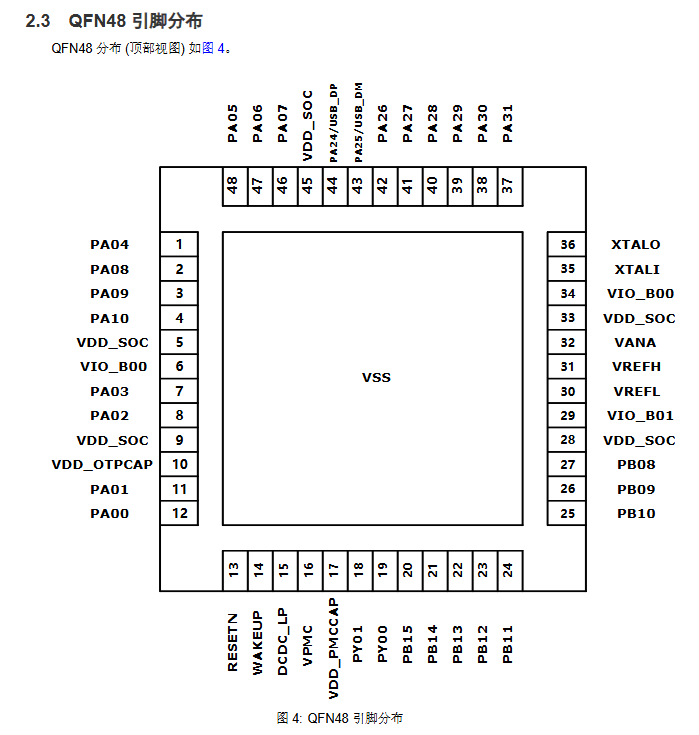

# HPM5321IEG1（U1）手焊专项指南

> 本文档专门讲解如何焊接 `U1`（HPM5321IEG1，QFN-48 主控 MCU），以及没有静电环时的 DIY 平替方案、焊后检查、上电流程。QFN-48 是整板最贵、最难焊的器件，建议按本文档一步步来，避免像之前那样把芯片烫坏/静电击穿。

---

## 1. U1 基本参数与引脚分布

### 1.1 型号与封装

| 项 | 参数 |
|---|---|
| 位号 | U1 |
| 型号 | HPM5321IEG1 |
| 封装 | QFN-48（7×7 mm，底部带 EPAD 散热焊盘） |
| 1 脚位置 | 左下角，本体上有圆点/凹点标识 |
| 极关键电源脚 | 5、6、9、10、16、17、28、29、31、32、33、34、45（共 13 个） |
| 极关键地脚 | 49 = EPAD（VSS，底部散热焊盘） |
| 最脆弱脚 | 第 6 脚 `VIO_B00`，紧贴 EPAD 边缘，最容易因锡溢出而短路 |

### 1.2 QFN-48 引脚分布图

> 顶视图，1 脚位于左下角，逆时针方向 1→48 编号；中间 49 脚为 EPAD（VSS）。

### 1.3 焊接前心理准备

- **U1 是整个板子最贵的芯片，必须最后再焊。**
- 焊之前确认：C26 已焊、U2 隔离 5V 正常、U5/U3/U4 已焊且隔离侧无短路。
- 找一个**干净、无静电、光线好**的工作台；如果桌上有化纤垫、塑料膜、泡沫，先撤掉。

---

## 2. 防静电方案（没有静电环时的平替）

QFN-48 对静电敏感，U1 之前坏掉大概率与 ESD 有关。下面按效果从高到低给方案。

### 方案 A：静电环（最佳）

如果你有一个防静电手腕带（ESD wrist strap）：
1. 手腕带一头戴手腕，另一头通过 **1MΩ 限流电阻** 接到可靠大地（如三孔插座接地端、暖气片金属水管、接地良好的金属机壳）。
2. 烙铁/热风枪如果是三芯插头，地线必须良好接地。
3. 工作台面铺 **防静电桌垫** 并接地；没有就用铝箔/铜箔铺一层连到大地。

### 方案 B：没有静电环时的 DIY 平替（推荐）

#### B1 自制"接地腕带"

**材料**：
- 一根废旧 USB 线（含屏蔽网最好）或 1m 左右单芯导线
- 一个鳄鱼夹 / 1MΩ 电阻（推荐串 1MΩ，防止触电）
- 湿纸巾 / 湿毛巾一小块

**做法**：
1. 导线一端剥出铜线，缠在手腕内侧（用橡皮筋或魔术贴固定）；导线另一端串 1MΩ 电阻后，**鳄鱼夹夹到可靠接地的金属物体**（如：
   - 已接地的烙铁外壳
   - 金属水管
   - 三孔插座的接地孔（用插头接出地线）
   - 机箱金属外壳
   - 裸露的水泥墙钢筋（不是刷漆墙面）
2. 关键：让皮肤始终与大地保持同一电位，**摸芯片前先摸一下接地金属**。

#### B2 没有鳄鱼夹时的极简方案

**做法**：
1. 焊接时，把 **烙铁电源线的地线脚** 或烙铁金属外壳，用导线接到 **暖气片、金属窗框、水龙头** 等建筑接地。
2. 你自己的身体也**至少一只手或手腕通过导线/金属触到同一个接地点**（比如左手扶着接地的金属物体，右手拿镊子夹芯片边缘）。
3. 焊接过程中不要到处走动，不要用手摸化纤衣物、泡沫、塑料袋。

#### B3 更稳妥的"大地平面"工作台

**材料**：
- 一张铝箔纸或铜箔胶带（30×30 cm 即可）
- 一段导线
- 1MΩ 电阻（可选但推荐）

**做法**：
1. 铝箔铺在工作台上，把手焊区域覆盖。
2. 导线一端夹住铝箔，另一端通过 1MΩ 电阻接到可靠大地。
3. PCB 板和你的手都时刻与这片铝箔接触（放上去就是等电位）。

> 💡 原理：静电击穿的本质是"电位差"。只要你的身体、PCB、工具、芯片都接到同一个参考地，就不会产生足以击穿芯片的电位差。1MΩ 电阻用于限制意外电流，防止触电。

### 方案 C：至少要做到的底线

如果没有做任何接地，至少：
1. 摸芯片前、拿起 PCB 前，先**摸一下接地的金属物体**（机箱、水龙头等），放掉自己身上静电。
2. 用**镊子夹持芯片边缘**，手指不要碰芯片顶部黑色封装或底部焊盘。
3. 工作台远离化纤、塑料、泡沫；必要时铺一层湿润的报纸（临时降低静电积聚）。

---

## 3. U1 焊接步骤

### 3.1 焊前 PCB 检查（断电）

**必须全做，任何一项响就别焊 U1**：

| 检查项 | 方法 | 期望 |
|---|---|---|
| U1 区域 3V3 对地 | 蜂鸣档测第 5/9/33/45 脚 `VDD_SOC` 对 GND | **不响** |
| U1 区域 VIO_B00 对地 | 蜂鸣档测第 6/34 脚 `VIO_B00` 对 GND | **不响** |
| LDO1 输出对地 | 蜂鸣档测 LDO1 第 5 脚 `VOUT` 对 GND | **不响** |
| U1 焊盘周边无桥锡 | 显微镜/手机微距目视 | 48 脚焊盘清晰、EPAD 区域干净 |

> 如果哪一项响了：说明 PCB 侧 3V3 网络还有短路（电容桥锡、EPAD 区锡珠等），先修好，否则新 U1 一焊上就坏。

### 3.2 工具设定

| 工具 | 推荐设定 | 说明 |
|---|---|---|
| 热风枪 | **300~310°C**（想更稳妥用 300°C，对应延长加热时间） | 风量 2 挡（最低或次低） |
| 烙铁 | **320°C** | 仅用于修桥锡、补个别脚 |
| 锡膏 | 有铅锡膏（熔点 183°C） | 无铅需要更高温度，QFN 新手不建议 |
| 助焊膏/焊油 | 必备 | 帮助低温下锡流动，防虚焊 |
| 镊子 | 尖细不锈钢镊子 | 夹芯片边缘，不碰引脚和封装顶面 |

### 3.3 预热整块 PCB

1. 热风枪调至 **200°C，风量 2 挡**。
2. 在 PCB 上方 **5~8 cm** 处画圈预热 **30~60 秒**。
3. 让整个 PCB 和元器件均匀升温，减少正式焊接时的温度冲击。

### 3.4 上锡膏

#### EPAD（第 49 脚，底部散热焊盘）

- **只涂极薄一层锡膏**，目标是加热后刚好润湿整个 EPAD 表面，不形成堆积。
- 错误做法：中间堆一团 → 受热溢出到边缘 → 流到第 5/6/9 脚 → 3V3 对地短路 → U1 坏。
- 推荐做法：用刮刀/牙签把锡膏在 EPAD 区**刮平**，薄到几乎透底能看到焊盘颜色。

#### 48 个外围引脚

- 每个引脚焊盘都薄涂锡膏（钢网最好，没有就用牙签/刮刀）。
- **不能省**：引脚才是 U1 的电气连接主体，EPAD 主要管散热和机械托正。

#### 助焊膏

- 在 EPAD 和外围焊盘上再薄涂一层助焊膏/焊油，低温焊接时尤其需要它帮助锡流动。

### 3.5 对位

1. 用镊子夹 U1 的**两侧边缘**（别碰底部焊盘和顶部）。
2. 芯片 1 脚圆点/凹点 → 对齐 PCB 丝印的 1 脚标记（左下角）。
3. 轻轻放下，**确认四边引脚都与焊盘对齐**；不对就再调，别急着加热。

### 3.6 热风回流焊接

1. 热风枪 **300~310°C，风量 2 挡**。
2. 风嘴在芯片上方 **2~3 cm** 处，**画小圆**均匀加热整个芯片（不要只吹一个角）。
3. 加热时间约 **25~40 秒**；温度越低、时间越靠近上限。
4. 观察到：
   - 锡膏整体反光熔化；
   - 芯片在表面张力作用下轻微"归位"（自对中）；
   - 芯片四周能看到极细的锡线润湿引脚。
5. 达到上述状态后立即移开热风枪，让板子自然冷却。

> ⚠️ 关键：不要反复吹。温度低不会立刻坏芯片，但一次没焊好别立刻吹第二次，先冷却再检查。

### 3.7 冷却与检查

1. 冷却到室温（约 30~60 秒）后再动板子。
2. 显微镜 / 手机微距斜照检查：
   - 芯片四边贴平，没有翘起来；
   - 1 脚方向正确；
   - 四周 48 个引脚都有锡润湿，无明显桥锡；
   - EPAD 边缘没有锡珠溢出到第 5/6/9/34 脚附近。

---

## 4. 焊后检查（不上电，先用万用表）

这一步决定你能不能上电。四项全通过才能插电。

| # | 检查项 | 方法 | 期望 |
|---|---|---|---|
| 1 | 相邻引脚短路 | 万用表二极管档，沿四边逐个测相邻脚 | 两两之间应有 PN 结压降（显示几百 mV），不是 0Ω 或蜂鸣响 |
| 2 | 3V3 对地短路 | 黑笔 GND，红笔测 5/9/33/45 `VDD_SOC` 脚焊盘 | **不响** |
| 3 | VIO_B00 对地短路 | 黑笔 GND，红笔测 6/34 `VIO_B00` 脚焊盘 | **不响** |
| 4 | 其余电源/IO 对地短路 | 抽查几个关键脚（如 29/32 等） | 非接地脚应不响 |
| 5 | EPAD 没桥到贴边电源脚 | 红笔 EPAD 区域，黑笔测 5/6/9 脚 | **不响** |

> 如果第 1/2/3/5 项响了：说明有桥锡，必须拆下 U1 清理焊盘后重焊，否则上电必坏。
> 拆芯片方法：热风枪 310°C 加热整颗芯片 30~60 秒，用镊子轻抬取下；然后用吸锡带清理 PCB 焊盘。

---

## 5. 上电流程（严格分步）

### 5.1 首次上电（串限流或短暂点测）

**不要直接插电脑 USB！** 先用 5V 充电器（限流或手动点一下）：

1. 准备一个带 **限流保护** 的电源（可调电源，先设 5V、限流 100mA），或者普通 5V 充电器插一下立刻拔。
2. 上电后立即用手背摸：
   - U1 本体是否发烫？
   - U2 是否发烫？
   - LDO1 是否发烫？
3. 任何一个发烫 → **立刻断电**，先别继续，回查焊后检查项。

### 5.2 如果都不烫，测关键电压

| 测试点 | 期望值 | 说明 |
|---|---|---|
| `USB1 VBUS ↔ GND` | 5.0 V | USB 输入正常 |
| `LDO1 VOUT ↔ GND` | 3.30 V ± 0.05 V | 系统 3V3 正常 |
| `U2 +Vin ↔ -Vin` | 5.0 V | 隔离 DC-DC 输入正常 |
| `U2 +Vout ↔ -Vout` | 5.0 V ± 0.25 V | 隔离 5V 正常 |
| `USB 侧 GND ↔ U2 副边 -Vout` | **不通（蜂鸣不响）** | 隔离成立 |

### 5.3 后续：烧录固件与功能验证

电压全部正常后：
1. 连接电脑 USB，检查设备管理器是否识别 HPMicro 设备（或是否出现 DFU/ISP 设备，取决于固件状态）。
2. 按住 `SW1` 按键上电，进入 ISP 模式。
3. 使用 HPMicro 烧录工具烧录固件。
4. 烧录后观察 D1/D2 指示灯、测试 USB 通信、两路 CAN 收发。

---

## 6. 常见问题速查

### Q：焊完 U1 后 3V3 对地响了怎么办？

A：先别上电。大概率是：
1. EPAD 锡多溢出桥到 5/6/9 脚；
2. 某个 IO 脚桥到 EPAD（地）；
3. 某个去耦电容桥锡。
处理：拆 U1 → 清理 PCB 焊盘（吸锡带吸平 EPAD）→ 重新焊。

### Q：为什么我用 300°C 焊完，有些引脚二极管档测不到压降？

A：温度偏低 + 时间偏短导致虚焊。处理：
1. 检查是哪些引脚没焊上；
2. 烙铁 320°C + 焊油，单独补那几个脚；
3. 或者拆下重焊（这次温度提到 310°C、时间延长到 35 秒）。

### Q：没有热风枪，只用烙铁能焊 QFN-48 吗？

A：极不推荐。烙铁很难把热量均匀传到 EPAD 和四周 48 脚，新手几乎必虚焊或过热。建议借/买一把热风枪，或者找有热风焊台的朋友帮忙。

### Q：U1 已经坏了一颗，换新的时要注意什么？

A：
1. 先确认坏掉的是芯片本身（拆下来测该脚对 EPAD 短），而不是 PCB 或桥锡问题；
2. 新芯片到货后一直放在防静电袋里，直到焊前才取出来；
3. 按本文档的防静电方案操作；
4. 焊前、焊后、上电前三次万用表检查，一项不通过就别上电。

---

## 7. 必备口诀

> **等电位、轻上锡、低温慢热、焊后查、限流上电。**

1. 等电位：防静电做好，身体/工具/PCB/芯片同一电位。
2. 轻上锡：EPAD 薄锡，四周引脚薄锡，锡多必桥。
3. 低温慢热：300~310°C、风量低、画圈加热、看锡反光即停。
4. 焊后查：相邻脚、3V3 对地、VIO_B00 对地、EPAD 不桥电源脚。
5. 限流上电：先别插电脑，5V 限流或点测，摸 U1/U2/LDO 不烫再继续。
