---
html:
  toc: true

print_background: true
---


# <center>HPM Manufacturing Tool 使用手册</center>

## 1. 概述

&emsp;&emsp;HPM Manufacturing Tool 是 HPMicro 公司推出的配置及批量烧写工具，旨在帮助企业用户快速批量的对HPMicro公司推出的芯片进行镜像配置及烧写。该工具主推 GUI 用户界面交互模式，该模式包含了烧写工具(HPMicro Programmer)及由烧写工具导出的量产包工具(HPMicro Manufacturing Util)两个入口。同时该工具也支持命令行烧写模式。下面分别对这几种操作模式进行介绍。

## 2. GUI模式

### 2.1 烧写工具(HPMicro Programmer)

&emsp;&emsp;HPM Manufacturing Tool 首次启动加载主界面为烧写工具(HPMicro Programmer)，该工具主要帮助用户进行烧写镜像、编辑镜像、烧写OTP以及量产命令配置等操作。主界面如下图所示：

<center>
    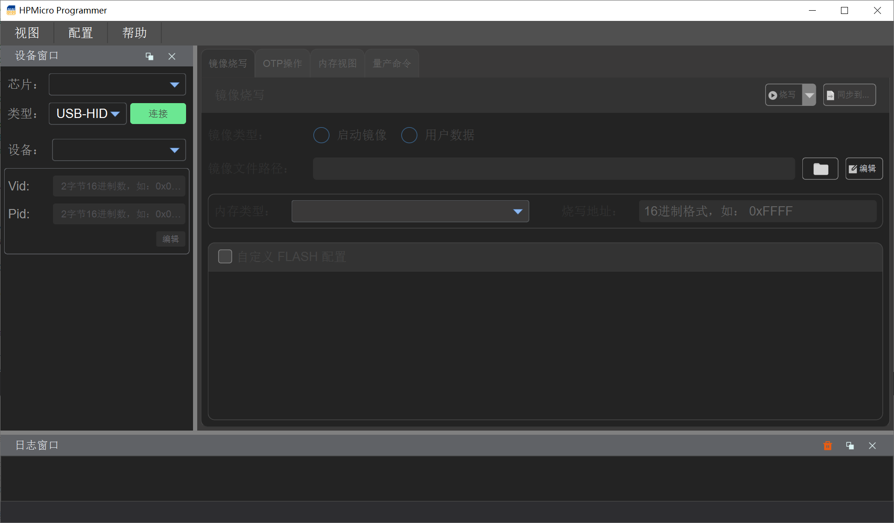
    <br>
    <div style="color:orange; border-bottom: 1px solid #d9d9d9;
    display: inline-block;
    color: #999;
    padding: 2px;">图2.1 HPMicro Programmer 主界面</div>
</center>

&emsp;&emsp;该界面当前版本主要包含以下几部分，菜单栏，活动窗口和主窗口。菜单栏中视图菜单可以控制活动窗口的显示状态，帮助菜单包含用户手册，语言切换等功能。主界面主要包含对芯片的烧写以及配置操作，如镜像烧写、OTP读写、量产烧写等功能。后续将分别进行介绍。

#### 2.1.1 设备连接

&emsp;&emsp;HPM Programmer工具打开后主界面默认是未使能状态，需要先在设备窗口连接设备。该工具支持USB-HID和串口两种连接方式。连接好开发板后，用户需要手动选择芯片以及设备类型，随后工具会自动检测已插入设备，点击连接按钮进行连接。连接成功如下图所示：

<center>
    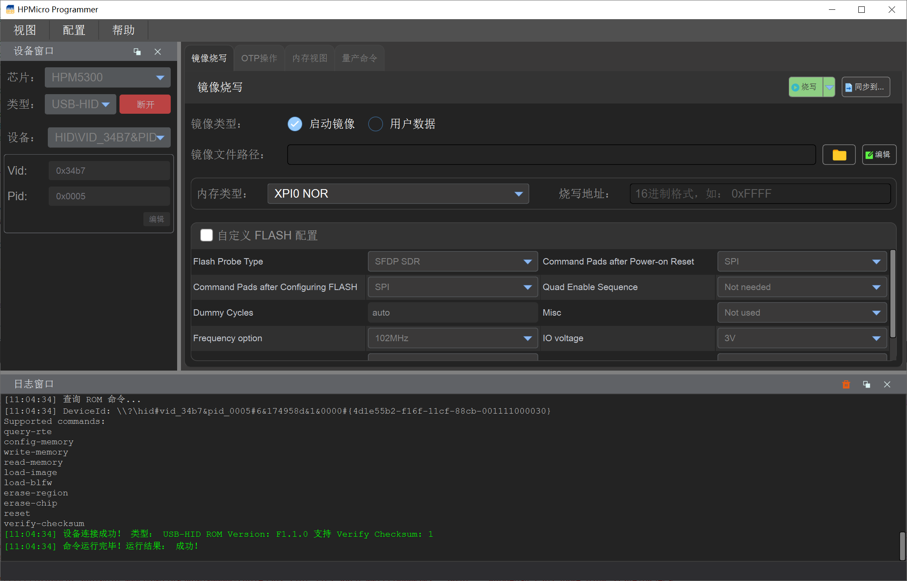
    <br>
    <div style="color:orange; border-bottom: 1px solid #d9d9d9;
    display: inline-block;
    color: #999;
    padding: 2px;">图2.1.1 连接成功</div>
</center>

&emsp;&emsp;连接成功后，便可以进行镜像烧写、OTP读写及量产命令设置等操作了。

##### 2.1.1.1 自定义 USB vid，pid 参数连接

&emsp;&emsp;自 v0.5.0 版本之后，工具在使用 USB-HID 连接时，支持了自定义修改 vid，pid 的功能。该功能要求您先在 OTP 第 68 字将要指定的 vid 和 pid 写入 OTP，这样在设备连接时，就会检测到编辑后的 vid 和 pid。以 HPM5E00 为例，首先以默认的 USB-HID 配置连接设备，此时，vid 为 0x34b7，pid 为 0x0008。连接成功后，点击 OTP 操作页，在写视图中写入 68 字的值 0x12345678，指定 vid 为 0x1234，pid 为 0x5678。点击写入后，刷新 OTP 读视图值，确保数据已写入，如下图所示：

<center>
    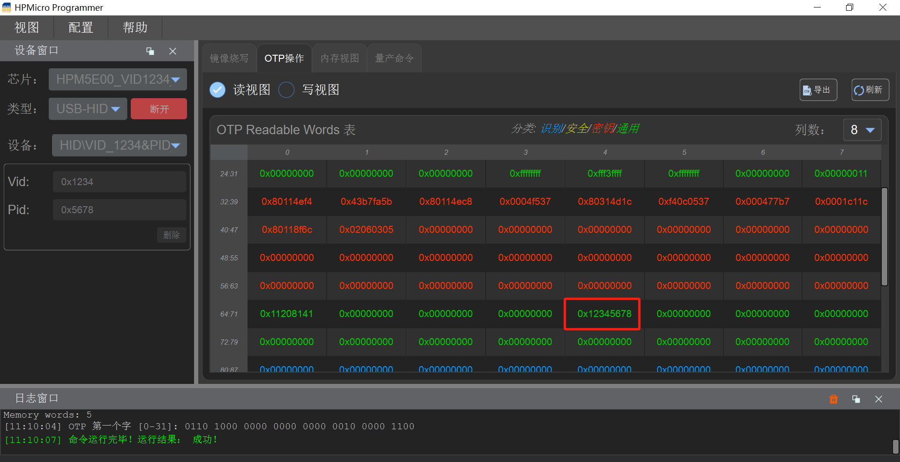
    <br>
    <div style="color:orange; border-bottom: 1px solid #d9d9d9;
    display: inline-block;
    color: #999;
    padding: 2px;">图2.1.1.1.1 写入自定义 vid,pid 到 OTP </div>
</center>

&emsp;&emsp;写入成功后，断开工具连接，reset设备，此时可以发现修改参数之后的设备已经被检测到，但由于 vid 和 pid 和默认配置不匹配，无法自动选取到设备列表中，如下图所示：

<center>
    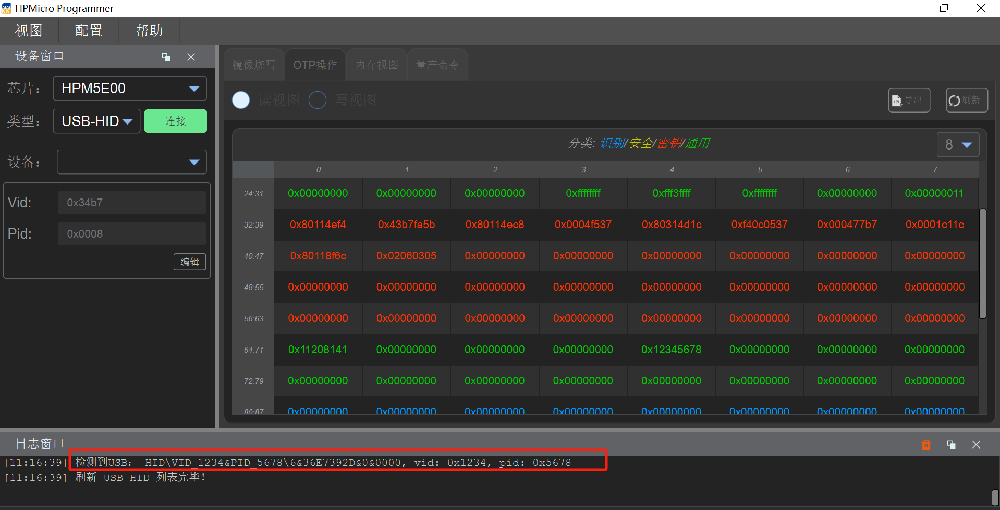
    <br>
    <div style="color:orange; border-bottom: 1px solid #d9d9d9;
    display: inline-block;
    color: #999;
    padding: 2px;">图2.1.1.1.2 自定义 vid,pid 设备自动检测</div>
</center>

&emsp;&emsp;此时需要编辑工具设备窗口的 vid 和 pid 值，首选确保设备窗口中芯片类型与修改 OTP 前设备保持一致，然后点击下方编辑按钮，将 vid 和 pid 修改为自定义的值后点击新增。设备列表中会新增一个芯片类型，并默认选择。此时应该能检测到设备，点击连接后正常连接，如下图所示：

<center>
    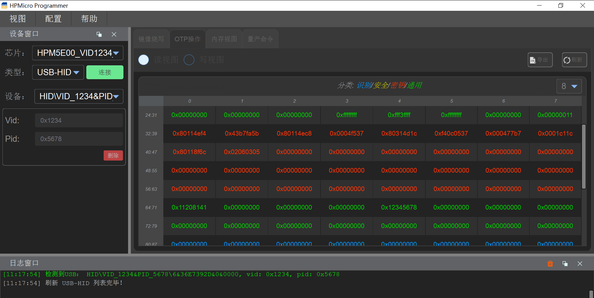
    <br>
    <div style="color:orange; border-bottom: 1px solid #d9d9d9;
    display: inline-block;
    color: #999;
    padding: 2px;">图2.1.1.1.3 新增自定义 vid,pid 设备</div>
</center>

&emsp;&emsp;新增的芯片类型支持删除，您可以在断开设备连接后，在芯片下拉框中直接删除自定义 vid，pid 的芯片，也可以选择了要删除的芯片后，点击下方的删除按钮，如下图所示：

<center>
    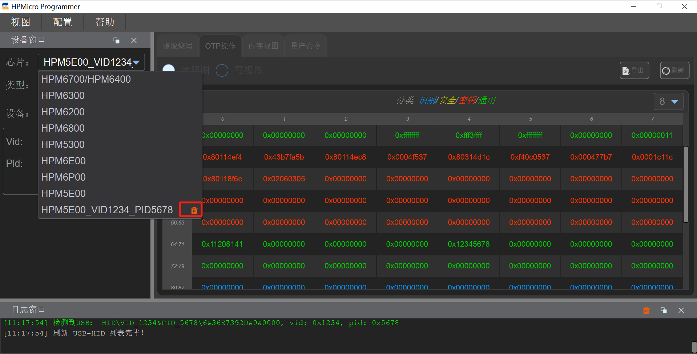
    <br>
    <div style="color:orange; border-bottom: 1px solid #d9d9d9;
    display: inline-block;
    color: #999;
    padding: 2px;">图2.1.1.1.4 删除自定义 vid,pid 类型</div>
</center>


##### 2.1.1.2 LINUX版本连接注意事项：

- Linux版本工具在连接USB或者串口设备时需要先提升应用权限，最简单的操作是使用sudo命令运行程序，打开后可以直接连接USB或者串口设备，如下：
    ```
    sudo ./hpm_manufacutring_gui
    ```
- 优先推荐采用 sudo 命令进行提权，您也可以采用 su 命令直接切换到 root 用户，然后运行程序，但 root 用户权限过高，强烈不推荐此方法。如果一定要使用 su 命令切换用户，不要使用 `su - `命令切换账号，因为 su 命令默认会加载环境变量，这样有可能导致桌面环境变量错误因而无法正常打开工具。想要通过非 root 用户连接设备，参考下面两种方案。
- 非 root 权限用户，如果连接串口设备，可以将当前用户加入到 dialout 组中，这样就可以直接运行工具连接而不需要sudo命令。
- 非 root 权限用户，如果连接USB设备，需要配置udev规则，具体操作如下：
    - 在/etc/udev/rules.d目录下创建udev规则文件，命令如下：
    ```
    cd /etc/udev/rules.d
    sudo vim 71-hpmicro.usbhid.rules
    ```
    数字71代表优先级，数字越大优先级越高。该值建议参考 rules.d 目录下其他文件。
    - 输入以下内容，保存退出:
    ```
    SUBSYSTEMS=="usb", ATTRS{idVendor}=="34b7",MODE="0666",GROUP="${group}"
    ```
    其中${group}修改为当前用户组名称
    - 重启 udev 服务，命令如下：
    ```
    sudo service udev reload
    sudo service udev restart
    ```
    - 重新连接设备，即可正常连接。

##### 2.1.1.3 开发板连接注意事项

- 目前 HPM5301EVK Lite 不支持通过 USB 模式进行连接，可以采用串口方式进行连接。
- LINUX版本工具使用串口连接部分先楫官方开发板时，由于采用的是ft2232驱动，有可能会在列表中显示两个串口设备，一个为/dev/ttyUSB0，另一个为/dev/ttyUSB1，此时需要手动选择/dev/ttyUSB1 进行连接。


#### 2.1.2 镜像烧写

&emsp;&emsp;镜像烧写功能可以支持HPMicro自研芯片的启动镜像烧写以及用户自定义数据的烧写。
- 当镜像类型选择了启动镜像后，工具会自动对加入的工具进行启动镜像格式检测，当启动镜像格式检测成功后，工具会自动获取当前镜像的烧写地址。
- 当启动镜像不符合规定的格式时，工具会提示对镜像进行编辑或者修改镜像类型为用户数据选项，镜像编辑会打开镜像编辑活动窗口(该窗口也可直接从菜单栏视图菜单中打开)。具体请参考[镜像编辑章节](#4-镜像编辑助手)。
- 当镜像类型选择为用户数据时，用户需要手动填写镜像地址，工具不会检测该地址正确性，会直接烧写。

&emsp;&emsp;对于启动镜像，目前根据 SoC 类型主要分为 FLASH 镜像以及 EMMC 镜像，现分别介绍如下：

##### 2.1.2.1 FLASH 镜像
&emsp;&emsp;在烧写之前，用户需要也需要选择Flash配置信息告诉SoC当前Flash配置状态。`Flash Words配置可以参考 HPM SDK下 boards.c文件开头注释`，相关内容如下所示：

```
/**
 * @brief FLASH configuration option definitions:
 * option[0]:
 *    [31:16] 0xfcf9 - FLASH configuration option tag
 *    [15:4]  0 - Reserved
 *    [3:0]   option words (exclude option[0])
 * option[1]:
 *    [31:28] Flash probe type
 *      0 - SFDP SDR / 1 - SFDP DDR
 *      2 - 1-4-4 Read (0xEB, 24-bit address) / 3 - 1-2-2 Read(0xBB, 24-bit address)
 *      4 - HyperFLASH 1.8V / 5 - HyperFLASH 3V
 *      6 - OctaBus DDR (SPI -> OPI DDR)
 *      8 - Xccela DDR (SPI -> OPI DDR)
 *      10 - EcoXiP DDR (SPI -> OPI DDR)
 *    [27:24] Command Pads after Power-on Reset
 *      0 - SPI / 1 - DPI / 2 - QPI / 3 - OPI
 *    [23:20] Command Pads after Configuring FLASH
 *      0 - SPI / 1 - DPI / 2 - QPI / 3 - OPI
 *    [19:16] Quad Enable Sequence (for the device support SFDP 1.0 only)
 *      0 - Not needed
 *      1 - QE bit is at bit 6 in Status Register 1
 *      2 - QE bit is at bit1 in Status Register 2
 *      3 - QE bit is at bit7 in Status Register 2
 *      4 - QE bit is at bit1 in Status Register 2 and should be programmed by 0x31
 *    [15:8] Dummy cycles
 *      0 - Auto-probed / detected / default value
 *      Others - User specified value, for DDR read, the dummy cycles should be 2 * cycles on FLASH datasheet
 *    [7:4] Misc.
 *      0 - Not used
 *      1 - SPI mode
 *      2 - Internal loopback
 *      3 - External DQS
 *    [3:0] Frequency option
 *      1 - 30MHz / 2 - 50MHz / 3 - 66MHz / 4 - 80MHz / 5 - 100MHz / 6 - 120MHz / 7 - 133MHz / 8 - 166MHz
 *
 * option[2] (Effective only if the bit[3:0] in option[0] > 1)
 *    [31:20]  Reserved
 *    [19:16] IO voltage
 *      0 - 3V / 1 - 1.8V
 *    [15:12] Pin group
 *      0 - 1st group / 1 - 2nd group
 *    [11:8] Connection selection
 *      0 - CA_CS0 / 1 - CB_CS0 / 2 - CA_CS0 + CB_CS0 (Two FLASH connected to CA and CB respectively)
 *    [7:0] Drive Strength
 *      0 - Default value
 * option[3] (Effective only if the bit[3:0] in option[0] > 2, required only for the QSPI NOR FLASH that not supports
 *              JESD216)
 *    [31:16] reserved
 *    [15:12] Sector Erase Command Option, not required here
 *    [11:8]  Sector Size Option, not required here
 *    [7:0] Flash Size Option
 *      0 - 4MB / 1 - 8MB / 2 - 16MB
 */
```

##### 2.1.2.2 EMMC 镜像
&emsp;&emsp;用户可以将RAM镜像经过编辑后烧写到 EMMC 中。选择 RAM 镜像后，用户需要先点击编辑按钮进行镜像编辑，然后选择 RAM 镜像添加固件容器头，生成新镜像文件（具体请参考[镜像编辑章节](#4-镜像编辑助手)）。选择新镜像后，用户需要先选择EMMC的内存类型，以 HPM6800 为例，内存类型可以切换到 SDXC0 或 SDXC1。切换后，烧写地址将更改为 Sector 索引并自动填充索引值。同时，自定义内存配置将改为 自定义 EMMC 配置选项。与 FLASH Option 信息不同，EMMC 配置信息 Option[0] 以 0xeccf9 开头，整体配置如下图所示：

<center>
    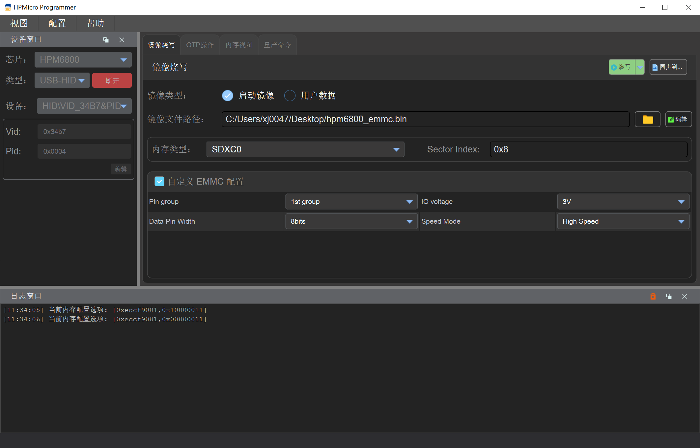
    <br>
    <div style="color:orange; border-bottom: 1px solid #d9d9d9;
    display: inline-block;
    color: #999;
    padding: 2px;">图2.1.2.2.1 烧写EMMC镜像</div>
</center>

&emsp;&emsp;配置完成之后点击镜像烧写任务栏的烧写按钮，会直接对当前镜像进行烧写。如下图所示，动画结束表示烧写完成。

<center>
    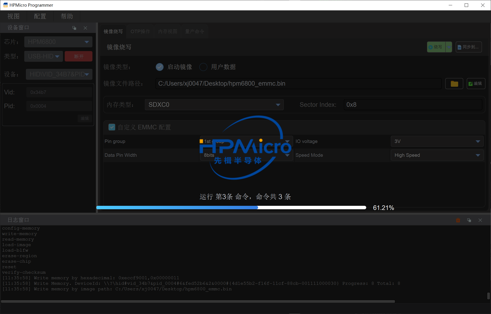
    <br>
    <div style="color:orange; border-bottom: 1px solid #d9d9d9;
    display: inline-block;
    color: #999;
    padding: 2px;">图2.1.2.2.2 镜像烧写</div>
</center>

##### 2.1.2.3 镜像烧写并校验

&emsp;&emsp;自 v0.6.0 版本后，工具新增了快速校验烧写内容的功能，该功能需加载 v0.6.0 版本固件后方可使用。在设备正常连接并加载固件后，在镜像烧写标签页的烧写按钮旁边会有一个下拉按钮（如固件未正常加载该按钮会被置灰），点击后可以选择“烧写并校验”功能。如下图所示：

<center>
    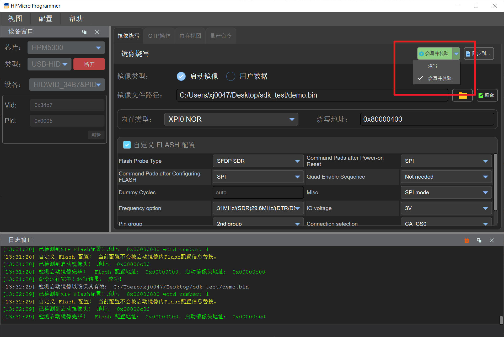
    <br>
    <div style="color:orange; border-bottom: 1px solid #d9d9d9;
    display: inline-block;
    color: #999;
    padding: 2px;">图2.1.2.3.1 镜像烧写并校验</div>
</center>


选择 “烧写并校验” 选项后，按钮文案会同步为 “烧写并校验”，点击后工具会先执行烧写操作，烧写完毕后工具会使用校验命令校验内存中的烧写内容与文件是否一致，如果一致会看到 “Verify checksum success” 的日志提示，如下图所示：

<center>
    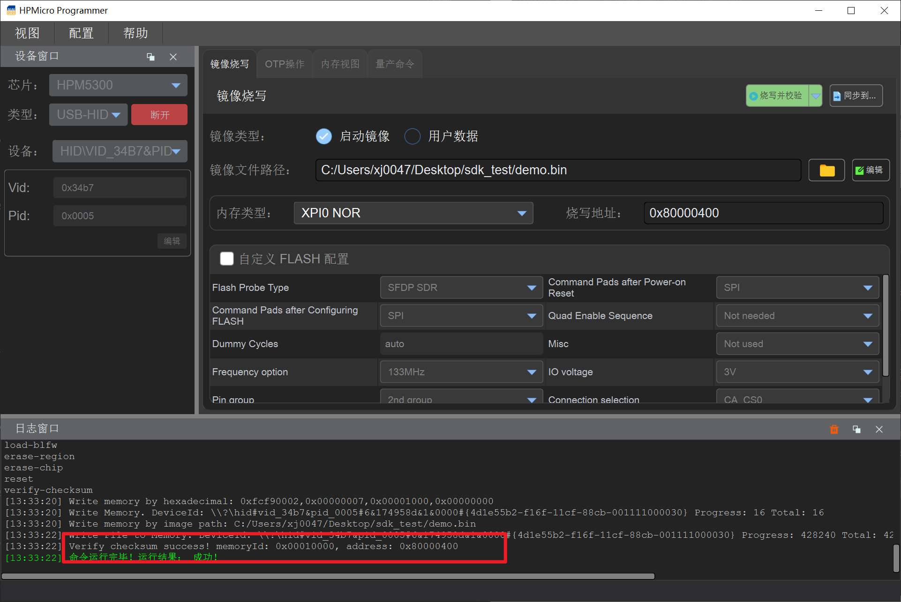
    <br>
    <div style="color:orange; border-bottom: 1px solid #d9d9d9;
    display: inline-block;
    color: #999;
    padding: 2px;">图2.1.2.3.2 镜像烧写并校验操作</div>
</center>

注意：右边同步到按钮的功能与 “烧写” 按钮功能保持一致，如果当前选择了 “烧写并校验” 选项，点击同步到之后，量产命令列表中也会在最后加入校验命令。


#### 2.1.3 OTP读写

&emsp;&emsp;当前工具提供了对OTP进行读写的功能，第一次打开OTP标签页，工具会自动读取当前芯片可读的OTP字，可以通过表格右侧下拉框修改展示的列数，点击刷新按钮会重新获取可读OTP字的值，如下图所示：

<center>
    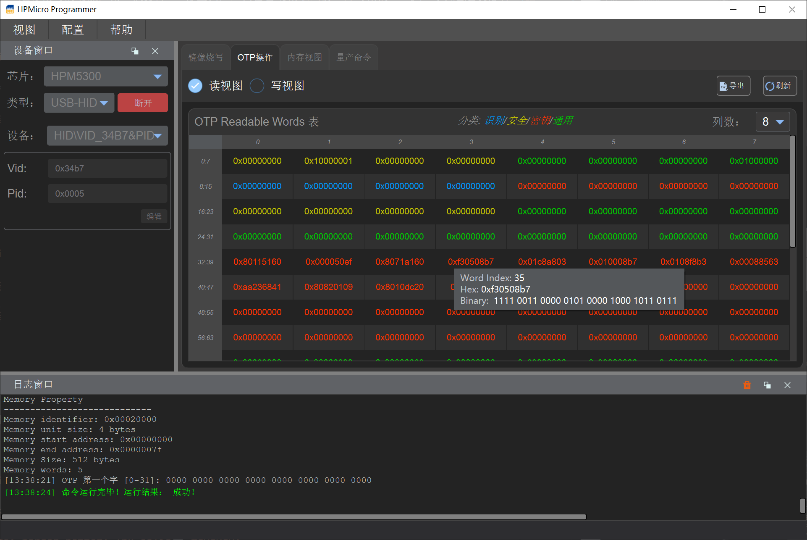
    <br>
    <div style="color:orange; border-bottom: 1px solid #d9d9d9;
    display: inline-block;
    color: #999;
    padding: 2px;">图2.1.3 OTP读视图</div>
</center>

&emsp;&emsp;当鼠标悬浮到某个字上时，会显示当前字的十六进制以及二进制表达，同时会显示当前字的一些关键字段，如下图所示：

<center>
    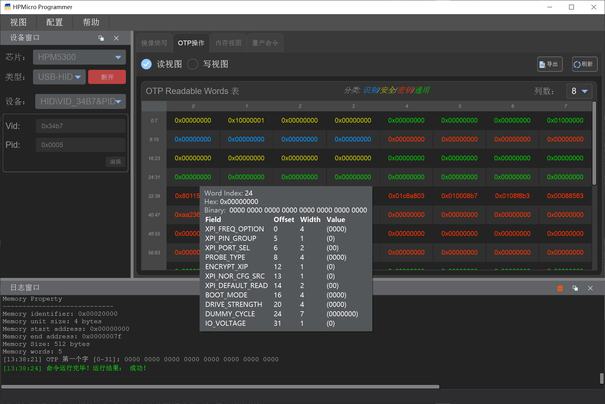
    <br>
    <div style="color:orange; border-bottom: 1px solid #d9d9d9;
    display: inline-block;
    color: #999;
    padding: 2px;">图2.1.3.1 OTP读视图关键字段展示</div>
</center>

&emsp;&emsp;切换到写视图，工具提供了两种添加OTP字的方式：
- 用户可以切换到用例标签页，里面内置了一些常用的OTP关键字的配置，勾选某个选项前的复选框，点击确定后便会读取选中的字，如下图所示：

<center>
    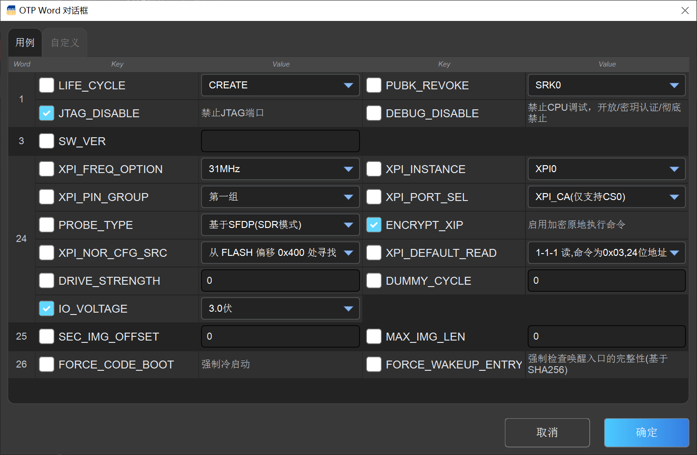
    <br>
    <div style="color:orange; border-bottom: 1px solid #d9d9d9;
    display: inline-block;
    color: #999;
    padding: 2px;">图2.1.3.2 OTP写模板选择</div>
</center>

- 另外，用户可以切换到自定义标签页，编辑想要写的OTP字，支持多个连续编辑及烧写，如下图所示：

<center>
    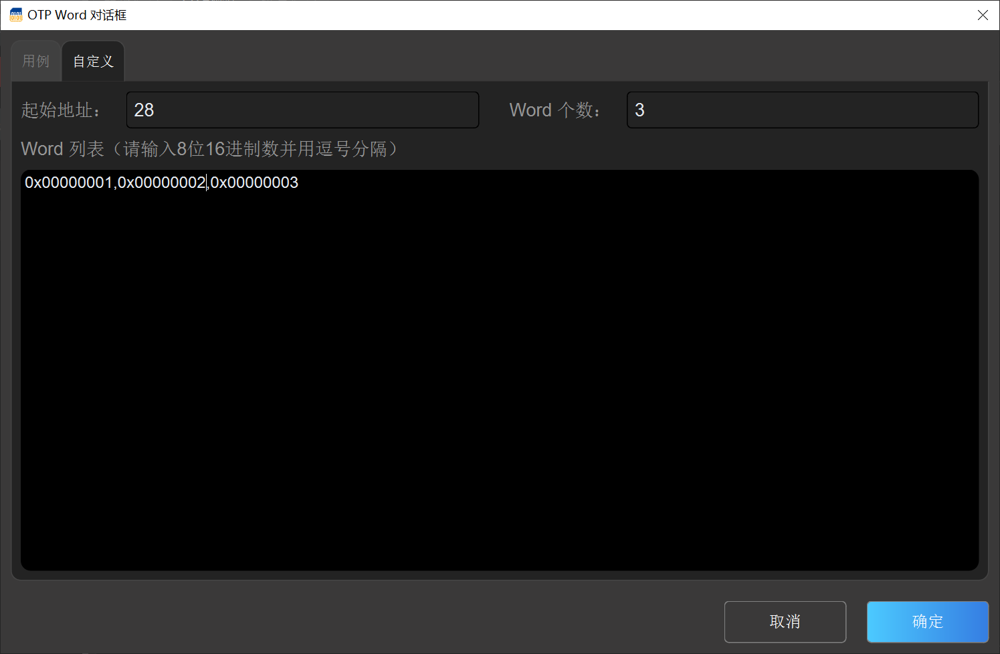
    <br>
    <div style="color:orange; border-bottom: 1px solid #d9d9d9;
    display: inline-block;
    color: #999;
    padding: 2px;">图2.1.3.3 OTP写自定义编辑</div>
</center>

<center>
    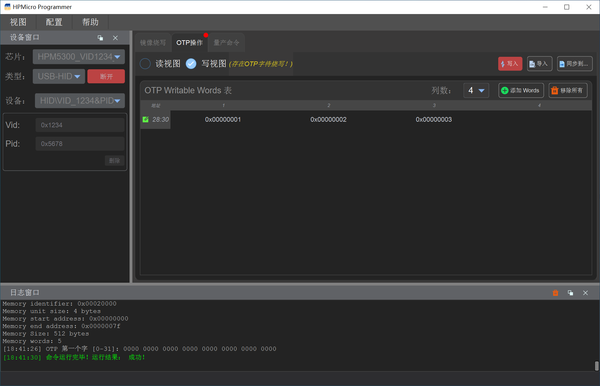
    <br>
    <div style="color:orange; border-bottom: 1px solid #d9d9d9;
    display: inline-block;
    color: #999;
    padding: 2px;">图2.1.3.4 OTP写视图</div>
</center>

&emsp;&emsp;当添加完毕后，点击OTP标签页工具栏右侧的写入按钮，便可以修改已编辑的OTP字。

&emsp;&emsp;您也可以直接导入一个 csv 或 txt 格式的配置文件直接加载配置文件中的OTP数据。该配置文件格式与读视图中导出的配置文件保持一致，以 “word，value” 开头，代表每行两个值的意义，如下所示：

<center>
    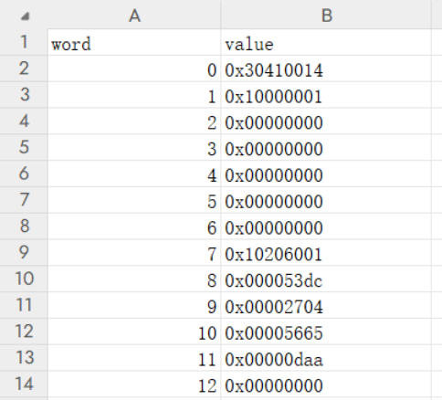
    <br>
    <div style="color:orange; border-bottom: 1px solid #d9d9d9;
    display: inline-block;
    color: #999;
    padding: 2px;">图2.1.3.5 OTP 写视图导入 csv 文件格式</div>
</center>

导入过程会自动过滤掉值不存在的字以及值为 0 的值，导入成功后如下图所示：

<center>
    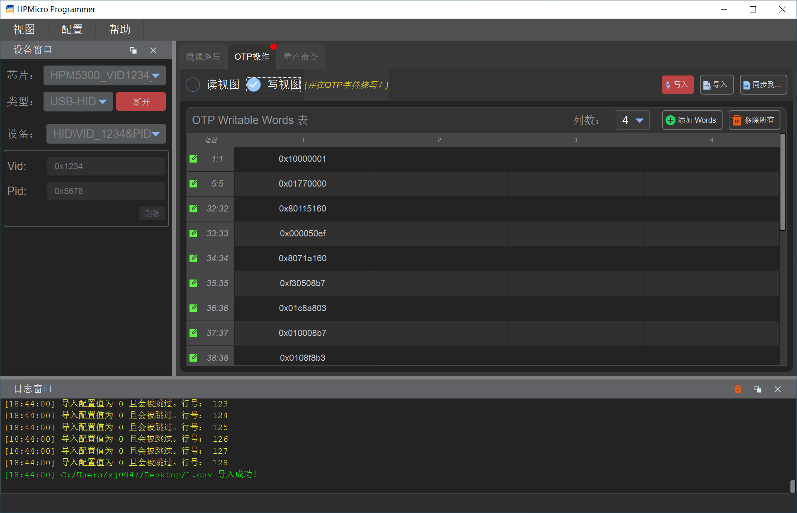
    <br>
    <div style="color:orange; border-bottom: 1px solid #d9d9d9;
    display: inline-block;
    color: #999;
    padding: 2px;">图2.1.3.6 OTP 写视图导入 csv </div>
</center>


#### 2.1.4 内存视图

&emsp;&emsp; 自 v0.6.0 版本后，工具新增了内存视图标签页，方便用户对当前连接设备的 FLASH/eMMC 等内存数据进行查看、校验以及擦除等。整体界面如下图所示：

<center>
    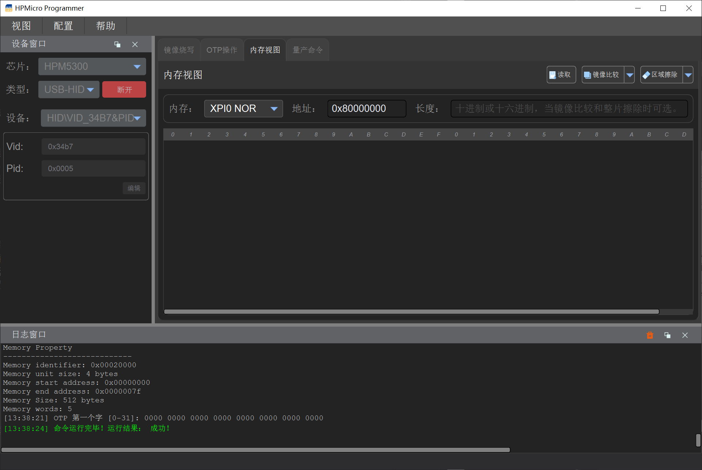
    <br>
    <div style="color:orange; border-bottom: 1px solid #d9d9d9;
    display: inline-block;
    color: #999;
    padding: 2px;">图2.1.4.1 内存视图 </div>
</center>

内存下拉框中会自动加载当前设备支持的 FLASH/eMMC 并显示其对应的起始地址，如上图中，HPM5300 系列的 XPI0 的地址 0x80000000 已自动填入。

&emsp;&emsp; 内存视图当前支持读取指定内存数据，比较数据以及擦除三个主要功能。但在使用前均需要对 FLASH/eMMC 进行配置，当工具检测到 ROM 未配置当前数据时，会先弹框提示配置 FLASH/eMMC 后，当配置成功后，再继续执行选择的命令，如下图所示：

<center>
    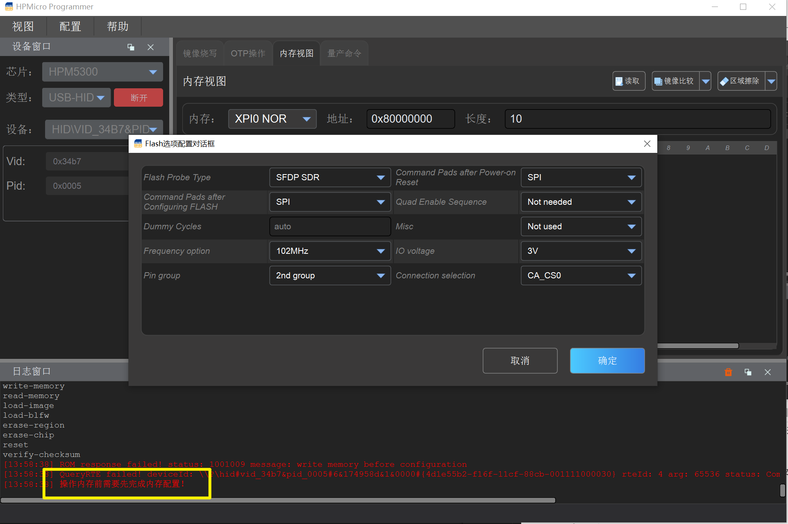
    <br>
    <div style="color:orange; border-bottom: 1px solid #d9d9d9;
    display: inline-block;
    color: #999;
    padding: 2px;">图2.1.4.2 内存配置界面 </div>
</center>

下面分别介绍内存视图的主要功能。

##### 2.1.4.1 内存读取

&emsp;&emsp;内存视图支持读取指定开始地址以及指定长度的内存数据。使用读取功能时，长度参数需要手动进行填写，填写后点击读取按钮，未配置内存时会先弹出配置对话框。配置完毕后便会将读取内容显示到界面上，如下图所示：

<center>
    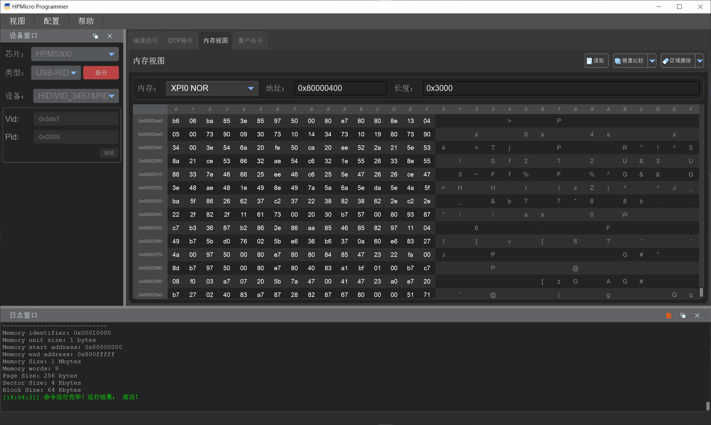
    <br>
    <div style="color:orange; border-bottom: 1px solid #d9d9d9;
    display: inline-block;
    color: #999;
    padding: 2px;">图2.1.4.1.1 内存视图读取数据 </div>
</center>

读取的内容会按照偏移地址进行显示，每行16个字节，分为左右两部分，左边为具体地址的十六进制值，右面对应位置为该值对应的 ASCII 码。

##### 2.1.4.2 镜像比较

&emsp;&emsp;内存视图支持比较某个镜像文件与内存中某个内存区域数据是否一致。工具此处提供了两种比较方式，一种为普通的镜像比较，即通过直接读取内存数据逐字节进行比较。同时也提供了快速校验方式，该方式会直接计算文件的校验和，与对应内存区域的校验和直接进行比较（该方式在正常加载固件后方可使用）。

&emsp;&emsp;两个比较方式各有特点：
- 镜像比较方式速度较慢，但可以精确获取到错误地址以及数据并显示；
- 镜像快速校验方式速度快，但只会提供校验的最终结果，无法获取到错误地址及数据；
您可以根据自身需求选择不同的校验方式使用。两种方式使用方式完全相同，您只需要在比较前先通过下拉框选择您需要的校验方式即可。

注意：
- 镜像比较及快速校验默认从选择的镜像开头进行比较，因此输入的地址需要为镜像的烧写地址；
- 长度参数可以忽略，当不输入时默认比较整个选择文件的长度；

下面是采用镜像比较的方法比对了一份不匹配数据的执行结果，可以看到，在内存视图中会标识处错误的地址以及在日志中会显示错误值。如下图所示：

<center>
    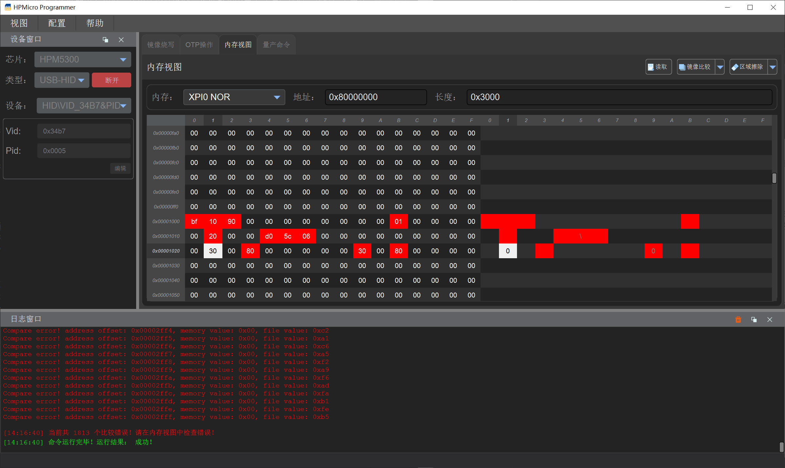
    <br>
    <div style="color:orange; border-bottom: 1px solid #d9d9d9;
    display: inline-block;
    color: #999;
    padding: 2px;">图2.1.4.2.1 镜像比较 </div>
</center>

##### 2.1.4.3 内存区域擦除

&emsp;&emsp;您可以点击擦除按钮来对当前内存区域进行区域擦除或整片擦除。您需要通过下拉按钮先来选择擦除的方式。区域擦除即会对输入的地址以及长度进行指定擦除。整片擦除将会擦除整块内存数据，因此当选择整块擦除时，地址以及长度参数可以忽略。

下图为执行区域擦除后的结果：

<center>
    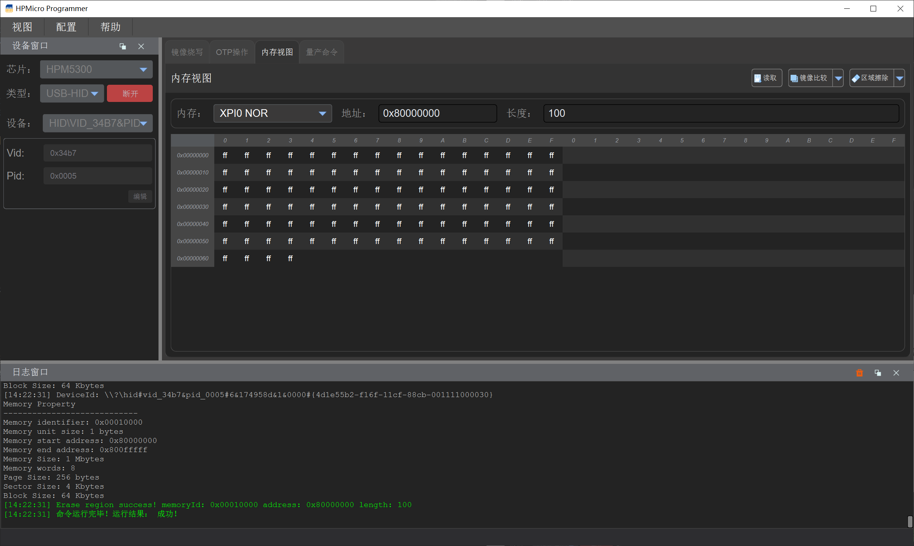
    <br>
    <div style="color:orange; border-bottom: 1px solid #d9d9d9;
    display: inline-block;
    color: #999;
    padding: 2px;">图2.1.4.3.1 区域擦除 </div>
</center>


#### 2.1.5 批量烧写

&emsp;&emsp;批量烧写功能为高级功能，主要为量产工具提供烧写命令。

- 在批量烧写功能中，用户可以自己编辑原子命令，点击新增按钮，打开编辑对话框，如下图所示：

<center>
    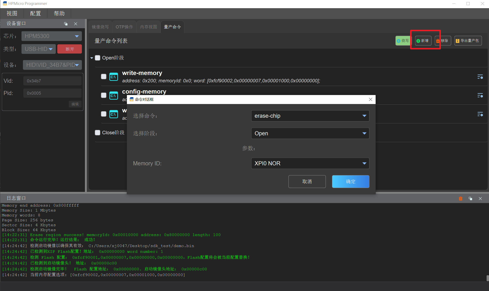
    <br>
    <div style="color:orange; border-bottom: 1px solid #d9d9d9;
    display: inline-block;
    color: #999;
    padding: 2px;">图2.1.5.1 命令配置对话框</div>
</center>

- 用户也可以直接从镜像烧写和OTP写标签页中同步命令，点击标签页工具栏右侧同步按钮，可以直接将命令同步到批量烧写命令中，当量产命令中有其他命令时，工具提供了追加和重置两种方式来同步命令。

##### 2.1.5.1 验证内存校验和

&emsp;&emsp;自 v0.6.0 版本后，工具新增了 verify-checksum 命令来校验内存数据，该功能需要在固件正常加载后才可使用。
该命令有两个入口：

1. 直接配置 verify-checksum 命令

&emsp;&emsp;在命令配置对话框中选择 verify-checksum 命令，然后配置即可。需要输入想要验证的地址，同时支持十六进制数组以及文件两种数据输入方式，如下图所示：

<center>
    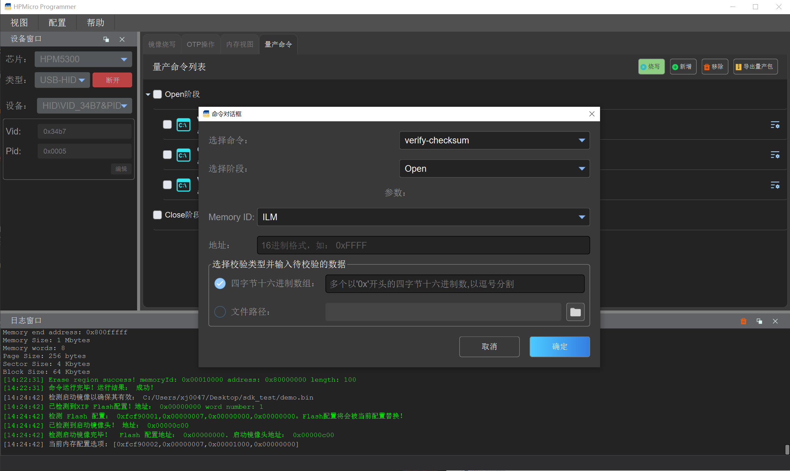
    <br>
    <div style="color:orange; border-bottom: 1px solid #d9d9d9;
    display: inline-block;
    color: #999;
    padding: 2px;">图2.1.5.1.1 verify-checksum 命令对话框</div>
</center>

2. 在 write-memory 命令后附加 verify-checksum 命令

&emsp;&emsp;您也可以在配置 write-memory 命令时勾选“写完数据后验证 checksum” 复选框，这样在执行完 write-memory 命令后工具会自动执行 verify-checksum 命令对当前写入的命令进行校验，如下图所示：

<center>
    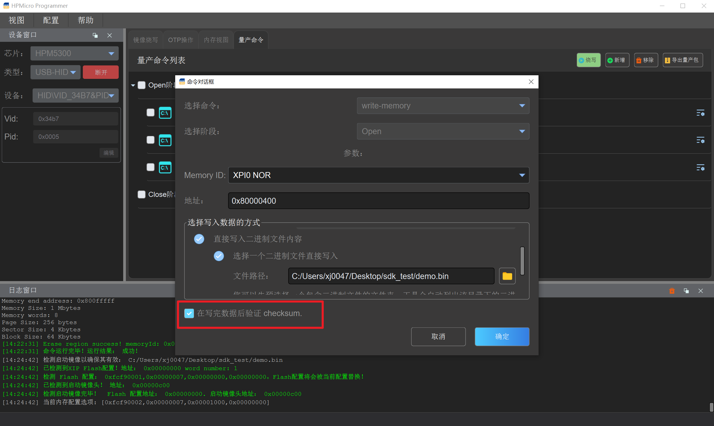
    <br>
    <div style="color:orange; border-bottom: 1px solid #d9d9d9;
    display: inline-block;
    color: #999;
    padding: 2px;">图2.1.5.1.2 verify-checksum 命令对话框</div>
</center>

命令添加后效果如下图所示：

<center>
    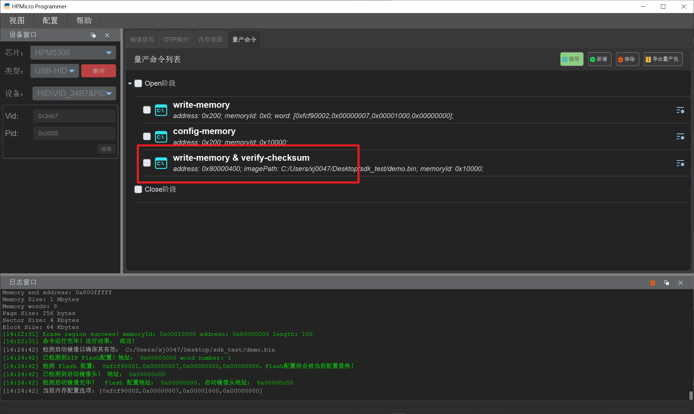
    <br>
    <div style="color:orange; border-bottom: 1px solid #d9d9d9;
    display: inline-block;
    color: #999;
    padding: 2px;">图2.1.5.1.3 verify-checksum 合并到 write-memory</div>
</center>

##### 2.1.5.2 烧写固定文件夹中单个镜像功能

&emsp;&emsp;自 v0.6.0 版本后，新增了烧写固定文件夹下单个镜像功能。通过该功能，你可以在 write-memory 命令中选择一个指定的文件夹，工具会遍历该文件夹目录下所有镜像文件并显示（子目录不遍历）。您在烧写时可以随时切换该目录下的镜像文件进行烧写，避免了想要快速切换文件时需要手动编辑 write-memory 的问题。

您需要现在 write-memory 命令中选择一个固定文件夹，如下图所示：

<center>
    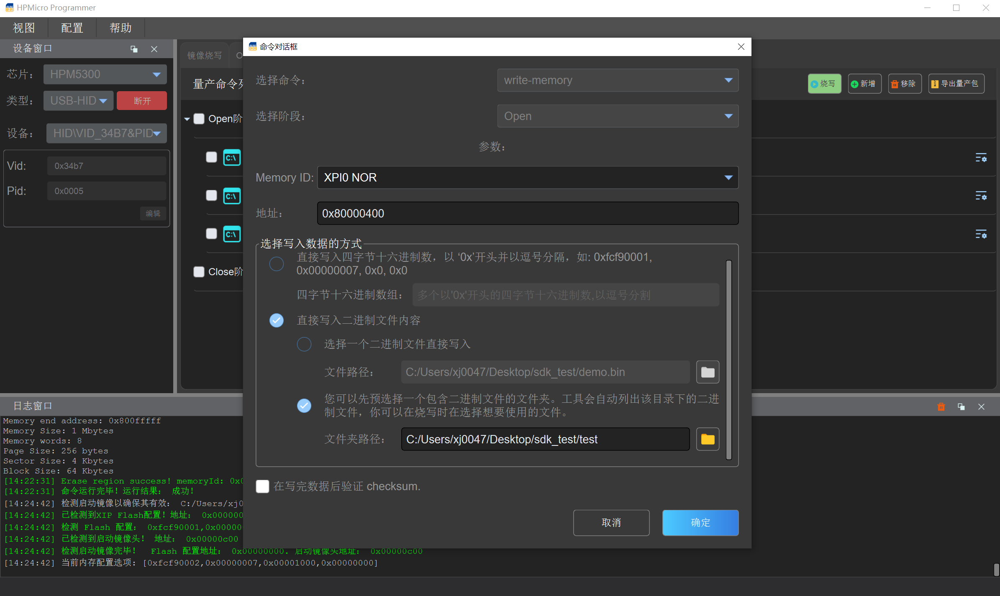
    <br>
    <div style="color:orange; border-bottom: 1px solid #d9d9d9;
    display: inline-block;
    color: #999;
    padding: 2px;">图2.1.5.2.1 选择固定文件夹</div>
</center>

确定选择后，命令列表中便会显示该文件夹以及该文件夹下对应的镜像，如下图所示：

<center>
    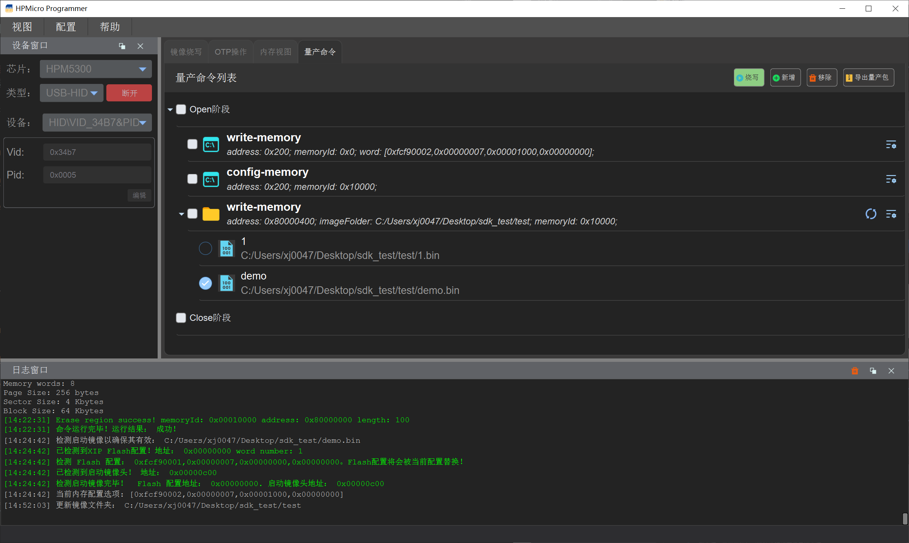
    <br>
    <div style="color:orange; border-bottom: 1px solid #d9d9d9;
    display: inline-block;
    color: #999;
    padding: 2px;">图2.1.5.2.2 选择固定文件夹</div>
</center>

在烧写前您需要先选定要烧写的镜像，每次烧写前均可动态切换。


#### 2.1.6 导入导出配置

&emsp;&emsp;工具支持将整个当前工具配置进行导出，开发模式下也支持导入别人导出的无锁配置文件。导入导出按钮入口如下图所示：

<center>
    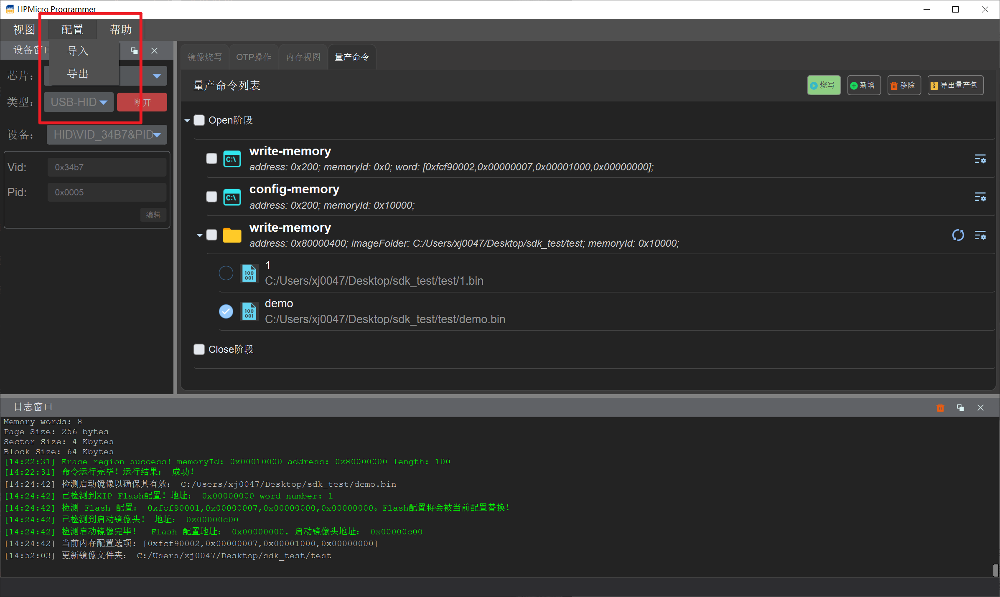
    <br>
    <div style="color:orange; border-bottom: 1px solid #d9d9d9;
    display: inline-block;
    color: #999;
    padding: 2px;">图2.1.6.1 导入导出配置入口</div>
</center>

&emsp;&emsp;导出支持两种模式，一种是无锁配置，该类型配置文件在开发模式和量产模式均可导入，方便开发人员进行配置保存及测试。锁定配置仅支持在量产模式进行导入，锁定配置详细信息请参考下一节。
&emsp;&emsp;开发模式下导入配置仅可导入无锁配置文件，导入锁定配置文件会提示错误。
&emsp;&emsp;自 v0.6.0 版本后，工具提供了两种类型的导入文件类型：
- HPMMFG 后缀文件：低版本兼容配置文件，但该配置文件不包括镜像数据，您在导入后还需要手动把烧写的镜像拷贝到指定目录；
- HPMARC 后缀文件：v0.6.0 新增配置文件，包括所有配置及镜像数据，导入后可以直接烧写，无需二次配置；

注意：v0.6.0 版本后导出配置仅支持 HPMARC 后缀文件，该配置文件在 v0.6.0 及以上版本可用。


#### 2.1.7 锁定配置

&emsp;&emsp;考虑到烧写工具与量产工具数据的一致性，烧写工具和量产工具会公用同一份配置文件，这就导致配置文件存在数据泄露的危险。因此该版本工具提供了锁定配置的功能，当配置锁定后，配置文件会写入加密字段，只允许当前配置文件在量产工具中打开，如果强行在烧写工具中打开便会清空文件。锁定配置的入口在菜单栏配置下拉菜单中，有个`导出`菜单，点击后选择导出锁定配置，选择保存路径后，会将当前配置导出一份新的加锁的配置文件，只需要在量产工具中直接导入该配置文件即可，如下图所示：

<center>
    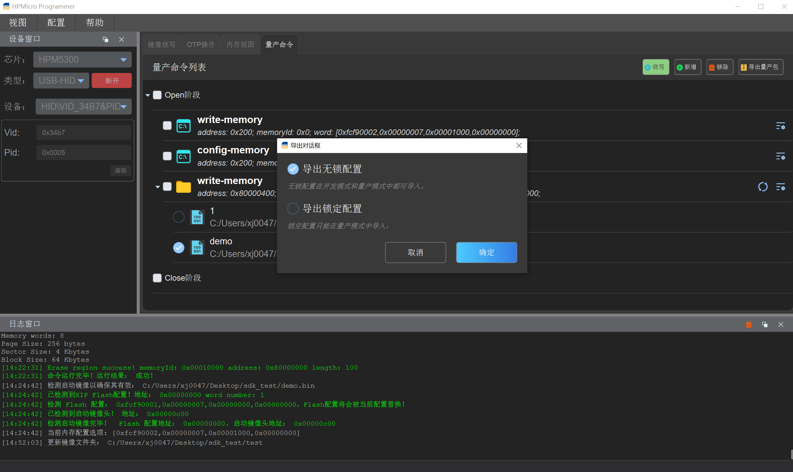
    <br>
    <div style="color:orange; border-bottom: 1px solid #d9d9d9;
    display: inline-block;
    color: #999;
    padding: 2px;">图2.1.7.1 导出锁定配置文件</div>
</center>

#### 2.1.8 构建生成量产包

&emsp;&emsp;当配置完成后，您可以生成可控的量产包进行量产烧写，点击右上角的导出量产包按钮，会弹出配置量产包的对话框，如下图所示：

<center>
    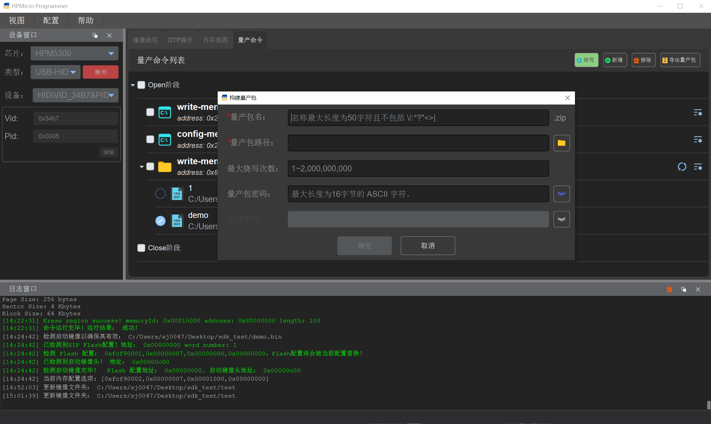
    <br>
    <div style="color:orange; border-bottom: 1px solid #d9d9d9;
    display: inline-block;
    color: #999;
    padding: 2px;">图2.1.8.1 构建量产包配置</div>
</center>

其中，量产包名和生成量产包路径是必填项，填写这两项之后就可以生成量产包，您也可以对量产包进行控制，如设置该包可以烧写的最大次数，当烧写到达最大次数后，无法进行烧写，您也可以设置量产包的解压密码，设置后需要密码才能解压正常使用，配置好后，点击确定等待量产包打包，如下图所示：

<center>
    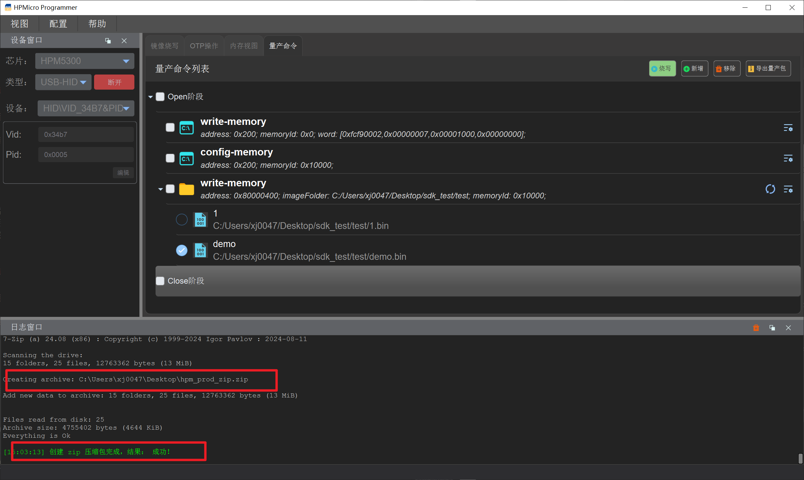
    <br>
    <div style="color:orange; border-bottom: 1px solid #d9d9d9;
    display: inline-block;
    color: #999;
    padding: 2px;">图2.1.8.2 构建量产包完毕</div>
</center>

量产包生成完毕后便可以正常使用量产工具了。


### 2.2 量产工具(HPMicro Manufacturing Util)

&emsp;&emsp;解压量产包后，双击打开 `hpm_manufacturing_gui` 程序便可以使用量产工具。量产工具的主要作用是使用量产命令列表中配置的命令批量烧写插入的设备，使用量产工具之前需要先在烧写工具(HPMicro Programmer)量产命令列表中进行配置。量产工具仅支持导入配置、开始烧写和停止烧写等操作。

&emsp;&emsp;量产工具主体分为上下两部分。上半部分包括烧写设备信息和开始烧写按钮（首次加载是置灰状态）。下半部分包括USB和串口两个标签页及其对应设备列表。其中，`USB列表支持设备自动插拔检测`，串口设备需要手动添加后才支持烧写。

&emsp;&emsp;如果量产工具未能读取到烧写命令，开始烧写按钮是置灰无法点击状态，如下图所示：

<center>
    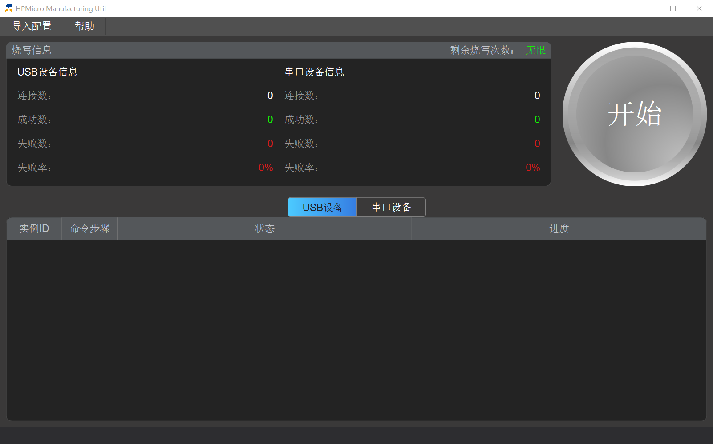
    <br>
    <div style="color:orange; border-bottom: 1px solid #d9d9d9;
    display: inline-block;
    color: #999;
    padding: 2px;">图2.2.1 不可烧写状态</div>
</center>


用户可以点击右上角导入配置按钮，导入一个新的配置文件，导入后程序会自动检测该文件内烧写序列的有效性，当检测成功后烧写按钮为绿色，是可烧写状态。如下图所示：

<center>
    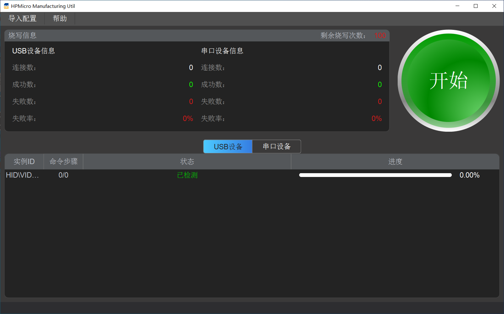
    <br>
    <div style="color:orange; border-bottom: 1px solid #d9d9d9;
    display: inline-block;
    color: #999;
    padding: 2px;">图2.2.2 可烧写状态</div>
</center>

&emsp;&emsp;点击 `START`后软件便进入烧写状态，此时只要插入USB设备便会自动进行烧写，手动添加的串口设备也会自动进行烧写，点击 `STOP`按钮会停止自动烧写，但是USB设备仍然会自动检测插拔状态。如下图所示：

<center>
    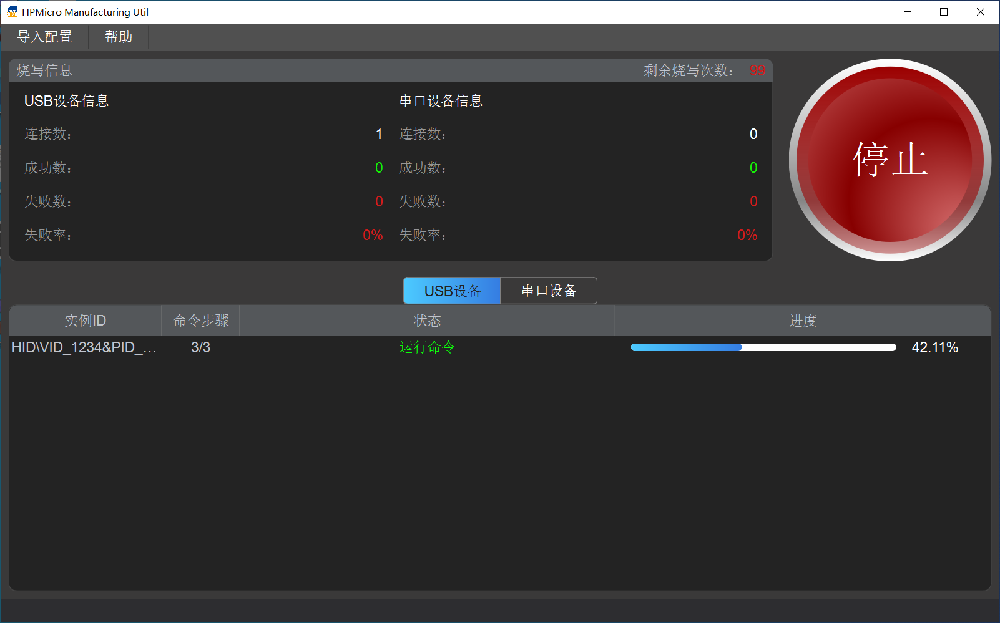
    <br>
    <div style="color:orange; border-bottom: 1px solid #d9d9d9;
    display: inline-block;
    color: #999;
    padding: 2px;">图2.2.3 烧写过程</div>
</center>

#### 2.2.1 量产工具导入烧写工具配置注意事项


&emsp;&emsp;在量产工具界面，用户可以通过右上角 `导入配置` 按钮导入其他用户烧写工具的配置。
&emsp;&emsp;自 v0.6.0 版本后，工具支持了 HPMARC 后缀格式的完整配置导出，您可以在此处导入 HPMARC 后缀的配置然后直接进行烧写。
&emsp;&emsp;如果导入了 HPMMFG 后缀的文件，如果用户配置了烧写镜像的命令，默认情况下，镜像路径为绝对路径，如果导入后绝对路径失效工具会进行提示。为了防止该问题，量产工具支持镜像相对路径烧写。用户只要将镜像文件放到软件目录下（软件根目录或者子目录中），便会自动将镜像识别为相对路径，这样只要将镜像拷贝到量产工具相对应目录下便可正常烧写。在 v0.5.0 及以上版本，工具支持直接构建量产压缩包，更方便使用。优先建议您使用量产压缩包功能，或直接导入 HPMARC 后缀的配置文件。


#### 2.2.2 量产工具串口连接设备相同串口号自动连接配置

&emsp;&emsp;为了用户使用方便，在量产工具中使用串口设备进行烧写时，当手动添加了某个串口连接后，后续再连接的设备如果是相同的串口号，那将会自动连接，不需要手动添加配置，以此提高烧写效率。用户可以通过右上角的帮助菜单中的设置功能将此功能关闭，如下图所示：

<center>
    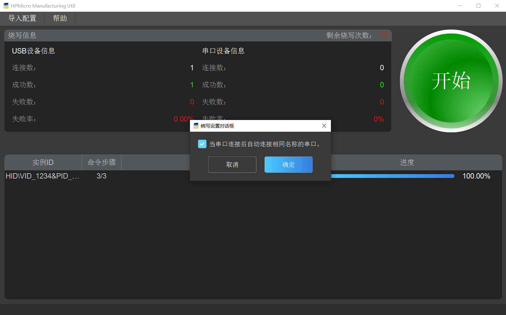
    <br>
    <div style="color:orange; border-bottom: 1px solid #d9d9d9;
    display: inline-block;
    color: #999;
    padding: 2px;">图2.2.4 烧写配置对话框</div>
</center>

### 2.3 ROM 固件功能扩展

&emsp;&emsp; 为了增强以及扩展 ROM 的功能，HPM Manufacturing Tool 自 0.3.2 版本后，增加了 ROM 固件自动安装功能。对于烧写工具和量产工具两种模式，该固件都会在设备连接时通过 `Load image` 命令自动下载到 RAM 后默认开启。固件存放地址为软件根目录 bl_fw 目录，按照 SoC 进行分类，分为签名固件和非签名固件。固件命名格式为 `${socName}_blfw_[unsigned|signed].bin`。想要在连接时取消固件自动加载功能，用户可以手动修改固件名称使其无法被程序定位。该功能有以下几点需要注意：
 - 该工具会根据当前SoC life cycle 的状态选择是否加载签名固件。用户可以通过镜像编辑助手，将工具提供的未签名固件进行签名，然后拷贝到固件加载目录（具体请参考[镜像编辑章节](#4-镜像编辑助手)）；
 - 设备在连接时会自动加载固件，对于USB设备，会出现掉电重启的现象，重启后软件会自动连接，请不要在该过程操作设备，否则连接以及后续过程会出错；
 - reset 操作后固件会清除，对于串口连接的设备，由于 reset 操作暂时无法动态识别，因此下载固件后谨慎使用 reset 功能，使用reset后确保手动点击断开连接按钮，然后重新连接设备保证固件重新被加载；
 - 由于固件是通过 `Load image` 命令进行加载的，加载了固件后，`Load image`命令无法再正常使用；
 - 一些 ROM 新增功能如 “Verify checksum” 等之后在固件加载后才可正常使用，因此想要体验工具及 ROM 完整功能，请尽量保证固件正常加载；


## 3. 命令行模式

&emsp;&emsp;HPM Manufacturing Tool同时支持命令行模式，在命令行模式下，输入 `hpm_manufacturing_cmd.exe -h`便可查看命令行支持的参数，其中

 - `-p` 代表串口，后面跟串口名，如 `-p COM1`，如果只有单个设备连接，可以省略串口名，直接 `-p`。
 - `-u` 代表USB，后面跟USB设备的vid和pid，如 `-u 0x34B7,0x0001`，如果只有单个设备连接，可以省略 vid 和 pid，直接 `-p`。
 - `-r` 代表运行，后面跟要执行的烧写命令。
 - `-t` 代表命令超时时间，单位为毫秒，默认值为10000（10秒）。
 - `-f` 代表烧写前先加载bootloader firmware, 参数为 `<芯片名称>,<0,1> 或 <固件路径>`, 0 代表非签名固件，1 为签名固件。注意：固件加载成功后，设备会自动重新上电，同时 load-image 命令后续可能无法正常使用。
 - `-i` 代表镜像编辑命令，设置该参数后除了`-r`设置命令参数有效，其余参数均无效。当前支持的配置命令为 `-r "create-image <json_file_path>"`，其中 json_file_path 为镜像编辑助手生成的配置文件路径。

当前支持的烧写命令如下所示：

```
--  query-rte <id> [<param>]
        id = 0, ROM features, param is not required
        id = 4, Memory properties
            - param: 0 - ILM / 1 - DLM
                     0x10000 - XPI0 NOR / 0x10001 - XPI1 NOR / 0x20000 - OTP
                     0x30000 - SDXC0 / 0x30001 - SDXC1
        id = 5, Supported command list
--  config-memory <memory_id> <config address>
        memory_id: 0x10000 - XPI0 NOR / 0x10001 - XPI1 NOR
                   0x30000 - SDXC0 / 0x30001 - SDXC1
--  write-memory <memory_id> <address/sector-index for eMMC> [[four-byte hexadecimal array]]/<file path>
           - memory_id: 0 - ILM / 1 - DLM
                        0x10000 - XPI0 NOR / 0x10001 - XPI1 NOR
                        0x20000 - OTP
                        0x30000 - SDXC0 / 0x30001 - SDXC1
--  read-memory <memory_id> <address/sector-index for eMMC> <byte length> [file path]
           - memory_id: 0 - ILM / 1 - DLM
                        0x10000 - XPI0 NOR / 0x10001 - XPI1 NOR
                        0x20000 - OTP
                        0x30000 - SDXC0 / 0x30001 - SDXC1
--  verify-checksum <memory_id> <address/sector-index for eMMC> [[four-byte hexadecimal array]]/<file path>
           - memory_id: 0 - ILM / 1 - DLM
                        0x10000 - XPI0 NOR / 0x10001 - XPI1 NOR
                        0x30000 - SDXC0 / 0x30001 - SDXC1                        
--  erase-region <memory_id> <address/sector-index for eMMC> <byte length>
           - memory_id: 0x10000 - XPI0 NOR / 0x10001 - XPI1 NOR
--  erase-chip <memory_id>
           - memory_id: 0x10000 - XPI0 NOR / 0x10001 - XPI1 NOR
--  load-image <image path>
--  load-blfw <soc_type> <isSigned>
           - soc_type: SoC Serial Name such as HPM6700/HPM6400, HPM6300, HPM6200, HPM5300, HPM6800
           - isSigned: 0 - unsigned / 1 - signed.
           - note: load-blfw is a wrapper for load-image boot loader firmware. So using these two commands at the same time could cause an error.
           - note: The device will be reset automatically if firmware loads success.
--  reset [<reset_type>], default reset_type is 0
        0 - Default reset / 1 - Hot reset / 2 - Cold reset;

--  create-image <path>
           - path: the configuration file of hpm_image_helper in the root directory such as imageutil.json.
```

烧写样例如下：
"Windows 平台：用 'hpm_manufacturing_cmd.exe' 的路径来替换 `${hpm_manufacturing_cmd}`。对于 USB 设备，当使用 PowerShell 运行命令时，需要使用双引号表示设备名称。"
"Linux 平台：使用 `sudo ./hpm_manufacturing_cmd` 替换 `${hpm_manufacturing_cmd}`， 想要正常连接USB 或串口设备，`sudo` 提权是有必要的。

```
${hpm_manufacturing_cmd} -p COM11 -r "load-image boot_image.bin"  (Windows)
${hpm_manufacturing_cmd} -p /dev/ttyUSB0 -r "load-image boot-image.bin" (Linux/MacOSX)
${hpm_manufacturing_cmd} -u "0x34b7,0x0001" -r "load-image boot_image.bin"
${hpm_manufacturing_cmd} -u "0x34b7,0x0001" -r "query-rte 0"
${hpm_manufacturing_cmd} -u "\\?\HID#VID_34B7&PID_0001#6&289dd98c&2&0000#{4d1e55b2-f16f-11cf-88cb-001111000030}" -r "query-rte 0"

```

如果只有单个设备连接，设备名称可以忽略：
```
${hpm_manufacturing_cmd} -p -r "load-image boot_image.bin"  (Windows)
${hpm_manufacturing_cmd} -u -r "query-rte 0"
```

典型烧写序列如下：
```
${hpm_manufacturing_cmd} -u "0x34b7,0x0001" -r "write-memory 0x0 0x200 [[0xfcf90001,0x05,0x0,0x0]]"
${hpm_manufacturing_cmd} -u "0x34b7,0x0001" -r "config-memory 0x10000 0x200"
${hpm_manufacturing_cmd} -u "0x34b7,0x0001" -r "write-memory 0x10000 0x80000400 flash_xip.bin"
```

同时命令也支持连续烧写，如下所示：

```
${hpm_manufacturing_cmd} -u "0x34b7,0x0001" -r "write-memory 0x0 0x200 [[0xfcf90001,0x05,0x0,0x0]]" -r "config-memory 0x10000 0x200" -r "write-memory 0x10000 0x80000400 flash_xip.bin"
```

典型的固件加载烧写序列:
```
${hpm_manufacturing_cmd} -p -r "load-blfw HPM6200 0"
${hpm_manufacturing_cmd} -p -f "HPM6200,0" -r "query-rte 0"
```

典型的镜像编辑序列命令：(imageUtil.json 是由 hpm_image_helper 在生成镜像时保留的配置文件)
```
${hpm_manufacturing_cmd} -i -r "create-image imageUtil.json"
```

## 4. 镜像编辑助手

&emsp;&emsp;镜像编辑助手作为独立的应用程序进行分发，您可以直接双击安装目录下的`hpm_image_helper`程序直接运行镜像助手程序，也可以通过烧写工具进行内部拉起打开。烧写工具内部有两个入口：
1. 工具`视图`菜单栏下点击`镜像编辑窗口`菜单进行打开；
2. 镜像烧写标签页下，在镜像文件路径输入框右侧，有个`编辑`按钮，点击后可以拉起镜像编辑助手对当前选择的镜像文件进行编辑。

镜像助手在加载时需要获取具体芯片型号信息，换句话说，烧写工具只有在连接设备成功后，才能拉起镜像助手。镜像助手的运行界面如下图所示：

<center>
    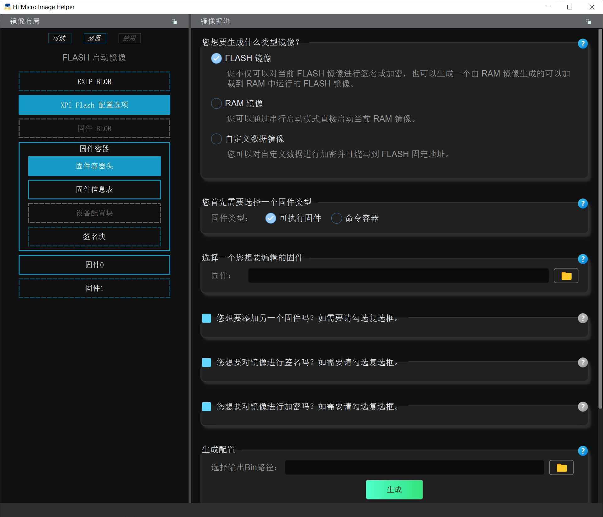
    <br>
    <div style="color:orange; border-bottom: 1px solid #d9d9d9;
    display: inline-block;
    color: #999;
    padding: 2px;">图4.1 镜像助手</div>
</center>


&emsp;&emsp;镜像助手当前支持 FLASH、RAM、自定义数据三种类型的镜像，左侧显示的是当前选择镜像的布局以及标识了每个是否是必选项。助手右侧为配置界面，从上往下按模块进行配置，每个模块右上角都有提示按钮，鼠标悬浮到提示按钮会提示当前模块的一些配置信息。整体主要分为以下几个模块：

### 4.1 镜像类型选择

&emsp;&emsp;选择您想要生成的镜像类型，默认为 FLASH 类型，不同镜像类型会对后面的模块产生不同的限制，因此您需要确保首先勾选此项目。

### 4.2 固件类型选择

&emsp;&emsp;该工具当前支持编辑可执行固件以及命令容器固件两种固件类型，您需要根据您自己的需求进行选择。

### 4.3 可执行固件配置

#### 4.3.1 固件0选择

&emsp;&emsp; 当选择完要生成的镜像类型以及固件类型选择可执行固件后，您就需要在此处选择想要编辑的固件，如果是从烧写工具镜像文件入口打开的镜像助手，那么此处会填写烧写工具中配置的镜像文件值。当固件地址更新后，会自动读取固件内容，如果判断当前固件类型是 FLASH 类型固件，会根据读取内容填入相关信息，如果判断为 RAM 类型的固件，则其它信息需要手动添加。具体可以参考助手工具右上角提示信息，整个固件选择部分如下图所示：

<center>
    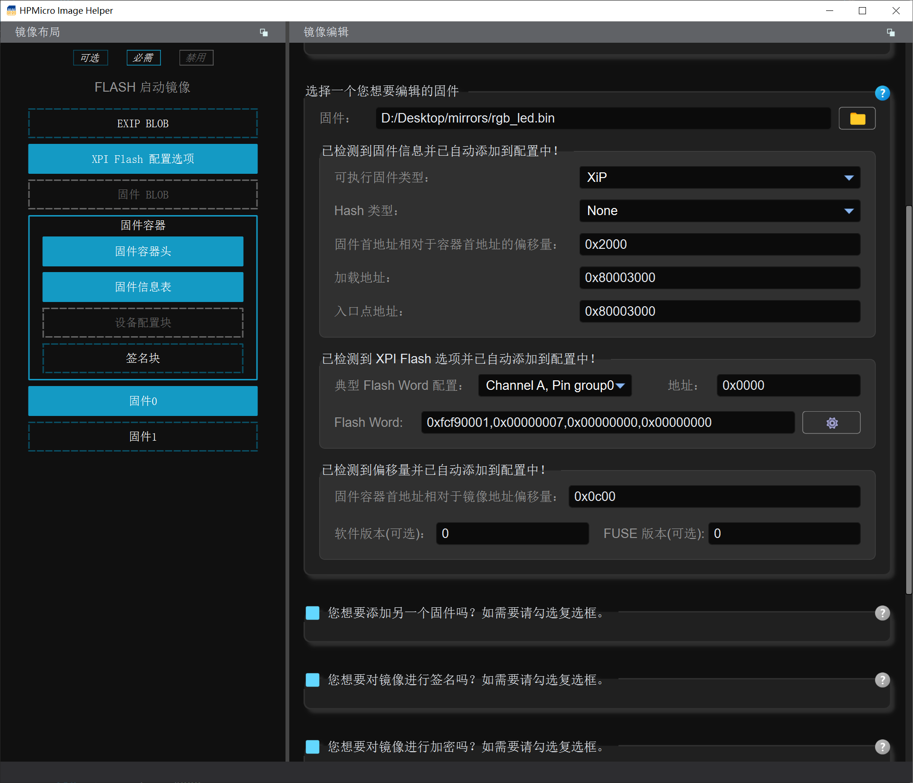
    <br>
    <div style="color:orange; border-bottom: 1px solid #d9d9d9;
    display: inline-block;
    color: #999;
    padding: 2px;">图4.3 固件选择</div>
</center>

#### 4.3.2 固件1选择

&emsp;&emsp;在单核启动场景中，只需要配置固件0即可。在双核启动场景中，固件0代表主核固件，固件1代表从核固件，由于固件1没有自动检测内容的逻辑，您需要手动配置固件1的信息。

### 4.4 命令容器配置

&emsp;&emsp;当选择完要生成的镜像类型以及固件类型选择命令容器后，您可以将一批命令封装成镜像来执行。当前命令容器支持以下四种命令：
- Configure Memory: 写入 Flash 相关配置； 
- Write Memory: 直接向某个地址写入16进制值；
- Erase Region: 擦除指定区域指定内存大小；
- Reset：复位设备（仅在 FLASH 类型镜像中可用）；

编辑效果如下图所示：

<center>
    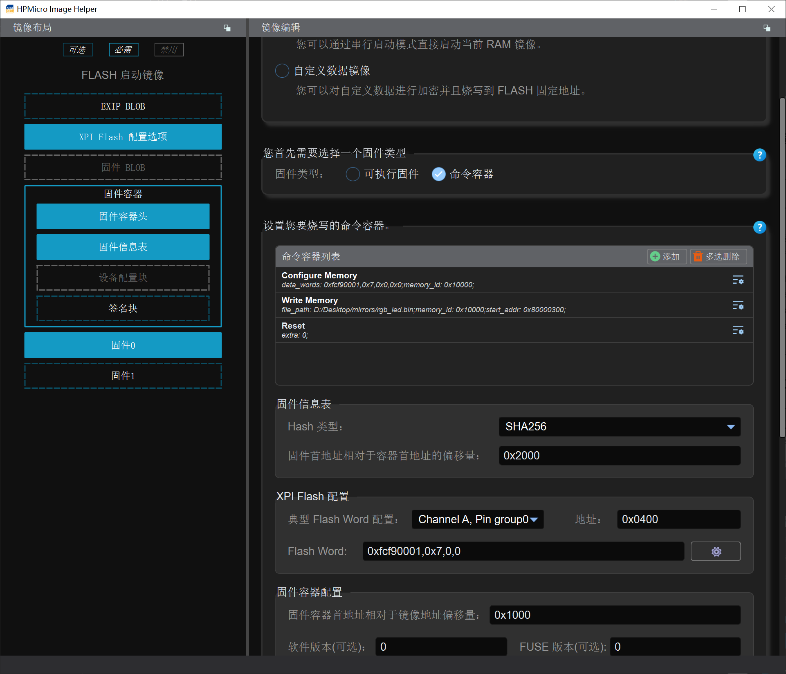
    <br>
    <div style="color:orange; border-bottom: 1px solid #d9d9d9;
    display: inline-block;
    color: #999;
    padding: 2px;">图4.4 命令容器编辑列表</div>
</center>

### 4.5 镜像签名

&emsp;&emsp;点击`新建超级根证书`按钮可以生成四个根证书，在对话框中勾选`生成二级根证书`复选框，可以生成二级证书并会自动填入根证书和二级证书信息，同时签名证书算法会与证书配置对话框中密钥超度的选择类型对应，如下图所示：

<center>
    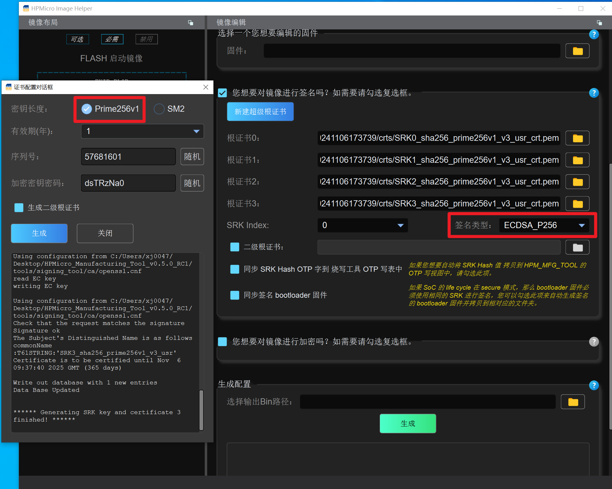
    <br>
    <div style="color:orange; border-bottom: 1px solid #d9d9d9;
    display: inline-block;
    color: #999;
    padding: 2px;">图4.5 签名配置</div>
</center>

根证书生成路径是在工具根目录/tools/signing_tool/certs/。以生成时的时间戳为文件夹名称进行保存。文件夹内有 crts 和 keys 两个文件夹分别代表公钥和私钥。公钥会写入镜像中，私钥会对当前镜像进行签名以供后续 BootROM 进行验签。
在生成镜像时，工具会自动把 SRK HASH 值写入到日志窗口，如下图所示：

<center>
    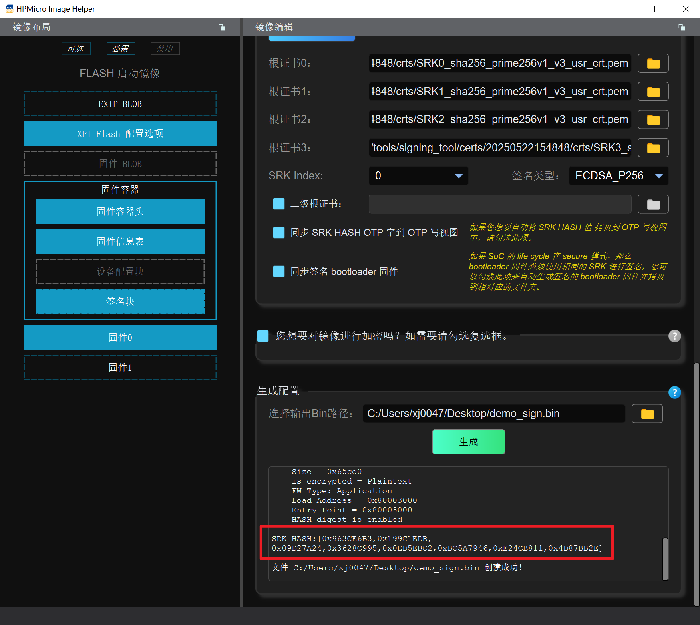
    <br>
    <div style="color:orange; border-bottom: 1px solid #d9d9d9;
    display: inline-block;
    color: #999;
    padding: 2px;">图4.5.1 镜像签名</div>
</center>

您可以复制这些值保存下来或者直接添加到 HPMicro Manufacturing Tool 中进行写入。当然工具提供了相当快捷的方式帮您完成以上操作：
- 首先确保镜像编辑助手是通过 HPMicro Manufacturing Tool 中的编辑按钮或菜单栏镜像编辑窗口打开的（如果直接双击 hpm_image_helper.exe 打开则无法使用该功能）。
- 直接勾选 同步 SRK HASH OTP 到 OTP 写视图 复选框，然后点击生成按钮生成镜像，那么工具便会自动将 SRK HASH 写入到工具写视图中；
- 同时，如果您想要签名 bootloader 固件，直接勾选 同步签名 bootloader 固件复选框即可，点击生成后工具会生成对应的签名固件并拷贝到相应的目录。

详细镜像签名原理及流程可参考先楫知识库：[HPMicro Manufacturing Tool 镜像安全启动配置及Bootloader固件同步签名流程](https://kb.hpmicro.com/2024/12/18/hpmicro-manufacturing-tool-镜像安全启动配置及bootloader固件同步签名流程)


### 4.6 镜像加密

&emsp;&emsp;镜像助手也提供了 EXIP 加密逻辑，勾选加密复选框，便可以进行配置。如下图所示：

<center>
    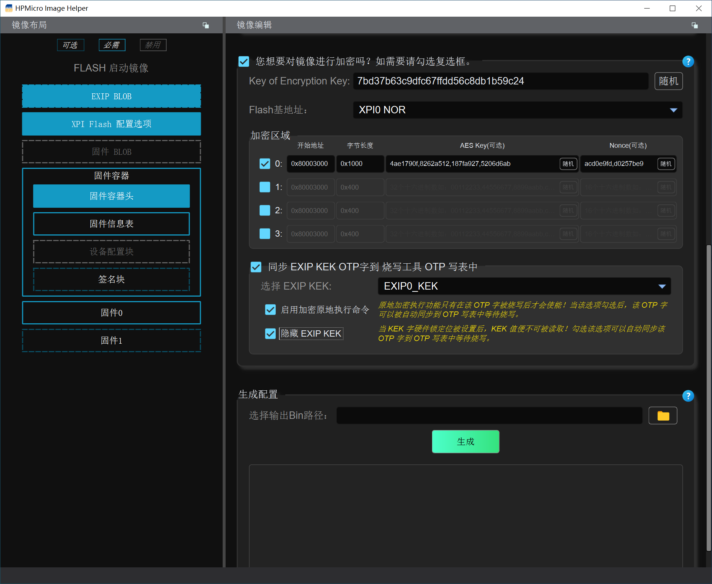
    <br>
    <div style="color:orange; border-bottom: 1px solid #d9d9d9;
    display: inline-block;
    color: #999;
    padding: 2px;">图4.5 EXIP 配置</div>
</center>

启用镜像加密功能后，我们便能看到各类配置，下面分别进行说明：

- KEK 字符串：16字节十六进制数，用来打包解密区域配置，该值需要写入 OTP 供 BootROM 使用；
- FLASH 基地址：选择加密区域是在 XPI0 还是 XPI1；
- 加密区域：具体的加密位置配置，包括：
    + 区域起始地址（必填）
    + 区域加密长度（必填）
    + AES Key（可选，不填会随机生成）
    + Noce （可选，不填会随机生成）
- 同步 EXIP KEK 到 OTP 配置：勾选此项后，生成镜像后会自动将 KEK 拷贝到 OTP 写视图中，方便使用。同时，我们还提供了另外两个 OTP 字的快捷输入：
    + 启用加密原地执行命令：即使能 ENCRYPT_XIP，使能后 BootROM 才会开启 EXIP 功能；
    + 隐藏 EXIP KEK: 使能 EXIP KEK 的硬件锁定位，这样 EXIP KEK 在 OTP 中便无法读取，确保了 KEK 的安全性。


详细镜像加密原理及流程可参考先楫知识库：[HPMicro Manufacturing Tool 镜像加密流程](https://kb.hpmicro.com/2024/12/18/hpmicro-manufacturing-tool-镜像加密流程)


### 4.6 生成镜像

&emsp;&emsp;选择镜像输出路径后，点击生成，便能生成新的镜像，您可以从日志窗口查看是否生成成功。


### 4.7 典型镜像编辑场景介绍

#### 4.7.1 RAM 镜像编辑为 Load to RAM 支持的镜像

在 HPM_MFG_TOOL 工具中镜像烧写标签页选择一个 RAM 镜像，此时工具无法自动检测到镜像容器头，会提示去编辑，打开镜像编辑助手后，界面如下所示：

<center>
    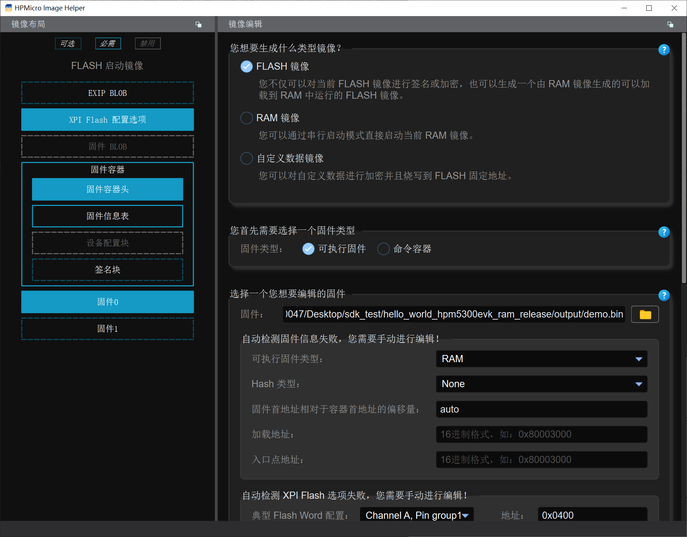
    <br>
    <div style="color:orange; border-bottom: 1px solid #d9d9d9;
    display: inline-block;
    color: #999;
    padding: 2px;">图4.7.1.1 RAM 镜像编辑</div>
</center>

此处需要二次配置的地方有两处：
1. 固件信息表的加载地址和入口点地址，此处填入编译 RAM 镜像的链接脚本对应的加载地址和入口点地址即可。
2. FLASH 配置选项，由于 RAM 中不包括 FLASH 配置，FLASH 配置处需要自行进行添加，工具会预先在此处预置一个设备可用的 FLASH 配置信息供参考，您也可以点击自定义自行配置
配置完成后效果如图：

<center>
    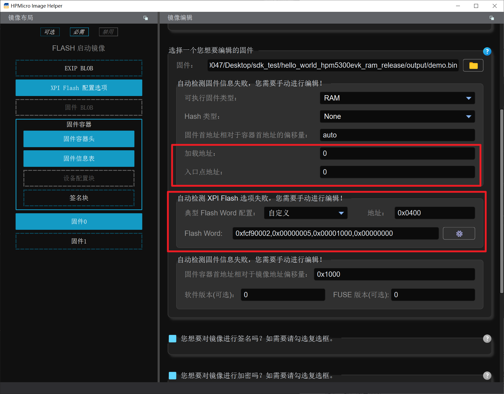
    <br>
    <div style="color:orange; border-bottom: 1px solid #d9d9d9;
    display: inline-block;
    color: #999;
    padding: 2px;">图4.7.1.2 RAM 镜像编辑</div>
</center>

简单的 Load to RAM 镜像其它选项均可采用默认配置，然后添加一个生成镜像路径，点击生成即可。

#### 4.7.2 FLASH 镜像签名

当选中某个 FLASH 镜像进行编辑时，工具会从 FLASH 中获取到基本信息，如固件信息头，信息表，FLASH 配置等，您不需要再自行填写，如下所示：

<center>
    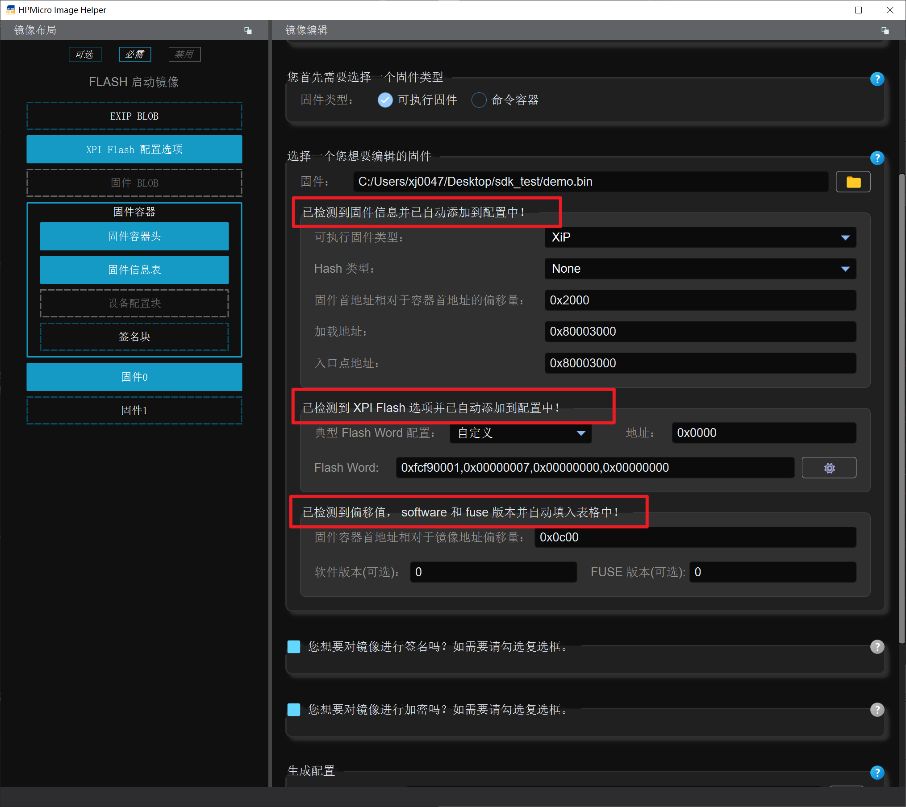
    <br>
    <div style="color:orange; border-bottom: 1px solid #d9d9d9;
    display: inline-block;
    color: #999;
    padding: 2px;">图4.7.2.1 镜像签名</div>
</center>

您只需要勾选镜像签名复选框，然后便会弹出镜像编辑窗口，此时您可以输入已有的根证书路径，或者点击新建根证书，通过工具来生成根证书，根证书生成完毕后会自动填入根证书选项中，如下图所示：

<center>
    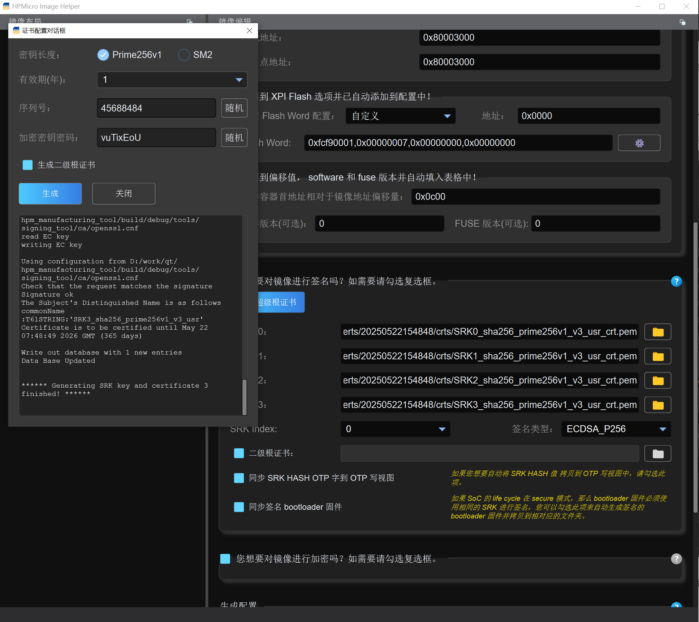
    <br>
    <div style="color:orange; border-bottom: 1px solid #d9d9d9;
    display: inline-block;
    color: #999;
    padding: 2px;">图4.7.2.2 镜像签名</div>
</center>

`SRK Index` 为根证书索引，选择某个索引后镜像生成过程中会使用该索引对应的根证书进行签名及后续校验。
`签名类型` 选项与新建根证书对话框中的密钥长度类型保持一致，如果您使用的是新建根证书生成的密钥，该选项无需修改。

`SRK HASH` 需要写入 OTP 中供 BootROM 验签使用，您可以直接勾选 `同步 SRK HASH OTP 字到 OTP 写视图`复选框，这样工具在生成镜像时会自动将 `SRK HASH` 写入开发工具的 OTP 写视图，后续直接在开发工具烧写即可。未勾选后续则需要手动配置并烧写 `SRK HASH` 值到 OTP 后，签名才能正常使用。

如果 SoC 的 lifecycle 为 secure 模式，那么在 OTP 写入 SRK HASH 后，工具默认的未签名 bootloader 固件则无法正常使用，您需要用相同的证书对 bootloader 固件进行签名并放置到开发工具根目录 bl_fw 对应的 SoC 下。或者您直接勾选 `同步签名 bootloader 固件`，那么工具会自动为您完成以上流程。

最后添加一个生成镜像路径，点击生成即可完成镜像签名操作。

#### 4.7.2 FLASH 镜像加密

在烧写镜像到设备后，为了数据的安全性，防止镜像内容被直接读取，一般都会对镜像进行加密操作。当镜像被加密后，执行时设备需要先使用对应的密钥进行解密，然后再执行镜像程序。

当选中某个 FLASH 镜像进行加密时，与镜像签名一样，工具会从 FLASH 中获取到基本信息，如固件信息头，信息表，FLASH 配置等，您不需要再自行填写。

您只需要勾选镜像加密复选框，填入对应的信息即可。如下图所示：

<center>
    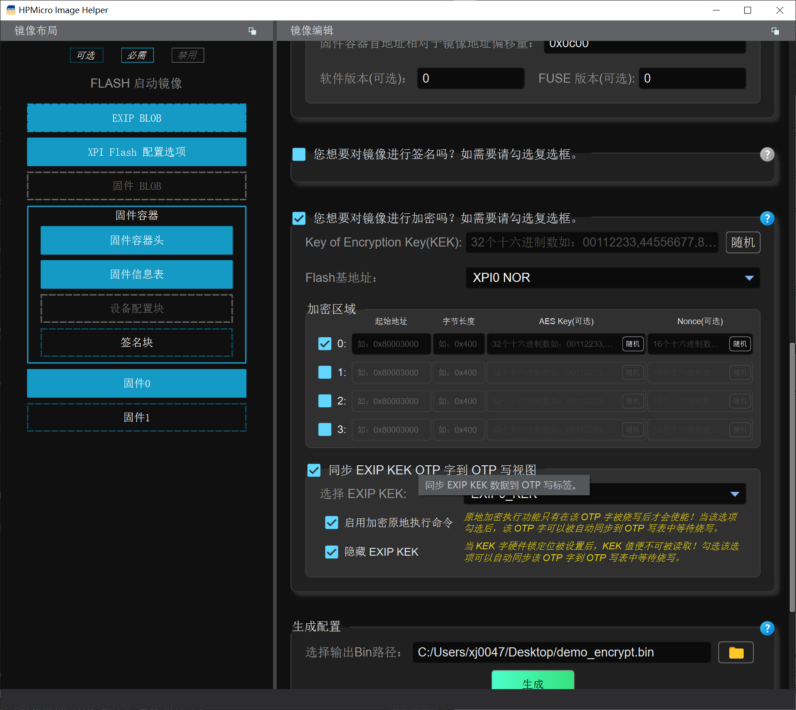
    <br>
    <div style="color:orange; border-bottom: 1px solid #d9d9d9;
    display: inline-block;
    color: #999;
    padding: 2px;">图4.7.3 镜像加密</div>
</center>

KEK 为加密算法封包解包密钥，您可以点击右侧的随机按钮随机生成，也可以自己输入16字节十六进制数；

然后需要选择要加密的 FLASH 区域基地址 XPI0 NOR 或者 XPI1 NOR；

紧接着输入要加密的区域起始地址和范围（字节长度），工具当前支持加密四个区域。加密区域的地址和字节长度需要与 1KB 对齐。加密区域使用的两个参数 AES Key 和 Nonce 可按需添加，不填写时工具会在加密时随机生成；

镜像加密密钥以及其它 OTP 对应参数需要烧写到 OTP 后，加密流程才可以正常使用。此处强烈建议您保持勾选 `同步 EXIP KEK OTP 字到 OTP 写视图`复选框及子选项。由工具帮您完成 OTP 配置，后续镜像生成后，只需要在开发工具写视图写入对应 OTP 配置即可。

以上配置完成后，点击生成按钮，便可以生成一份加密镜像，同时会将对应的 OTP 所需信息拷贝到烧写工具 OTP 写视图待后续烧写；